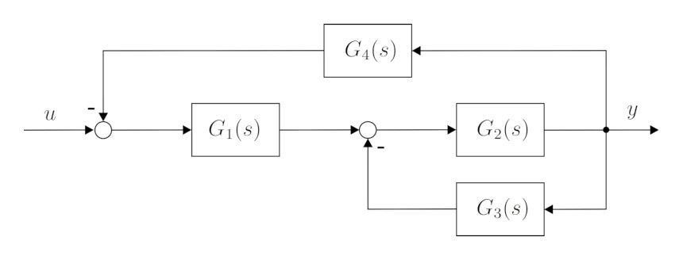
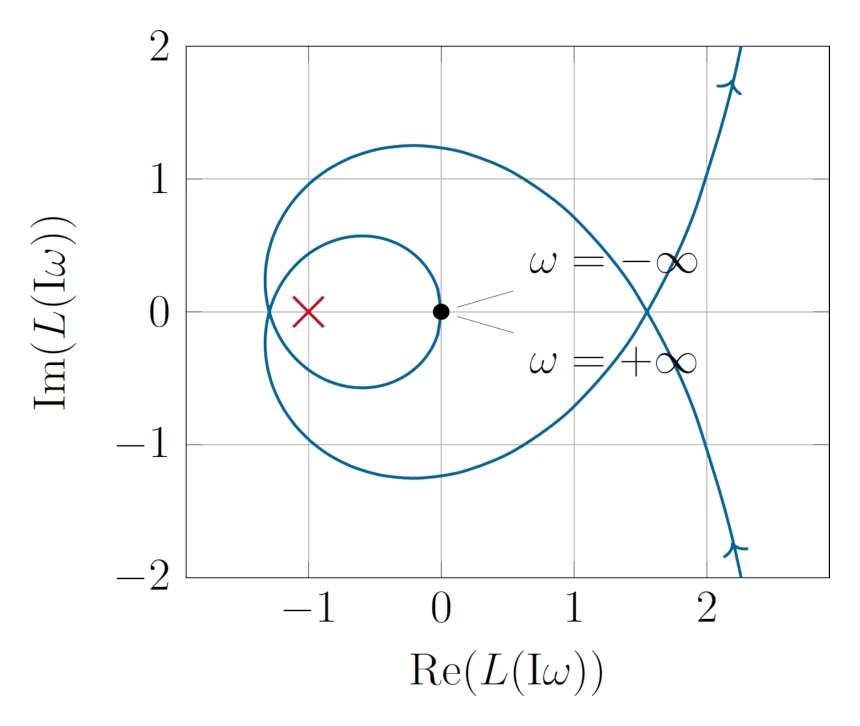
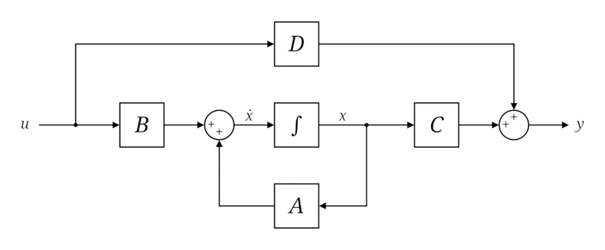
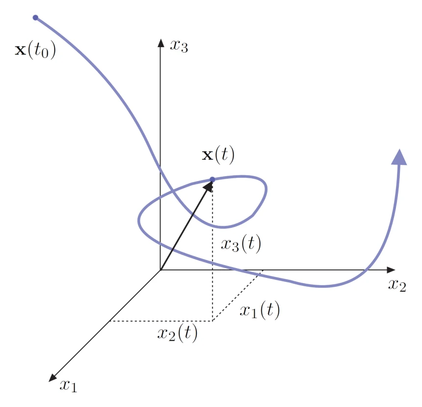
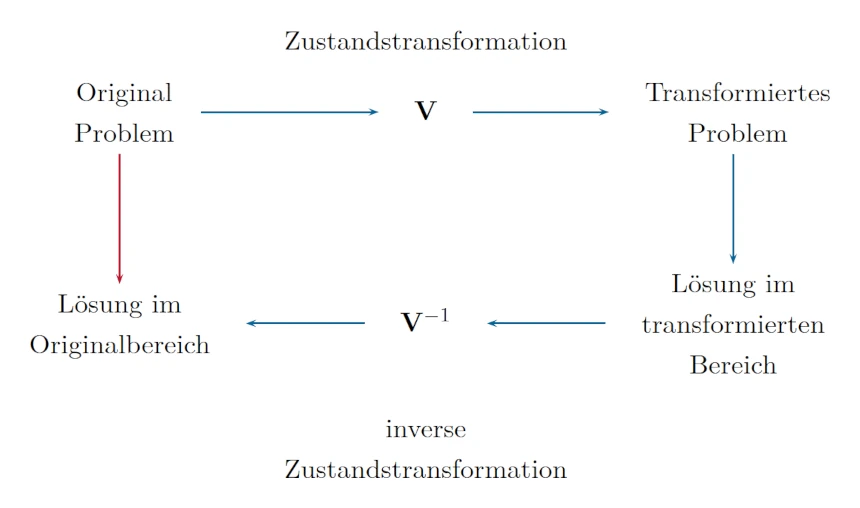

public:: true
icon:: 🤖
inherit-color-icon-from:: [[logseq-page-color-lightblue]]
tags:: [[uni]]
alias:: automatisierung, automatisierungs

- [📁 folder](file://C:\Users\Matteo\Documents\Uni\Automatisierung)
- ## vorlesungen
	- 
	- [[aut vo temp]]
- ## beispiele
	- [UE1](((670d389a-4eef-4ce3-b96d-45d619392212)))
	  background-color:: green
	  
		- {{renderer :media-timestamp, 00:21:45, ((670d389a-4eef-4ce3-b96d-45d619392212))}} [Aufgabe 1.1)](((6724c433-2054-4cae-a0c7-8189a8b54740)))
		  background-color:: green
		  collapsed:: true
			- formeln
			  id:: 67137aaa-de70-4aa6-b1cc-28cdb18cab78
			  collapsed:: true
				- ((67122f45-de81-44a5-a037-8b3d5d9241fa))
			- [📚 2024-10-16 19h43m.xopp](../assets/documents/2024-10-16 19h43m.xopp)
			- 
		- {{renderer :media-timestamp, 01:12:05, ((670d389a-4eef-4ce3-b96d-45d619392212))}} [Aufgabe 1.3)](((6724c44b-c553-4d8f-97ed-6c5e519059a7)))
		  background-color:: green
		  collapsed:: true
			- formeln
			  collapsed:: true
				- ((67122f45-9636-4f84-bfd4-c73aed78e4bd))
			- [📚 2024-10-18 19h56m.xopp](../assets/documents/2024-10-18 19h56m.xopp)
			- 
	- [UE2](((6713c96e-d606-449c-8013-b19ee52a12e9)))
	  background-color:: green
	  
		- {{renderer :media-timestamp, 15:25, ((6713c96e-d606-449c-8013-b19ee52a12e9))}} [Aufgabe 2.1)](((6723bef6-7df5-4c1d-ac04-937ad238fd72)))
		  background-color:: green
		  collapsed:: true
			- formeln
			  collapsed:: true
				- ((671678e8-ee03-4007-b265-9bc44d9e4b10))
				- ((4b1b3de8-2aa6-4d25-8f9c-0d1b44573ad3))
				- ((6717bfce-d663-4bfb-837a-ad7fcea2e66d))
				- ((671b4ba8-7462-4472-9618-d005e15646f4))
				- ((671b4e73-5df4-4f5c-b69e-02176e8edb95))
			- {{renderer :media-timestamp, 00:15:23, ((6713c96e-d606-449c-8013-b19ee52a12e9))}} a)
			  background-color:: green
			- {{renderer :media-timestamp, 00:33:38, ((6713c96e-d606-449c-8013-b19ee52a12e9))}} b)
			  background-color:: green
			- [📚 2024-10-23 16h03m.xopp](../assets/documents/2024-10-23 16h03m.xopp)
			- 
		- {{renderer :media-timestamp, 48:20, ((6713c96e-d606-449c-8013-b19ee52a12e9))}} [Aufgabe 2.2)](((6723bf25-1e0b-45a3-b083-52ad9f455747)))
		  background-color:: green
		  collapsed:: true
			- formeln
			  collapsed:: true
				- ((671e6a4a-7f50-4907-873e-4ba1e3c4fca5))
				- ((672106f0-bdcd-4f36-bc24-36f6986eb183))
				- ((83774afb-cb88-4c67-b8d6-b4e2313a52d1))
				- ((67226f1c-9890-463b-9a3d-cbf28270b121))
			- [📚 2024-10-25 16h44m.xopp](../assets/documents/2024-10-25 16h44m.xopp)
			- 
		- {{renderer :media-timestamp, 1:11:55, ((6713c96e-d606-449c-8013-b19ee52a12e9))}} [Aufgabe 2.4)](((6723bf3d-9b22-4943-a9bb-39462c2806c2)))
		  background-color:: green
		  collapsed:: true
			- formeln
			  collapsed:: true
				- ((67234c51-e437-4e1f-a175-2035d14681aa))
				- ((672397b1-e35d-4257-a8c9-cab0b1329d27))
				- ((672397b1-abfc-49e4-ab4d-d4c52767ecdc))
				- ((6724aaef-8410-4c29-8fde-f677528c0937))
			- [📚 2024-10-31 09h53m.xopp](../assets/documents/2024-10-31 09h53m.xopp)
			- 
	- [UE3](((67234c2b-153b-4204-b3b8-5828d0122842)))
	  background-color:: green
	  
		- {{renderer :media-timestamp, 03:16, ((67234c2b-153b-4204-b3b8-5828d0122842))}} [Aufgabe 3.1.](((67254b5d-122d-4394-9ae1-c9d89ebc30ba)))
		  background-color:: green
			- formeln
				- ((67234c51-e437-4e1f-a175-2035d14681aa))
				- ((67254498-19a4-47c4-a559-8bad13c5ebe3))
				- ((6729ef23-4d38-4044-b7e9-f4866a30bcc0))
				- ((672a2989-ea9a-4046-b0d5-aeb334016b0e))
			- [📚 2024-11-01 22h47m.xopp](../assets/documents/2024-11-01 22h47m.xopp)
			- 
	- [UE4](((67234c2b-aaa9-48f3-9a71-4c2e5d08fd4c)))
	  background-color:: green
	  
		-
	- [UE5](((67234c2b-aa3d-4983-b0c1-7ac4398465e3)))
	  background-color:: green
	  
		-
	- 
	  background-color:: green
		- 1) Die Aufgaben a) und b) können unabhängig voneinander gelöst werden.
		  background-color:: green
			- a) Gegeben sind die folgenden Modellgleichungen:
			  background-color:: green
			  $$\begin{array}{l}m\dot{v} =F_{t}-m g\sin\varphi, \\ \dot{\varphi}=\left(-\frac{1}{\rho}+\frac{\cos\varphi}{r}
			  \right)v\quad\text{mit}\quad\rho=\frac{v^{2}}{g\cos\varphi}, \\ \dot{r}=v\sin\varphi.\end{array}$$
			  Der Eingang des Systems ist $u=F_{t}$. Der Ausgang des Systems ist $y = \varphi$. Die Parameter $m > 0$ und $g > 0$ sind konstant und reellwertig.
				- i) Geben Sie den [[Zustandsvektor]] und die [[Zustandsraumdarstellung]] für das [[nichtlineare]] System an
				  background-color:: green
					-
				- ii) Berechnen Sie die [[Ruhelagen]] des Systems für $u_{R} = 0$ und $−π/2 < φ_R < π/2$
				  id:: 6701697a-19e5-4cfc-850a-277a29ab40e8
				  background-color:: green
				- iii) [[Linearisieren]] Sie das [[nichtlineare]] System um die in Aufgabe [ii](((6701697a-19e5-4cfc-850a-277a29ab40e8))). berechneten [[Ruhelagen]] und geben Sie die [[Zustandsraumdarstellung]] des [[linearisierten]] Systems an.
				  background-color:: green
			- b) Gegeben ist das [[lineare]], [[zeitinvariante]] System
			  background-color:: green
			  collapsed:: true
			  $$\begin{array}{l}\dot{\mathbf{x}}=\left[\begin{array}{ccc}-1 & 2 & 3\\ 0 & -1 & 0\\ 0 & 2 & 1\end{array}\right]\mathbf{x}+\left[\begin{array}{c}0\\ 0\\ 0\end{array}\right]u,\\ y=\left[0\quad\alpha\quad0\right]\mathbf{x}.\end{array}$$
				- i) Ist die [[Ruhelage]] für $u = 0$ [[asymptotisch]] stabil?
				  background-color:: green
				- ii) Kann für das System ein [[trivialer Beobachter]] entworfen werden?
				  background-color:: green
				- iii) Für welche $\alpha = 0$ kann ein [[Dead-Beat Beobachter]] entworfen werden?
				  background-color:: green
		- 2) Die Aufgaben a) - d) können unabhängig voneinander gelöst werden.
		  background-color:: green
		  collapsed:: true
			- a) Entwerfen Sie für die [[Übertragungsfunktion]]
			  background-color:: green
			  collapsed:: true
			  $$G(s)=\frac{20}{\left(\frac{\sqrt{3}}{10}s+1\right)\left(\frac{s}{10}+1\right)}$$
			  einen [[PI-Regler]] so, dass die [[Sprungantwort]] des geschlossenen Kreises folgende Vorgaben erfüllt:
				- [[Überschwingen]] 40 % und
				- [[Anstiegszeit]] $t_r = 0.15 \text{s}$.
			- b) Diskretisieren Sie das autonome, [[lineare]], [[zeitinvariante]] System
			  background-color:: green
			  $$\begin{array}{l}\dot{\mathbf{x}}=\left[\begin{array}{c}-\alpha & \alpha \\ 0 & -1\end{array}\right]\mathbf{x},\\ y=\left[1\quad1
			  \right]\mathbf{x},\end{array}$$
			  mit einer allgemeinen [[Abtastzeit]] $T_a > 0$, wobei der Parameter $\alpha$ konstant und reellwertig ist.
			- c) Beweisen Sie allgemein die Gültigkeit des [[Separationsprinzips]] für [[lineare]], [[zeitinvariante]], [[[[zeitdiskrete]]]] [[Eingrößensysteme]] der Form
			  background-color:: green
			  $$\begin{array}{l}\mathbf{x}_{k+1}=\Phi\mathbf{x}_{k}+\Gamma u_{k} ,\quad\mathbf{x}(0)=\mathbf{x}_{0}, \\ y_{k}=\mathbf{c}^{\mathrm{T}}\mathbf{x}_{k}~.\end{array}$$
			- d) Geben Sie die [[Übertragungsfunktion]] eines [[Lag-Glied]] an und skizzieren Sie dessen [[Sprungantwort]]. Beschriften Sie die [[Sprungantwort]] und stellen Sie den Zusammenhang zu den Parametern der [[Übertragungsfunktion]] her.
			  background-color:: green
		- 3) Die Aufgaben a) - c) können unabhängig voneinander gelöst werden.
		  background-color:: green
		  collapsed:: true
			- a) Gegeben ist das [[lineare]], [[zeitinvariante]] System
			  background-color:: green
			  collapsed:: true
			  {:width 400}
				- i) Berechnen Sie die [[Übertragungsfunktion]] $G(s)$ vom Eingang $u$ zum Ausgang $y$.
				  background-color:: green
				- ii) Für die [[Übertragungsfunktionen]] gelte nun ${G_1(s)} = \frac{1}{as+1}$, $G_2(s) = V_2$, ${G_3(s) = \frac{1}{s}}$ und ${G_4 = \frac{1} {s+2}}$ , mit $V_2 > 0$. Für welche Werte von $a$ ist die [[Übertragungsfunktion]] [[BIBO-stabil]]?
				  background-color:: green
			- b) Für die [[Übertragungsfunktion]]
			  background-color:: green
			  $$G(s)=\frac{s+1}{(2s^{2}-1)(s-3)}$$
			  wurde folgender [[PID-Regler]]
			  $$R(s)=K_{p}\left(1+\frac{1}{T_{I}s}+T_{d}s\right),\quad K_{p}=5,\quad T_{I}=2,\quad T_{d}=2$$
			  entworfen. Unten ist die zugehörige [[Nyquist-Ortskurve]] des [[offenen Kreises]] $L\left(s\right)$ zu sehen. Verwenden Sie das [[Nyquist-Kriterium]], um die [[Stabiliät]] des [[geschlossenen Regelkreises]] zu untersuchen.
			  {:width 400}
			- c) Gegeben ist das lineare, [[zeitdiskrete]] Eingrößensystem
			  background-color:: green
			  collapsed:: true
			  $$\begin{array}{l} \mathbf{x}_{k+1} = \left[ \begin{array}{c c}{1}&{-\frac{1}{3}}\\ {0}&{\frac{1}{2}}\end{array} \right] \mathbf{x}_{k} + \left[\begin{array}{c} 1 \\ 0 \end{array}\right]u_{k} \\ y_{k}=\left[1\quad2\right]\mathbf{x}_{k}.\end{array}$$
				- i) Entwerfen Sie für dieses System einen Dead-Beat Regler.
				  background-color:: green
				- ii) In wie vielen Zeitschritten wird eine Anfangsauslenkung $x_{0}$ für den geschlossenen Regelkreis nach 0 überführt?
				  background-color:: green
				- iii) Die Anfangsauslenkung des ersten Zustands sei x1,0 = 1. Geben Sie jenes Intervall von Anfangsauslenkungen für den zweiten Zustand $x_{2,0}$ an, damit $|u_k| ≤ 2$ für $k = 0, 1, 2, ...$ gilt.
				  background-color:: green
		- 4) Die Aufgaben a) - c) können unabhängig voneinander gelöst werden.
		  background-color:: green
		  collapsed:: true
			- a) Gegeben ist ein allgemeines [[lineares]], [[zeitinvariantes]] Abtastsystem mit der Störung $v_k$ in der Form
			  collapsed:: true
			  $$\begin{array}{rl}{\mathbf{x}_{k+1}=\Phi\mathbf{x}_{k}+\mathbf{Γu}_{k}+\mathbf{Hv}_{k},} & {{}\quad\mathbf{x}(0)=\mathbf{x}_0}\\ {\mathbf{y}_{k}=\mathbf{Cx}_{k}+\mathbf{Du}_{k}.} \end{array}$$
				- i) Geben Sie die allgemeine Lösung des Zustands $x_{k}$ in kompakter [[Summendarstellung]] an. <u>Hinweis</u>: Berechnen Sie zuerst $x_{1}$ und $x_{2}$ und leiten Sie daraus die Vorschrift für $x_{k}$ her.
				  background-color:: green
				- ii) Nachfolgend wird das System ohne Störung ($\mathbf{v}_{k} = \mathbf{0}$) betrachtet. Wie lautet die Bedingung für die Ruhelagen dieses Systems für konstante Eingangsgrößen $\mathbf{u}_{k} = \mathbf{u}_{s}$? Wie viele Ruhelagen gibt es?
				  background-color:: green
			- b) Bestimmen Sie die eingeschwungene Lösung einer BIBO-stabilen [[Übertragungsfunktion]] $G(z)$ für die Eingangsfolge
			  background-color:: green
			  $$(u_{k})=\Big(\frac{1}{2}\cos\Bigl(\frac{\pi}{2}k T_{a}+\frac{\pi}{8}\Bigr)\Bigr),\quad T_{a}=0.5\mathrm{s}.$$
			- c) Gegeben ist die $q$-Übertragungsfunktion
			  background-color:: green
			  collapsed:: true
			  $$G^{\#}(q)=\frac{\frac{q}{3}-2}{\left(\frac{q}{6}+\frac{1}{2}\right)\left(\frac{q}{4}+2\right)}.$$
				- i) ist diese $q$- [[Übertragungsfunktion]] [[BIBO-stabil]]?
				  background-color:: green
			- Untersuchen Sie für welche sinnvollen Abtastzeiten $T_a$ die $q$-[[Übertragungsfunktion]]
			  collapsed:: true
				- ii) [[sprungfähig]] und
				  background-color:: green
				- iii) [[realisierbar]]
				  background-color:: green
			- ist. Begründen Sie Ihre Antwort
	- 
	  background-color:: green
- ## flashcards
  collapsed:: true
	- ### index
		- query-table:: true
		  collapsed:: true
		  #+BEGIN_QUERY
		  {
		  :title [:b "all flashcards"]
		  :query [:find (pull ?block [*])
		  :where
		  [?block :block/content ?blockcontent]
		  [?block :block/page ?page]
		  [?page :block/name ?pagename]
		  [?block :block/path-refs [:block/name "flashcard"]]
		  ( or
		  (property ?block :deck "Uni::Automatisierungstechnik_Theorie")
		  (property ?block :deck "Uni::Mathematik_Theorie")
		  )
		  ( not
		  (?page :page/name "templates-uni")
		  )
		  ]
		  }
		  #+END_QUERY
		- query-table:: true
		  query-properties:: [:block :tags]
		  collapsed:: true
		  #+BEGIN_QUERY
		  {
		  :title [:b "all flashcards defined here"]
		  :query [:find (pull ?block [*])
		  :where
		  [?block :block/content ?blockcontent]
		  [?block :block/page ?page]
		  [?page :block/name ?pagename]
		  [?block :block/path-refs [:block/name "flashcard"]]
		  ( or
		  (property ?block :deck "Uni::Automatisierungstechnik_Theorie")
		  (property ?block :deck "Uni::Mathematik_Theorie")
		  )
		  [?page :page/name "automatisierungstechnik"]
		  ]
		  }
		  #+END_QUERY
	- welche struktur haben lösungen von [[linearen]], [[zeitinvarianten]], [[autonomen]] [[systemen]] der Form $\\ \dot{ \mathbf{x}} = \mathbf{A} \mathbf{x}~, \quad\mathbf{x}(0) = \mathbf{x}_{0}$ ?
	  deck:: Uni::Automatisierungstechnik_Theorie
	  tags:: flashcard
	  id:: 672caa16-69d1-4526-b0da-21d3b1f44cbb
		- Jede Lösung $x_{j}(t),~j=1,\ldots,n$ des [[systems]] ist eine Linearkombination der Funktionen $\\t^{k_{1}}\mathrm{e}^{\lambda t},\quad t^{k_{2}}\mathrm{e}^{\alpha t}\cos(\beta t)\quad u n d\quad t^{k_{3}}\mathrm{e}^{\alpha t}\sin(\beta t)$
		- skript
		  collapsed:: true
			- ((672bbbac-9b19-42cd-8b83-2f3757b8703b))
	- welche bedeutung haben die [[eigenwerte]] der [[Systemmatrix]]? 
	  deck:: Uni::Automatisierungstechnik_Theorie
	  tags:: flashcard
	  id:: 6729bee5-1fa5-4f94-bf67-3121c89d7e93
		- sie sind auch die [[pole]] der [[Übertragungsfunktion]]
	- wie schaut ein [[LTI]] system im [[bildbereich]] aus
	  deck:: Uni::Automatisierungstechnik_Theorie
	  tags:: flashcard
	  id:: 6729bee5-1e22-41f4-93cc-5ffc3390a802
		- $\hat{\mathbf{x}}(s)-\mathbf{x}_{0}=\mathbf{A}\hat{\mathbf{x}}(s)+\mathbf{b}\hat{u}(s) \\ \hat{y}(s)=\mathbf{c}^{\mathrm{T}}\hat{\mathbf{x}}(s)+d\hat{u}(s)$
		  tags:: formel, wip
		  bezeichnung:: [[LTI]] system im [[bildbereich]]
		  id:: 672397b1-e35d-4257-a8c9-cab0b1329d27
			- $-$ ... [[zustandsvektor]]
	- wann ist eine [[matrix]] nilpotent?
	  deck:: Uni::Automatisierungstechnik_Theorie
	  tags:: flashcard
	  id:: 6729bee5-5a43-48fd-81e1-9171dd9e783f
	  collapsed:: true
		- {{embed ((6723472c-5a53-4cd9-9a9c-73a2288a42b8))}}
	- wie lautet die allgemeine lösung eines [[linearen]] [[zeitinvarianten]] [[systems]]?
	  id:: 6714ba62-f7a2-4391-b28f-5670d8ef3f5f
	  deck:: Uni::Automatisierungstechnik_Theorie
	  tags:: flashcard
		- $\mathbf{x}(t)=\Phi(t)\mathbf{x}_{0}+\int_{0}^{t}\Phi(t-\tau)\mathbf{B}\mathbf{u}(\tau)\mathrm{d}\tau$
	- was kann man immer machen wenn das [[Ausgangssignal]] höhere höhere [[ableitungen]] hat?
	  id:: 6713cc3f-8aee-4148-a06c-a3ba42049204
	  deck:: Uni::Automatisierungstechnik_Theorie
	  tags:: flashcard, wip
		- man kann neue zustände einführen
		- zum Beispiel $5\ddot{y}-\frac{1}{10}\dot{y}y=7.5t u$
			- man kann einen neuen zustand $x_1 = y$ einführen
			- und $x_2 = \dot y$
		- ziel dabei ist es, die variable alleine stehen zu lassen ohne [[ableitungen]], [[integrale]] oder dergleichen. gilt auch für die eingänge
	- was ist die [[zustandsraumdarstellung]] eines systems
	  id:: 67063236-f001-405b-b61b-40bd3b6f77af
	  deck:: Uni::Automatisierungstechnik_Theorie
	  tags:: flashcard, wip, ai
	  collapsed:: true
		- was ist die zustandsraumdarstellung eines systems
		  collapsed:: true
		  Die Zustandsraumdarstellung (State-Space Representation) ist eine mathematische Methode zur Beschreibung dynamischer Systeme. 
		  
		  Anstatt die Eingangs-/Ausgangsbeziehung direkt darzustellen, fokussiert sie sich auf den **inneren Zustand** des Systems zu einem bestimmten Zeitpunkt.
		  
		  Hier sind die Schlüsselkomponenten der Zustandsraumdarstellung:
		  
		  * **Zustandsvektor (x(t)):** Dieser Vektor enthält alle Variablen, die den aktuellen Zustand des Systems beschreiben.
		  * **Eingangsvektor (u(t)):** Dieser Vektor repräsentiert externe Eingänge, die das System beeinflussen.
		  * **Ausgangsvektor (y(t)):** Dieser Vektor enthält die messbaren Größen, die vom System erzeugt werden.
		  
		  Die Beziehung zwischen diesen Vektoren wird durch zwei Gleichungen ausgedrückt:
		  
		  1. **Zustandsgleichung:** Beschreibt, wie sich der Zustandsvektor im Laufe der Zeit verändert. Sie hat typischerweise die Form:
		     **dx(t)/dt = Ax(t) + Bu(t)**
		      * A ist die [[Systemmatrix]], die die dynamischen Eigenschaften des Systems beschreibt.
		      * B ist die Eingangsmatrix, die angibt, wie die Eingänge den Zustand beeinflussen.
		  
		  2. **Ausganggleichung:** Beschreibt, wie der Ausgangsvektor vom Zustandsvektor abhängt:
		     **y(t) = Cx(t) + Du(t)**
		      * C ist die Ausgangsmatrix, die angibt, wie der Zustand den Ausgang beeinflusst.
		      * D ist die Durchgriffsmatrix, die einen direkten Zusammenhang zwischen Eingang und Ausgang beschreibt (optional).
		  
		  **Vorteile der Zustandsraumdarstellung:**
		  
		  * **Allgemeingültigkeit:** Sie kann eine große Klasse von Systemen beschreiben, sowohl lineare als auch nichtlineare.
		  * **Kompaktheit:** Die gesamte Systemdynamik wird in den Matrizen A, B, C und D zusammengefasst.
		  * **Analyse und Steuerung:** Sie ermöglicht die Anwendung leistungsstarker Analyse- und Steuerungsmethoden, wie z.B. Polortung, Eigenwertanalyse und Reglerentwurf.
	- wie schaut ein allgeimeines lineares system aus?
	  deck:: Uni::Automatisierungstechnik_Theorie
	  tags:: flashcard
	  id:: 6713c976-8b34-4000-b17c-3440c7336130
	  collapsed:: true
		-
		- {:width 400}
			- $\mathbf{A}$ ... [[Dynamikmatrix]]
			  id:: 67138ab1-181a-49b1-891e-f0a72036b01c
			- $\mathbf{B}$ ... [[Eingangsmatrix]]
			  id:: 671391a2-acdd-4459-8495-9f80c58207cb
			- $\mathbf{C}$ ... [[Ausgangsmatrix]]
			  id:: 671391ab-954e-42d8-9316-4ba379f1dc4d
			- $\mathbf{D}$ ... [[Durchgriffsmatrix]]
			  id:: 671391bc-936b-489f-8df5-bc54ac5df8b0
			- $\mathbf{u}$ ... [[Eingangssignal]]
			  id:: 6713c976-36b0-4499-836a-4f50a8738b53
			- $\mathbf{y}$ ... [[Ausgangssignal]]
			  id:: 6713c976-d9a5-4ca2-817d-e9ff7cfa10e5
			- $\mathbf{x}$ ... [[zustandsvektor]]
			  id:: 6713c976-d547-4097-a7bb-de4a9416207b
	- wann ist ein system frei?
	  id:: 6707e302-6e9f-4f87-81e0-2ca5daeea57c
	  deck:: Uni::Automatisierungstechnik_Theorie
	  tags:: flashcard, grundlagen
	  collapsed:: true
		- wenn auf dem system keine eingangsgröße wirkt, oder festgelegt ist. es kann also in dieser form 
		  $$\begin{array}{l l}{\dot{\mathbf{x}}=\mathbf{f}(\mathbf{x},t),} & {{}\quad\mathbf{x}(t_0)=\mathbf{x}_0}\\ {\mathbf{y}=\mathbf{h}(\mathbf{x},t)} & \end{array}$$
		  angeschrieben werden
		- skript
		  collapsed:: true
			- ((6707e786-b6b4-4ea6-bcfa-7eb26d99f2bc))
	- wann ist ein system [[linear]]?
	  deck:: Uni::Automatisierungstechnik_Theorie
	  tags:: flashcard, grundlagen
	  id:: 6713d111-18e3-40cc-8a88-1a97514fff2d
	  collapsed:: true
		- wenn es sich in diese form überführen lässt ([[matrix]] schreibweise)
		- $\dot{\mathbf{x}}=\mathbf{A}(t)\mathbf{x}+\mathbf{B}(t)\mathbf{u}~,\qquad\mathbf{x}(t_{0})=\mathbf{x}_{0} \\ \mathbf{y}=\mathbf{C}(t)\mathbf{x}+\mathbf{D}(t)\mathbf{u}$
		  id:: e08332b5-2b72-462d-8c3d-7b7b4d1b2a23
		  tags:: formel
		  bezeichnung:: [[linear]] [[zeitvariantes]] system, [[zustandsraumdarstellung]]
		  collapsed:: true
			- $\mathbf{A}$ ... [[Dynamikmatrix]] von der Zeit $t$ abhängig
			- $\mathbf{B}$ ... [[Eingangsmatrix]] von der Zeit $t$ abhängig
			- $\mathbf{C}$ ... [[Ausgangsmatrix]] von der Zeit $t$ abhängig
			- $\mathbf{D}$ ... [[Durchgriffsmatrix]] von der Zeit $t$ abhängig
			- $\mathbf{u}$ ... [[Eingangssignal]]
			- $\mathbf{y}$ ... [[Ausgangssignal]]
			- $\mathbf{x}$ ... [[zustandsvektor]]
			- $\mathbf{x}(t_0)$ ... Anfangsbedingung
		- skript
		  collapsed:: true
			- ((6707e513-673d-4329-bffa-4bbba881f61e))
			- ((6707e62f-76a3-4e0f-8155-843c10498afa))
	- wann ist ein system [[zeitinvariant]] und [[linear]] ([[LTI]])?
	  id:: 670b86ba-461c-4d37-913f-1a9d07a67894
	  deck:: Uni::Automatisierungstechnik_Theorie
	  tags:: flashcard, grundlagen
		- wenn es sich in diese form überführen lässt (also keine explizite zeitabhängigkeit und [[matrix]] schreibweise)
		- ((6729bee5-385f-4bbf-ac7d-5f099188180c))
		- skript
		  collapsed:: true
			- ((6707e513-673d-4329-bffa-4bbba881f61e))
			- ((6707e62f-76a3-4e0f-8155-843c10498afa))
	- wann ist ein system [[autonom]]?
	  deck:: Uni::Automatisierungstechnik_Theorie
	  tags:: flashcard, grundlagen
	  id:: 670b86ba-baa2-47ca-a463-7550a919729d
	  collapsed:: true
		- wenn es [frei](((6707e302-6e9f-4f87-81e0-2ca5daeea57c))) und [[zeitinvariant]] ist, dann lässt es sich in dieser form
		  ((6729bee5-0c5a-4946-8764-29f1eb4a8626))
		  auschreiben
		- skript
			- ((6707e85a-ac93-4d6b-b607-90b96e187cd7))
	- wie ist die [[transitionsmatrix]] definiert
	  deck:: Uni::Automatisierungstechnik_Theorie
	  tags:: flashcard, grundlagen
	  id:: 670b86ba-d750-4530-be16-b35b2ad26db7
	  collapsed:: true
		- ((6717bedf-9586-4607-a3d4-5211a81e6421))
		  collapsed:: true
		- das folgt aus dem exponential lösungsansatz für [diese](((670d3663-38e7-4891-a2e8-7ae2cf96c68a)))
		  $\dot{\mathbf{x}}=\mathbf{A}\mathbf{x}~,\qquad\mathbf{x}(t_{0})=\mathbf{x}_{0}$
		  [[differentialgleichung]].
		- das heißt die [[transitionsmatrix]] ist die lösung der dgl
		- skript
		  collapsed:: true
			- ((6707f767-f6a9-4d62-ae9c-86f991f58961))
			- ((6707f738-87ae-421f-84a1-bf6003713cb4))
	- welche wichtigen eigenschaften hat die [[transitionsmatrix]]
	  deck:: Uni::Automatisierungstechnik_Theorie
	  tags:: flashcard
	  id:: 670c0f53-c155-4ccb-aeea-3d5c63c1a2ee
	  collapsed:: true
		- $\mathbf{\Phi}(0) = \mathbf{E}\\ \mathbf{\Phi}(t+s)=\mathbf{\Phi}(t)\mathbf{\Phi}(s)\\ \mathbf{\Phi}^{-1}(t)=\mathbf{\Phi}(-t) \\ \frac{\mathrm{d}}{\mathrm{d}t}\mathbf{\Phi}(t) = \mathbf{A}\mathbf{\Phi}(t)$
		  tags:: formel
		  bezeichnung:: wichtige eigenschaften der [[transitionsmatrix]]
			- $\mathbf{\Phi}(0)$ ... [[transitionsmatrix]] an der Stelle $t=0$
			- $\mathbf{E}$ ... [[einheitsmatrix]]
			- $\mathbf{\Phi}(t+s)$ ... [[transitionsmatrix]] an der Stelle $t+s$
			- $\mathbf{\Phi}(t)$ ... [[transitionsmatrix]] an der Stelle $t$
			- $\mathbf{\Phi}(s)$ ... [[transitionsmatrix]] an der Stelle $s$
			- $\mathbf{\Phi}^{-1}(t)$ ... invertierte [[transitionsmatrix]]
			- $\mathbf{\Phi}(-t)$ ... zeitlich gespiegelte [[transitionsmatrix]]
			- $\frac{\mathrm{d}}{\mathrm{d}t}$ ... [[zeitableitung]]
			- $\mathbf{A}$ ... [[Systemmatrix]]
		- skript
		  collapsed:: true
			- ((670c0faa-41fd-446b-9c68-129d76804b34))
	- erkläre den begriff [[eingangsgröße]]
	  deck:: Uni::Automatisierungstechnik_Theorie
	  tags:: flashcard, grundlagen, wip
	  id:: 6713c976-4454-402b-b179-5a14612caefa
	- erkläre den begriff [[ausgangsgröße]]
	  deck:: Uni::Automatisierungstechnik_Theorie
	  tags:: flashcard, grundlagen, wip
	  id:: 6713c976-d57c-4ad6-9ea3-63245b1aa01d
	- erkläre den begriff [[zustandsgröße]]
	  deck:: Uni::Automatisierungstechnik_Theorie
	  tags:: flashcard, grundlagen, wip
	  id:: 6713c976-2e4a-4432-bdd5-554850fe0ef3
	  collapsed:: true
		- {{embed [[zustandsgrößen]]}}
	- wie prüft man ein [[system (mathematik)]] auf [[linearität]]
	  deck:: Uni::Automatisierungstechnik_Theorie
	  tags:: flashcard, wip
	  id:: 6713c976-dbff-41c8-a897-765c36530523
	  collapsed:: true
		- $\mathbf{y}(\alpha_{1}\mathbf{x}_{0,1} + \alpha_{2}\mathbf{x}_{0,2},\mathbf{0},t) = \alpha_{1}\mathbf{y}(\mathbf{x}_{0,1},\mathbf{0},t) + \alpha_{2}\mathbf{y}(\mathbf{x}_{0,2},\mathbf{0},t) \\ \mathbf{y}(\mathbf{0},\beta_{1}\mathbf{u}_{1} + \beta_{2}\mathbf{u}_{2},t) = \beta_{1}\mathbf{y}(\mathbf{0},\mathbf{u}_{1},t) + \beta_{2}\mathbf{y}(\mathbf{0},\mathbf{u}_{2},t) \\ \mathbf{y}(\mathbf{x}_{0},\mathbf{u},t) = \mathbf{y}(\mathbf{x}_{0},\mathbf{0},t) + \mathbf{y}(\mathbf{0},\mathbf{u},t)$
		  id:: 67122f45-9636-4f84-bfd4-c73aed78e4bd
		  tags:: formel, wip
		  bezeichnung:: bedingung für [[linearität]] von systemen
		  collapsed:: true
			- $\alpha_{1}, \alpha_{2}, \beta_{1}, \beta_{2}$ ... beliebige faktoren $\in\mathbb{R}$
		- oder man schaut ob sich das system in die form {{embed ((e08332b5-2b72-462d-8c3d-7b7b4d1b2a23))}} überführen lässt
	- was ist eine [[trajektorie]]?
	  deck:: Uni::Automatisierungstechnik_Theorie
	  tags:: flashcard
	  id:: 6713c976-cd9a-4024-953d-d83ac3c857da
	  collapsed:: true
		- eine [[trajektorie]] ist eine lösung einer [[system (mathematik)]] [[dgl]]
		- {:width 400}
		- [link](((670d389a-4eef-4ce3-b96d-45d619392212)))
		  {{renderer :media-timestamp, 20:22}}
	- was ist die bedingung einer [[Ruhelage]]? 
	  deck:: Uni::Automatisierungstechnik_Theorie
	  tags:: flashcard
	  id:: 6713c976-68c7-4daf-ab36-5de92d0ad610
	  collapsed:: true
		- $\dot{\mathbf{x}} = 0$
		  tags:: formel
		  bezeichnung:: bedingung für eine [[ruhelage]]
			- $\dot{\mathbf{x}}$ ... [[zeitableitung]] des [[Zustandsvektors]]
	- wie erfolgt eine [[linearisierung]] um eine [[Ruhelage]]?
	  deck:: Uni::Automatisierungstechnik_Theorie
	  tags:: flashcard, wip
	  id:: 6713c976-03a0-4e3e-b7f4-3a9eef1c8e31
	  collapsed:: true
		- $\begin{array}{l}\Delta\dot{\mathbf{x}} = \mathbf{f}\big(\mathbf{x}_{R},\mathbf{u}_{R}\big) + \frac{\partial}{\partial\mathbf{x}}\mathbf{f}(\mathbf{x}_{R},\mathbf{u}_{R})\Delta\mathbf{x} + \frac{\partial}{\partial\mathbf{u}}\mathbf{f}(\mathbf{x}_{R},\mathbf{u}_{R}) \Delta\mathbf{u} \\ \Delta\mathbf{y} = \frac{\partial}{\partial\mathbf{x}} \mathbf{h}(\mathbf{x}_{R},\mathbf{u}_{R}) \Delta\mathbf{x}+\frac{\partial}{\partial\mathbf{u}}\mathbf{h}(\mathbf{x}_{R},\mathbf{u}_{R}) \Delta\mathbf{u}\end{array}$
		  id:: 67122f45-de81-44a5-a037-8b3d5d9241fa
		  tags:: formel, wip
		  bezeichnung:: [[linearisierung]] um eine [[Ruhelage]]
		  collapsed:: true
			- $\Delta\dot{\mathbf{x}}$ ... [[zeitableitung]] der auslenkung
			- $\mathbf{f}\left(\mathbf{x}_{R},\mathbf{u}_{R}\right)$ ... system an der stelle $\mathbf{x}_{R}$ und eingang $\mathbf{u}_{R}$
			  id:: 67120fe5-7abe-493b-902e-aa4fe9796178
			- $\mathbf{h}\left(\mathbf{x}_{R},\mathbf{u}_{R}\right)$ ... system an der stelle $\mathbf{x}_{R}$ und eingang $\mathbf{u}_{R}$
			  id:: 6713c328-76a7-4f2f-9b85-8bcb58bd5b4d
			- $\mathbf{A} = \frac{\partial}{\partial\mathbf{x}}\mathbf{f}(\mathbf{x}_{R},\mathbf{u}_{R})$
			  id:: 67120fe5-fe8f-4d7c-9c39-be3330693430
			  collapsed:: true
				- ((67138ab1-181a-49b1-891e-f0a72036b01c))
				- $\mathbf{x}_R$ ... [[zustandsvektor]] der [[Ruhelage]]
				  id:: 95e69f11-41f5-4e86-bc12-f48d7246dad1
				- $\mathbf{u}_R$ ... eingangsvektor der [[Ruhelage]]
				  id:: 67112bbe-f4f6-4bee-be82-c96a3a180967
				- ((67120fe5-7abe-493b-902e-aa4fe9796178))
				- $\frac{\partial}{\partial\mathbf{x}}\mathbf{f}(\mathbf{x}_{R}, \mathbf{u}_{R})$ ... [[jakobimatrix]] des systems
			- $\mathbf{B} = \frac{\partial}{\partial\mathbf{u}}\mathbf{f}(\mathbf{x}_{R},\mathbf{u}_{R})$
			  id:: 67120fe5-420c-4660-a28e-b75481571673
			  tags:: formel, wip
			  bezeichnung:: [[Eingangsmatrix]]  des [[linearisierten]] systems, $\text{dim}(\mathbf{x}_R)\times \text{dim}(\mathbf{u})$ [[matrix]].
			  collapsed:: true
				- ((671391a2-acdd-4459-8495-9f80c58207cb))
				- ((95e69f11-41f5-4e86-bc12-f48d7246dad1))
				- ((67112bbe-f4f6-4bee-be82-c96a3a180967))
				- ((67120fe5-7abe-493b-902e-aa4fe9796178))
				- $\frac{\partial}{\partial\mathbf{u}}\mathbf{f}(\mathbf{x}_{R}, \mathbf{u}_{R})$ ... [[jakobimatrix]] des systems
			- $\mathbf{C} = \frac{\partial}{\partial\mathbf{x}}\mathbf{h}(\mathbf{x}_{R},\mathbf{u}_{R})$
			  id:: 671239e4-022e-4196-8377-5c30ff0b3b11
			  tags:: formel, wip
			  bezeichnung:: [[Ausgangsmatrix]]  des [[linearisierten]] systems.
				- ((671391ab-954e-42d8-9316-4ba379f1dc4d))
				- ((95e69f11-41f5-4e86-bc12-f48d7246dad1))
				- ((67112bbe-f4f6-4bee-be82-c96a3a180967))
				- ((6713c328-76a7-4f2f-9b85-8bcb58bd5b4d))
				- $\frac{\partial}{\partial\mathbf{x}}\mathbf{h}(\mathbf{x}_{R}, \mathbf{u}_{R})$ ... [[jakobimatrix]] des systems
			- $\mathbf{D} = \frac{\partial}{\partial\mathbf{x}}\mathbf{h}(\mathbf{x}_{R},\mathbf{u}_{R})$
			  id:: 67123982-1a38-4a4c-ae48-bbb139344e14
			  tags:: formel, wip
			  bezeichnung:: [[Durchgriffsmatrix]]  des [[linearisierten]] systems, $\text{dim}(\mathbf{x}_R)\times \text{dim}(\mathbf{u})$ [[matrix]].
				- ((671391bc-936b-489f-8df5-bc54ac5df8b0))
				- ((95e69f11-41f5-4e86-bc12-f48d7246dad1))
				- ((67112bbe-f4f6-4bee-be82-c96a3a180967))
				- ((6713c328-76a7-4f2f-9b85-8bcb58bd5b4d))
				- $\frac{\partial}{\partial\mathbf{u}}\mathbf{h}(\mathbf{x}_{R}, \mathbf{u}_{R})$ ... [[jakobimatrix]] des systems
		- $\begin{array}{l} \Delta\dot{\mathbf{x}} = \mathbf{A}\Delta\mathbf{x} + \mathbf{B}\Delta\mathbf{u} \\ \Delta\mathbf{y} = \mathbf{C}\Delta\mathbf{x} + \mathbf{D}\Delta\mathbf{u}\end{array}$
		  id:: 67122f45-a683-469e-88e8-058b5545e5fd
		  tags:: formel, wip
		  bezeichnung:: [[linearisierung]] um eine [[ruhelage]], einfache [[matrix]] schreibweise
			- $\mathbf{A}$ ... [[Dynamikmatrix]]  des [[linearisierten]] systems [link](((67120fe5-fe8f-4d7c-9c39-be3330693430)))
			- $\mathbf{B}$ ... [[Eingangsmatrix]] des [[linearisierten]] systems [link](((67120fe5-420c-4660-a28e-b75481571673)))
			- $\mathbf{C}$ ... [[Ausgangsmatrix]] des [[linearisierten]] systems [link](((671239e4-022e-4196-8377-5c30ff0b3b11)))
			- $\mathbf{D}$ ... [[Durchgriffsmatrix]] des [[linearisierten]] systems [link](((67123982-1a38-4a4c-ae48-bbb139344e14)))
	- wie bestimmt man die anzahl an [[Ruhelagen]] in systemen? 
	  deck:: Uni::Automatisierungstechnik_Theorie
	  tags:: flashcard
	  id:: 6713c976-1d9c-433b-964a-51a9952749d8
	  collapsed:: true
		- wenn [[nichtlinear]]:
			- muss wirklich für jeden fall untersucht werden
			- $\dot{x}=\left(x+2\right)\left(x+3\right)$ ... $2$ [[Ruhelagen]]
			- $\dot{x}=1+x^2$ ... $0$ [[Ruhelagen]]
			- $\dot{x}=\sin\left(x\right)$ ... $\infty$ [[Ruhelagen]]
		- wenn [[linear]]:
			- $\dot{\mathbf{x}}=\mathbf{Ax}+\mathbf{Bu}$
			  $0=\mathbf{Ax}_{R}+\mathbf{Bx}_{R}$
				- wenn $\exists\mathbf{A}^{-1}$ ([[invertierbar]], [[voller rang]]), dann ist  $\mathbf{x}_{R}=-\mathbf{A}^{-1}\mathbf{Bu}_R$ ... 1 [[Ruhelage]]
				- wenn $\nexists\mathbf{A}^{-1}$ ([[nicht invertierbar]]) und $\text{rang} \left( \mathbf{A} \right) = \text{rang}\left(\left[\mathbf{AB}\right]\right)$ (das bedeutet [[matrix]] $\mathbf{A}$ mit $\mathbf{B}$ erweitert, also $\mathbf{B}$ rechts an $\mathbf{A}$ geschrieben) ... $\infty$ [[Ruhelagen]]
				- wenn $\nexists\mathbf{A}^{-1}$ ([[nicht invertierbar]]) und $\text{rang} \left( \mathbf{A} \right) \ne \text{rang}\left(\left[\mathbf{AB}\right]\right)$ und für $\mathbf{u}_R\ne0$ ... $0$ [[Ruhelagen]]
	- wofür braucht man die [[zustandstransformation]]?
	  deck:: Uni::Automatisierungstechnik_Theorie
	  tags:: flashcard
	  id:: 6729bee5-97f3-44a9-b04d-0f656ffdf0ba
		- damit das berechnen der [[transitionsmatrix]] einfacher wird
		- {:width 400}
		- {{renderer :media-timestamp, 00:04:57, ((6713c96e-d606-449c-8013-b19ee52a12e9))}}
		- skript
		  collapsed:: true
			- ((6714d2d2-68d5-4dd1-abc4-a19d6b74b6a8))
	- wie schaut ein transformiertes [[system]] aus?
	  deck:: Uni::Automatisierungstechnik_Theorie
	  tags:: flashcard, [[zustandstransformation]]
	  id:: 6729bee5-6c05-4c25-9c64-c5d47bb41d16
		- $\dot{\mathbf{z}} = \underbrace{\mathbf{V}^{-1}\mathbf{AV}}_{\tilde{\mathbf{A}}}\mathbf{z}+\underbrace{\mathbf{V}^{-1}\mathbf{B}}_{\tilde{\mathbf{B}}}\mathbf{u}~, \quad \mathbf{z}(0) = \mathbf{z}_{0}=\mathbf{V}^{-1}\mathbf{x}_{0} \\ \mathbf{y}=\underbrace{\mathbf{C}\mathbf{V}}_{\tilde{\mathbf{C}}}\mathbf{z}+\underbrace{\mathbf{D}}_{\tilde{\mathbf{D}}}\mathbf{u}$
		  tags:: formel, wip
		  bezeichnung:: reguläre [[zustandstransformation]] eines [[LTI]] [[system (mathematik)]]
			- $-$ ...
	- ausgehend vom [[LTI]] [[system (mathematik)]] $\\ \dot{\mathbf{x}}=\mathbf{A}\mathbf{x}+\mathbf{B}\mathbf{u},\qquad\mathbf{x}(0)=\mathbf{x}_{0} \\ \mathbf{y}=\mathbf{Cx}+\mathbf{Du}\\$wie wird die reguläre [[zustandstransformation]] durchgeführt?
	  deck:: Uni::Automatisierungstechnik_Theorie
	  tags:: flashcard, wip
	  id:: 6729bee5-704c-45d5-a082-794565e0f1c5
		- $\mathbf{x}(t)=\mathbf{V}\mathbf{z}(t)$
		- $\dot{\mathbf{z}}=\underbrace{\mathbf{V}^{-1}\mathbf{A}\mathbf{V}}_{\tilde{\mathbf{A}}}\mathbf{z}+\underbrace{\mathbf{V}^{-1}\mathbf{B}}_{\tilde{\mathbf{B}}}\mathbf{u}~, \quad \mathbf{z}(0)=\mathbf{z}_{0}=\mathbf{V}^{-1}\mathbf{x}_{0} \\ \mathbf{y}=\underbrace{\mathbf{C}\mathbf{V}}_{\tilde{\mathbf{C}}}\mathbf{z}+\underbrace{\mathbf{D}}_{\tilde{\mathbf{D}}}\mathbf{u}$
		- $\mathbf{z}(t)=\tilde{\Phi}(t)\mathbf{z}_{0}+\int_{0}^{t}\tilde{\Phi}(t-\tau)\tilde{\mathbf{B}}\mathbf{u}(\tau)\mathrm{d}\tau \\ \mathbf{y}(t)=\tilde{\mathbf{C}}z(t)+\tilde{\mathbf{D}}\mathbf{u}(t)$
		- $\mathbf{x}(t)=\mathbf{V}\tilde{\Phi}(t)\mathbf{V}^{-1}\mathbf{x}_{0}+\int_{0}^{t}\mathbf{V}\tilde{\Phi}(t-\tau)\mathbf{V}^{-1}\mathbf{B}\mathbf{u}(\tau)\operatorname{d}\tau \\ \mathbf{y}(t)=\mathbf{C}\mathbf{x}(t)+\mathbf{D}\mathbf{u}(t)$