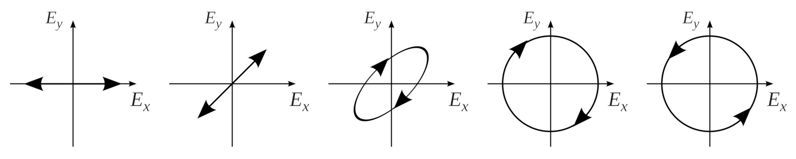
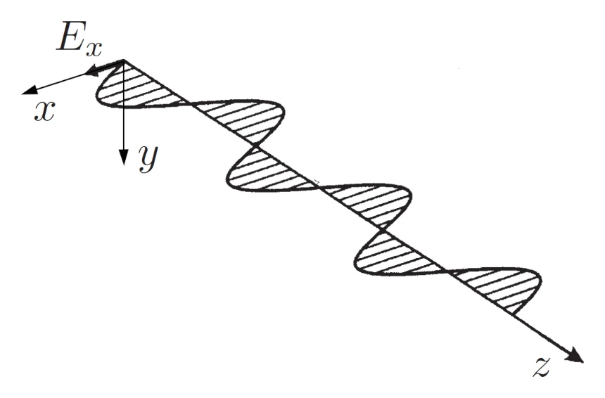
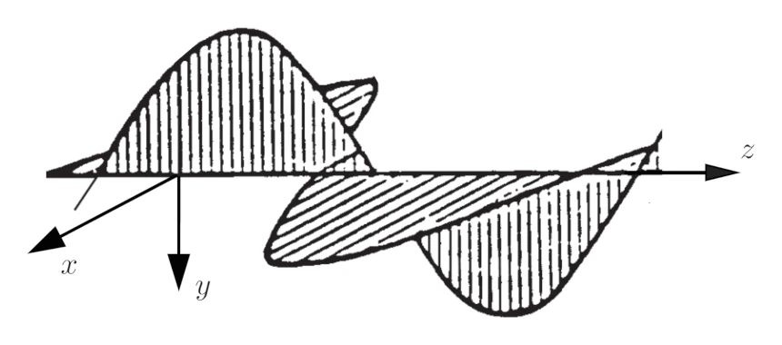
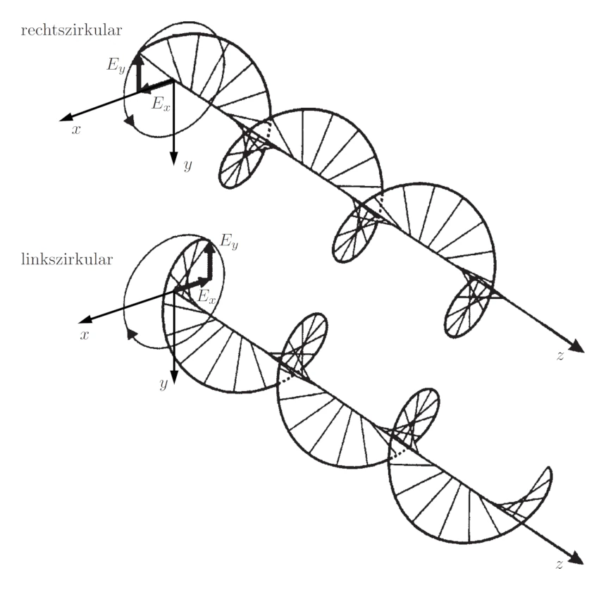
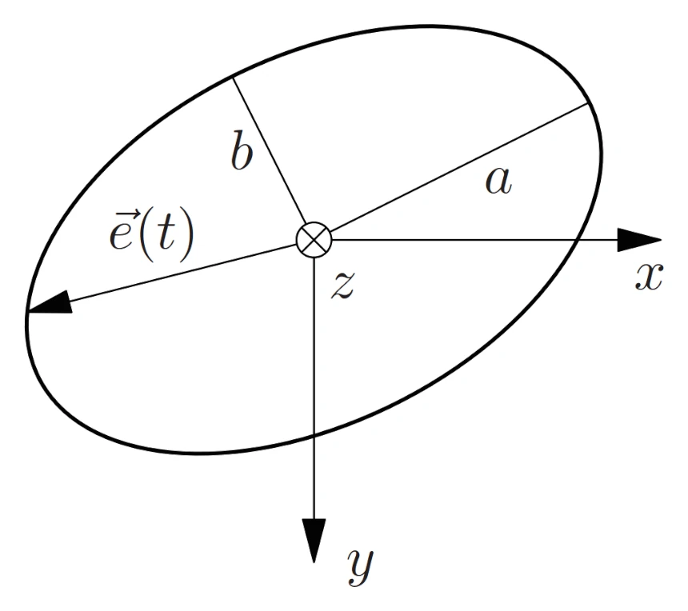

icon:: ⚛
inherit-color-icon-from:: [[logseq-page-color-red]] 
template-used:: standard-page
tags:: [[uni]], [[wellenausbreitung]], [[photonik]] 
alias:: polarisations, polarisiert, polarisiertes, polarized

- 
- 
  lineare [[polarisation]]
- 
  elliptische [[polarisation]]
- 
  rechts/links zirkulare [[polarisation]]
- zirkular [[polarisiertes]] licht hat gleiche anteile s- wie p-[[polarisiertes]] licht
- 
  id:: 673626f1-7a7f-4324-88a7-2e0ecdfd2cb8
- $\epsilon = \frac{a}{b}~,\quad \epsilon = 20 \log \left(\frac{b}{a} \right)$
  tags:: formel
  bezeichnung:: elliptizität einer elektromagnetischen welle
  id:: 67360dd7-52ba-4a90-a63b-ad4871a896af
	- $\epsilon$ ... elliptizität [link](((673626f1-7a7f-4324-88a7-2e0ecdfd2cb8))) $\mathrm{\left[ - \right]}$ oder $\mathrm{\left[ dB \right]}$
	- $a,b$ ... hauptachsen ($b$ ist immer die kurze achse) $\mathrm{\left[ m \right]}$