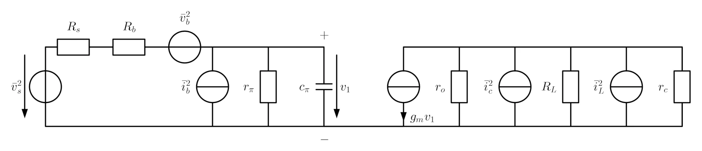
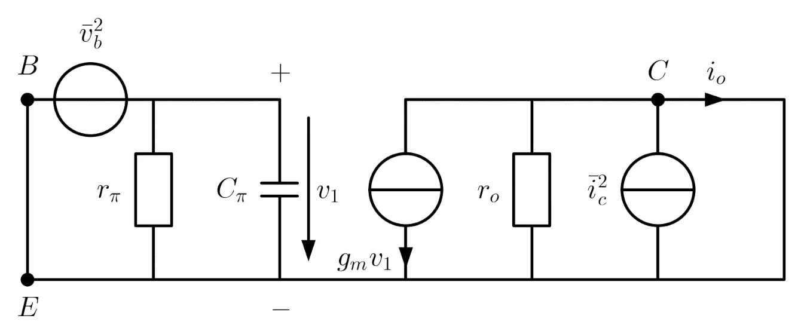

public:: true
icon:: 🔌
inherit-color-icon-from:: [[logseq-page-color-red]]
tags:: uni

- [📁 folder](file://C:\Users\Matteo\Documents\Uni\Schaltungstechnik)
- ## vorlesungen
- ## beispiele
	- ### Verstärkungsfehler
	  background-color:: green
		- a) Zeichnen Sie eine Invertierende OV-Grundschaltung
		  background-color:: green
		- b) und berechnen Sie den Einfluss einer endlichen Geradeaus-Leerlaufverstärkung.
		  background-color:: green
			- formeln
			  collapsed:: true
				- $u_{en}=-\frac{u_{a}}{v_{g}}$
				  tags:: [[formel]], [[opv]]
				  bezeichnung:: potential am negativen [[opv]] kontakt, wenn $u_{ep}=0$ [(ref)](((666c479b-dc31-47d7-afdf-857e3e084817))) [V]
					- $u_a$ ... ausgangsspannung [V]
					  $v_g$ ... geradeaus-leerlaufverstärkung [-]
				- ${v_{g}=\frac{u_{a}}{u_{ep}-u_{en}}}$
				  id:: 666c479b-dc31-47d7-afdf-857e3e084817
				  tags:: [[formel]], [[vv-opv]], [[opv]]
				  bezeichnung:: geradeaus leerlaufverstärkung (open loop gain) (wenn ideal, $v_{g\infty}=\infty$) [-]
				  collapsed:: true
					- $u_{en}$ ... potential am negativen [[opv]] kontakt [V]
					  $u_{ep}$ ... potential am positiven [[opv]] kontakt [V]
					  $u_{a}$ ... ausgangsspannung [V]
				- ${{v_{gt}=\frac{2\cdot u_{a}}{u_{ep}-u_{en}}}}$
				  tags:: [[formel]], [[vv-opv]], [[opv]]
				  bezeichnung:: gleichtaktverstärkung (open loop gain) (wenn ideal, $v_{gt\infty}=0$) [-]
				  collapsed:: true
					- $u_{en}$ ... potential am negativen [[opv]] kontakt [V]
					  $u_{ep}$ ... potential am positiven [[opv]] kontakt [V]
					  $u_{a}$ ... ausgangsspannung [V]
				- ${v_{r}=\frac{u_{a}}{u_{e}}}$
				  tags:: [[formel]], [[vv-opv]], [[opv]]
				  bezeichnung:: verstärkung/übertragungsfunktion (closed loop gain) (wenn ideal, $v_{r\infty}$) [-]
					- $u_{e}$ ... eingangsspannung [V]
					  $u_{a}$ ... ausgangsspannung [V]
				- ${v_{s}=\beta\cdot v_{g}}$
				  tags:: [[formel]], [[vv-opv]], [[opv]]
				  bezeichnung:: schleifen verstärkung (loop gain) (wenn ideal, ??) [-]
				  id:: 6676c9a3-b64a-4899-92bd-d0463f4b9f84
				  collapsed:: true
					- $\beta$ ... schleifen verstärkung [-]
					  id:: 6676c9a3-049d-440e-a8ca-be6997a6aa76
					  $v_{g}$ ... geradeaus leerlaufverstärkung [-]
		- c) Berechnen Sie den Fehlerfaktor $F$.
		  background-color:: green
		- canvas
		  collapsed:: true
			- [[draws/2024-06-13-16-48-03.excalidraw]]
		- d) kreuzen sie den richtigen an.
		  background-color:: green
		  id:: 666c6b2d-53cf-48a6-a98f-e7f51157b0b3
			- formeln
			  collapsed:: true
				- $\beta=-\frac{u_{ed}}{u_{a}}$
				  tags:: [[formel]], [[opv]]
				  bezeichnung:: rückkopplungsfaktor (feedback ratio) [-]
				  collapsed:: true
					- $u_{ed}$ ... differenzenspannung an [[opv]] [V]
					  $u_a$ ... ausgangsspannung [V]
			- {:width 400}
			- [📚 2024-06-14 18h23m.xopp](../assets/documents/2024-06-14 18h23m.xopp)
			- 
	- ### Integration von Systemen
	  background-color:: green
		- Berechnen Sie den Widerstand einer 200nm weiten und 1µm langen Leiterbahn, wenn sie einen Schichtwiderstand von 1Ω/□ aufweist.
		  background-color:: green
			- formeln
			  collapsed:: true
				- $R_{\square}=\frac{\rho}{H}$
				  tags:: [[formel]]
				  bezeichnung:: [[Schichtwiderstand]] einer Leiterbahn [Ω]
					- $\rho$ ... Spezifischer Widerstand [Ω⋅m]
					- $H$ ... Höhe des Leiters
				- $R=R_{\square}\cdot\frac{L}{W}$
				  tags:: formel
				  bezeichnung:: Leiterbahn widerstand aufgrund des [[Schichtwiderstands]] [Ω]
				  collapsed:: true
					- $R_{\square}$ ... [[Schichtwiderstand]] [Ω/□]
					- $L$ ... Länge der Leiterbahn [m]
					- $W$ ... Weite/Breite der Leiterbahn [m]
		- [📚 2024-06-16 20h34m.xopp](../assets/documents/2024-06-16 20h34m.xopp)
		- 
	- ### Verstärker
	  background-color:: green
		- {:width 400}
		- a) Berechnen Sie die Ausgangsspannung in Abhängigkeit von den Eingangsspannungen mittels Superposition
		  background-color:: green
		- b) Berechnen Sie $R_1$ und $R_3$
		  background-color:: green
		  für $f=0$:
		  $u_{a}\left(0\right)=u_{e1}-0.5u_{e2}$
		  
		  für $f\gg f_{g}$:
		  ${u_{a}\left(\infty\right)=1.5u_{e1}-0.5u_{e2}}$
		- $R_1=\text{10k}\Omega;R_3=\text{10k}\Omega$
		  background-color:: red
		- c) Berechnen Sie die Grenzfrequenzen $f_{g1}$ und $f_{g2}$
		  background-color:: green
			- formeln
			  collapsed:: true
				- $G=\frac{1}{1+j\frac{\omega}{\omega_{g}}}$
				  tags:: formel, Kreisfrequenz, Frequenz, Übertragungsfunktion, Tiefpass, wip
				  bezeichnung:: Standard Darstellung der [[Übertragungsfunktion]] des [[Tiefpasses]], um [[Grenzkreisfrequenz]] abzulesen
					- ${}\omega$ ... Kreisfrequenz. Freie Variable [rad/s]
					- ${}\omega_{g}$ ... Grenzkreisfreuquenz [rad/s]
				- ${G=j\frac{\omega}{\omega_{g}}}$
				  tags:: formel, Kreisfrequenz, Frequenz, Übertragungsfunktion, wip
				  bezeichnung:: Standard der Übertragungsfunktion des Hochpasses, um Grenzkreisfrequenz abzulesen
					- ${}\omega$ ... Kreisfrequenz. Freie Variable [rad/s]
					- ${}\omega_{g}$ ... Grenzkreisfreuquenz [rad/s]
				- ${}\omega=2\cdot\pi\cdot f$
				  tags:: formel, Kreisfrequenz, Frequenz, Übertragungsfunktion
				  bezeichnung:: Kreisfrequenz [rad/s]
				  collapsed:: true
					- ${}f$ ... Frequenz [Hz]
		- d) Wie groß ist der Fehler der Verstärkung $v_1=\frac{u_{a1}}{u_{e1}}$ (Abweichung Ist-Wert vom Soll-Wert) bei 10MHz?
		  background-color:: green
		- e) Zeichnen Sie den Betragsfrequenzgang (Knickzugnäherung!) von $v_1=\frac{u_{a1}}{u_{e1}}$
		  background-color:: green
		- f) Zeichnen Sie den Phasengang (Knickzugnäherung!) von $v_1=\frac{u_{a1}}{u_{e1}}$
		  background-color:: green
		- [📚 2024-06-17 10h14m.xopp](../assets/documents/2024-06-17 10h14m.xopp)
		- 
	- ### Komplexer Rückkopplungsfaktor
	  background-color:: green
		- {:width 400}
		- a) Berechnen Sie den komplexen Rückkopplungsfaktor $\beta$ der gegebenen Schaltung (symbolisch).
		  background-color:: green
		- b) Berechnen Sie die Grenzfrequenz des Poles des Rückkopplungsfaktors
		  background-color:: green
		- [📚 2024-06-18 17h45m.xopp](../assets/documents/2024-06-18 17h45m.xopp)
		- 
	- ### zeichnen Sie ein ESB eines [[bipolar transistor]] mit aquivalenten Eingangsrauschquellen ein und leiten Sie diese aus den Rauschgeneratoren ab
	  background-color:: green
		- {{embed ((6671b8bb-800c-461e-91dd-48a72f080ce5))}}
	- ### zeichnen Sie ein ESB eines [[feldeffekt transistor]] mit aquivalenten Eingangsrauschquellen ein und leiten Sie diese aus den Rauschgeneratoren ab
	  background-color:: green
	  id:: 66743f7f-14d4-4c99-a772-69c8950d1eff
		- {{embed ((6673e06c-7213-47d6-bed7-1743a3123e42))}}
		  id:: f7743fca-c3be-438e-8c6c-d6176541e98b
	- ### Welche Ausgangsspannung liefert die Schaltung?
	  background-color:: green
		- {:width 400}
		- [📚 2024-06-21 15h56m.xopp](../assets/documents/2024-06-21 15h56m.xopp)
		- 
	- ### Welche Ausgangsspannung liefert die Schaltung?
	  background-color:: green
		- {:width 400}
		- [📚 2024-06-21 16h18m.xopp](../assets/documents/2024-06-21 16h18m.xopp)
		- 
	- ### [[Tiefpassfilter]]
	  background-color:: green
		- a) Zeichnen sie die Schaltung eines invertierenden Tiefpassfilters mit OPV!
		  background-color:: green
		- b) dimensionieren sie den Filter so, dass er folgende Ubertragungsfunktion hat! (OPV idealisiert) $\\ \frac{-10}{1+\frac{j2\pi f}{1\text{kHz}}}$
		  background-color:: green
		- [📚 2024-06-22 17h08m.xopp](../assets/documents/2024-06-22 17h08m.xopp)
		- 
	- ### [[Bodediagramm]] Schleifenverstärkung
	  background-color:: green
		- a) Zeichnen Sie in das gegeben [[Bodediagramm]] die Schleifenverstärkung ein
		  background-color:: green
		- b) Geben Sie die Formel für die Schleifenverstärkung an
		  background-color:: green
		- c) Zeichnen Sie die [[Phasenreserve]] ein.
		  background-color:: green
			- formeln
				- ${}\Delta\varphi=\arg\left(v_{s}\right)$ wenn $|v_{s}|=1$ bzw. $|v_{s\text{ dB}}|=0$
				  tags:: formel, [[Bodediagramm]]
				  bezeichnung:: Phasenreserve  [°]
					- $v_s$ ... [Schleifenverstärkung](((6676c9a3-b64a-4899-92bd-d0463f4b9f84))) [dB]
			- [📚 2024-06-23 11h25m.xopp](../assets/documents/2024-06-23 11h25m.xopp)
			- 
	- ### Sensorschaltung
	  background-color:: green
		- {:width 600}
		- Mit der angegebenen schaltung sollen die spannungsausgänge von 3 sensoren gewichtet addiert werden
		  background-color:: green
			- $|A_1|=|\frac{\underline{U}_{a1}}{\underline{U}_{e1}}|=2$, $|A_2|=|\frac{\underline{U}_{a1}}{\underline{U}_{e2}}|=1$, $|A_3|=|\frac{\underline{U}_{a1}}{\underline{U}_{e3}}|=1.333$
			- Die sensorsignale treten mit einer maximalen frequenz von $f_{sens}=50\text{kHz}$ auf. eine nahegelegene schaltung verursacht auf der störfrequenz $f_{stör}=50\text{MHz}$ eine störung die mindestens 100-fach gegenüber dem Nutzsignal abgeschwächt werden soll. der betrag der niederfrequenten verstärkung des OV2 ${|A_{OV2}|=|\frac{\underline{U}_{a2}}{\underline{U}_{a1}}|}$ soll 10 betragen
			- weiters gegeben sind: $R_3=2\text{k}\Omega$, $R_5=10 \text{k} \Omega$, $R_6=1 \text{k}\Omega$, $R_8=10 \text{k} \Omega$
		- a) opvs ideal. berechne $R_1$
		  background-color:: green
		- b) opvs ideal. berechne $R_2$
		  background-color:: green
		- c) opvs ideal. berechne $R_4$
		  background-color:: green
		- d) opvs ideal. berechne die grenzfrequenz $f_{g}$, dass die obigen bedingungen eingehalten werden
		  background-color:: green
		- e) opvs ideal. berechne $R_7$
		  background-color:: green
		- f) opvs ideal. berechne $C$
		  background-color:: green
		- g) opvs ideal. zeichne den betragsfrequenzgang der verstärkung $|\frac{\underline{U}_{a2}}{\underline{U}_{e3}}|$ (knickzugnäherung)
		  background-color:: green
		- h) opvs ideal. zeichne den phasenfrequenzgang der verstärkung $|\frac{\underline{U}_{a2}}{\underline{U}_{e3}}|$ (knickzugnäherung)
		  background-color:: green
		- [📚 2024-06-23 18h58m.xopp](../assets/documents/2024-06-23 18h58m.xopp)
		- 
	- ### Slew Rate
	  background-color:: green
		- a) wie groß ist die maximale frequenz für unverzerrte sinusförmige vollaussteuerung ($U_{a}= \hat{U}_{a} \cdot \sin \left( \omega t\right)$)
		  background-color:: green
		- b) zeichne die auswirkung auf ein sinusförmiges signal $U_{a}= \hat{U}_{a} \cdot \sin \left( \omega_1 t\right)$ mit $\omega_{p}=$ maximale unverzerrt übertragbare kreisfrequenz
		  background-color:: green
		- [📚 2024-06-25 18h01m.xopp](../assets/documents/2024-06-25 18h01m.xopp)
		- 
	- ### Hochpassfilter #wip
	  background-color:: green
		- [📚 2024-06-26 10h59m.xopp](../assets/documents/2024-06-26 10h59m.xopp)
		- 
	- ### CMOS multiplexer
	  background-color:: green
		- [📚 2024-06-26 11h16m.xopp](../assets/documents/2024-06-26 11h16m.xopp)
		- 
- ## flashcards
	- ### index
	  collapsed:: true
		- {{query (and [[flashcard]] (page [[schaltungstechnik]]))}}
		  query-table:: true
		  query-properties:: [:block :tags]
		  query-sort-by:: block
		  query-sort-desc:: false
	- welche arten des [[rauschens]] gibt es? 
	  deck:: Uni::Schaltungstechnik_Theorie
	  tags:: flashcard
	  id:: 667bb0d9-e45b-42dc-9b77-3e4d039a6599
		- ((667b092b-dad5-493e-b7c7-d98cdefef492))
		- ((667b08a1-5da1-445d-9e45-897c1f96e825))
		- ((667b11a2-3589-4353-aeed-70fac1313b8a))
		- ((667afa05-a7fb-4630-9979-446113e45ff7))
		- ((667b11a2-0e7c-4d83-b124-2abb6a47676f))
		- ((667b09c0-6b33-4154-aef3-ded0255ace46))
	- wie kann man Stabilität im Bodediagramm feststellen?
	  deck:: Uni::Schaltungstechnik_Theorie
	  tags:: flashcard
	  id:: 667b288f-9c7f-4f30-91a7-6e89cffa85e7
		- Schwingungsbedingung
			- wenn bei $|G|=1$ die phase $\varphi=180\degree$ erreicht ist, dann ist die schaltung instabil, da mitkopplung
	- Zeichne das Kleinsignalersatzschaltbild inklusive aller Rauschgeneratoren und Formeln
	  {:width 400} 
	  deck:: Uni::Schaltungstechnik_Theorie
	  tags:: flashcard, schaltung, [[bipolar transistor]]
	  id:: 667b2313-7130-42a7-a847-944dcdff87b3
		- {:width 800}
	- kollektorschaltung
	  deck:: Uni::Schaltungstechnik_Theorie
	  tags:: flashcard, bidirectional, [[transistor]], [[schaltung]], [[bipolar transistor]]
	  id:: 667b22a2-de0a-426b-936b-b9cd6352ce19
		- {:width 400}
	- emitterschaltung
	  deck:: Uni::Schaltungstechnik_Theorie
	  tags:: flashcard, bidirectional, [[transistor]], [[schaltung]], [[bipolar transistor]]
	  id:: 667b2294-f51f-4de5-8ce4-3c0248999024
		- {:width 400}
	- basisschaltung
	  deck:: Uni::Schaltungstechnik_Theorie
	  tags:: flashcard, bidirectional, [[transistor]], [[schaltung]], [[bipolar transistor]]
	  id:: 667b224f-172f-4a4d-83f5-3f64adb34ae0
		- {:width 400}
	- [[stromverteilungs rauschen]] ([[partition noise]])
	  deck:: Uni::Schaltungstechnik_Theorie
	  tags:: flashcard, [[rauschen]]
	  id:: 667afa05-a7fb-4630-9979-446113e45ff7
		- wenn Ladungsträger, die den [[Strom]] $I$ tragen, auf zwei verschiedenen Elektroden landen können, dann wird durch die statistischen Schwankungen der Stromverteilung ein zusätzliches [[rauschen]] hervorgerufen
		- typischer fall ist der [[bipolar transistor]], wo sich der strom auf [[Basis]] und [[Kollektor]] aufteilen kann
	- [[lawinen rauschen]] ([[avalanche noise]])
	  deck:: Uni::Schaltungstechnik_Theorie
	  tags:: flashcard, [[rauschen]]
	  id:: 667b11a2-0e7c-4d83-b124-2abb6a47676f
		- tritt auf bei zener dioden oder avalanche durchbruch im pn-übergang
		- kann durch einen einzelnes $e^{-}$ verursacht werden -> lawinenmultiplikation
	- Warum werden parallel geschaltene [[transistoren]] verwendet? Vorteile, Nachteile?
	  deck:: Uni::Schaltungstechnik_Theorie
	  tags:: flashcard, [[transistor]]
	  id:: 667b11a2-ea50-4c9e-958d-27fdda234829
	  collapsed:: true
		- bei Hochleistungsverstärker kann oft ein [[Transistor]] die last nicht alleine tragen, daher müssen mehrere parallel geschalten werden.
		- vorteile
		  collapsed:: true
			- skalierbar. man kann im nachhinein mehr leistungsfähigkeit hinzufügen
		- nachteile
		  collapsed:: true
			- komplexer
			- geringerer [[wirkungsgrad]] aufgrund von $R_{E}$
		- {:width 400}
	- Durch welche Maßnahmen lässt sich der Einfluss des Leitwiderstandes der Analogschalter weitgehend eliminieren?
	  {:width 400}
	  deck:: Uni::Schaltungstechnik_Theorie
	  tags:: flashcard
	  id:: 667b11a2-eb7a-470f-bc5f-3c204a815317
	  collapsed:: true
		- in dem ein weiterer schalter eingebaut wird um den selben spannungsabfall zu erzeugen
		- {:width 400}
	- was ist der stromflusswinkel und wie schaut er für den a/ab/b betrieb aus?
	  deck:: Uni::Schaltungstechnik_Theorie
	  tags:: flashcard
	  id:: 667af4e8-753a-49e5-9611-b6886f7e9664
	  collapsed:: true
		- {:width 400}
		  id:: 82ad4c74-8901-4beb-8e30-8f952015e015
		- der stromflusswinkel ist definiert, als jener strom der durch den "ausgangstransistor" in einer periode fließt
		- [hier](((82ad4c74-8901-4beb-8e30-8f952015e015))) ist grün der a-betrieb, gelb der ab-betreib, rot der b-betrieb
		- {{embed ((666bec6f-8035-4981-a281-6440fe48db6e))}}
		- {{embed ((666bec6f-5a7a-4513-87df-2a7b0293fc97))}}
		- {{embed ((666bec6f-f6b7-41e7-95b9-ede73db9ff4d))}}
	- was ist die slew rate?
	  deck:: Uni::Schaltungstechnik_Theorie
	  tags:: flashcard
	  id:: 667adbd1-c1f1-4569-9875-05860329ede7
	  collapsed:: true
		- das ist die maximale rate mit der das ausgangssignal ansteigen kann
		- sie hängt von der korrektur kapazität $C_{k}$ ab. der maximale [[basis]][[strom]] begrenzt die umladegeschwindigkeit des [[kondensators]]
		- ${SR= \left. \frac{\text{d}U_{a}}{\text{d}t} \right\rvert_{max}}$
		  tags:: formel
		  bezeichnung:: maximale anstiegsgeschwindigkeit (slew rate) [V/s]
		  collapsed:: true
			- $U_a$ ... ausgangsspannung [V]
			- $\frac{\text{d}}{\text{d}t}$ ... zeit ableitung [s]
	- um welche schaltungen handelt es sich?
	  id:: 4563c626-e7a9-4cf1-b71c-2e4b35112971
	  deck:: Uni::Schaltungstechnik_Theorie
	  tags:: flashcard, bidirectional
	  collapsed:: true
	  {:width 350} {:width 400}
		- elektrometer verstärker
		- beweis, dass das, das selbe ist
			- [📚 2024-06-25 17h17m.xopp](../assets/documents/2024-06-25 17h17m.xopp)
			- 
	- Beschreibe die Vor- und Nachteile der Kaskodenschaltung, das Funktionsprinzip und wo sie eingesetzt werden
	  id:: 667ad3da-0b01-4ddb-8e99-b9f5eb29b683
	  deck:: Uni::Schaltungstechnik_Theorie
	  tags:: flashcard
	  collapsed:: true
		- vorteile
		  collapsed:: true
			- hohe [[verstärkung]] durch hohen [[Ausgangswiderstand]]
			- geringe rückkopplung an den eingang durch kompensation der [[Miller-Kapazität]]
		- nachteil
		  collapsed:: true
			- geringerer ausgangsspannungshub durch zusätzlichen [[transistor]] $T_2$
		- funktionsweise
		  collapsed:: true
			- der [[transistor]] $T_1$ arbeitet in emitterschaltung, bei der der [[transistor]] $T_2$ den
			  [[kollektor]][[widerstand]] ersetzt. $T_2$ arbeitet in [[basis]][[schaltung]]. im arbeitspunkt fließt durch
			  beide [[transistoren]] der gleiche strom, wenn man den basisstrom von $T_2$ vernachlässigt.
		- einsatz [link](https://en.wikipedia.org/wiki/Cascode#Other_applications)
			- in stromspiegeln bei [[MOSFET]]s
			- in okmbination mit spannungs leitern, können auch hochspannungs transistoren aufgebaut werden
	- um welche schaltung handelt es sich?
	  {:width 400} 
	  deck:: Uni::Schaltungstechnik_Theorie
	  tags:: flashcard, bidirectional
	  id:: 667ad2c9-6131-4de2-b271-12b0c3ac0ea5
		- kaskodenschaltung
	- komplementärer emitterfolger im ab-betrieb
	  deck:: Uni::Schaltungstechnik_Theorie
	  tags:: flashcard, [[transistor]]
	  id:: 66798cbb-c707-42ef-9f83-8b1333cd2f9f
	  collapsed:: true
		- {:width 400}
		- die schaltung hat ähnlichkeiten zu jener im b-betrieb, nur dass zwischen den basis kontakten von $T_1$ und $T_2$ eine offset spannung erzeugt werden muss um die [[transistoren]] "vorzuladen". dafür wird die flussspannung der dioden verwendet
	- komplementärer emitterfolger im b-betrieb
	  id:: 66798c85-f29b-4f69-babf-ff80b25b42c3
	  deck:: Uni::Schaltungstechnik_Theorie
	  tags:: flashcard, bidirectional, [[transistor]]
	  collapsed:: true
		- {:width 400, :height 366}
	- betriebsbereiche auf der arbeitsgeraden
	  deck:: Uni::Schaltungstechnik_Theorie
	  tags:: flashcard, [[transistor]]
	  id:: 66798c2f-83a4-4c98-bd95-d133abfe74af
	  collapsed:: true
		- {:width 400}
	- emitterfolger im a-betrieb
	  id:: 66797db4-ed02-4d2f-b95d-6170acfe22d8
	  deck:: Uni::Schaltungstechnik_Theorie
	  tags:: flashcard, [[transistor]]
	  collapsed:: true
		- {:width 400}
		- arbeitspunkteinstellung mittels $R_{a}$ und $R_{b}$
	- Ausgangskennlinienfeld eines [[feldeffekttransistor]] mit Early-Spannung
	  deck:: Uni::Schaltungstechnik_Theorie
	  tags:: flashcard, [[feldeffekt transistor]]
	  id:: 6677fabb-3354-443d-8cdf-c12a6c88c095
	  collapsed:: true
		- {:width 800}
	- Ausgangskennlinienfeld eines [[bipolartransistors]] mit Early-Spannung
	  deck:: Uni::Schaltungstechnik_Theorie
	  tags:: flashcard, [[bipolar transistor]]
	  id:: 6677fabb-12af-4305-b099-5648ef43cc3c
	  collapsed:: true
		- {:width 800}
	- was ist die korrekte Ersatzschaltung für die Berechnung der Eingangsrauschgrößen der Gesamtschaltung
	  $\bar{v_{ia}}^2$, $\bar{i_{ia}}^2$ ... Eingangsrauschgrößen des Verstärkers
	  {:width 400}
	  deck:: Uni::Schaltungstechnik_Theorie
	  tags:: flashcard
	  id:: 6677fabb-534f-4505-acec-5a2a99ce3749
	  collapsed:: true
		- {:width 400}
	- Was ist das Problem bei der Integration von Frequenzgangskompensation? Abhilfe?
	  deck:: Uni::Schaltungstechnik_Theorie
	  tags:: flashcard
	  id:: 6677fabb-a4cf-4f39-8a96-238e601b942f
	  collapsed:: true
		- Es können keine Grenzfrequenzen $f_{g1}$ zustande kommen, welche sehr große Kapazitäten benötigen, da die chipfläche dafür nicht ausreicht. 
		  id:: 6676cb72-d904-4077-a2b6-884180951197
		- Durch [Pole-splitting](((6676c9a3-b141-486d-bed1-f2178e1cf8d6))) wird der [[Miller-Effekt]] ausgenützt, wodurch die [[Miller-Kapazität]], um die Spannungsverstärkung vergrößert wird. außerdem bewirkt der effekt, eine gegenkopplung die $R_{a}$ reduziert. dadurch erhöht sich die Frequenz $f_{g2}$ (pole splitting)
		- die kritische frequenz $f_{k}$ wird, dann durch $f_{g3}$ statt $f_{g2}$ bestimmt.
		  background-color:: yellow
	- was ist die angepasste Freqeunzgangskorrektur, worin besteht der Unterschied zur universellen Freqeunzgangskorrektur?
	  id:: 6676c9a3-13b0-4836-b587-f58ce52c2373
	  deck:: Uni::Schaltungstechnik_Theorie
	  tags:: flashcard, stabilität
	  collapsed:: true
		- Universelle Frequenzgangskompensation
		  id:: 6676c9a3-1459-4529-b983-d95f15222160
		  collapsed:: true
			- für alle äußeren ohmschen Beschaltungen stabil
		- Angepasste Frequenzgangkorrektur
		  collapsed:: true
			- nur für $A_0>1$ stabil, aber dafür größere Bandbreite
			- $f_{g1}$ kann um $A_0$ größer gewählt werden
		- {:width 800}
	- was ist die Frequenzgangskompenstaion mit Pole Splitting und warum ist sie notwendig?
	  id:: 6676c9a3-b141-486d-bed1-f2178e1cf8d6
	  deck:: Uni::Schaltungstechnik_Theorie
	  tags:: flashcard, stabilität
	  collapsed:: true
		- die frequenzgangskompensation ist eine methode um im aktiven verstärkerbereich des OPVs ($v_{g}\ge0\text{dB}$) nur einen Pol wirksam zu machen. Der Verstärker ist durch den modifizieren Frequenzgang, selbst bei gegenkopplung stabil.
		  collapsed:: true
			- frequenzgangskompensation ist notwendig um stabilität zu gewährleisten
		- pole splitting bezieht sich daruaf, dass die pole $f_{g1}$ und $f_{g2}$ auseinander geschoben werden.
		- dabei soll die verstärkung $=0\text{dB}$ bei $f_{g2}$ sein
		  background-color:: yellow
		- {:width 400}
	- Um welche Schaltung handelt es sich?
	  {:width 400} 
	  deck:: Uni::Schaltungstechnik_Theorie
	  tags:: flashcard, schaltung, wip
	  id:: 6676c9a3-d59d-40fa-8467-edb6cb47a58d
	  collapsed:: true
		- Komplementärer [[Emitterfolger]] im [[AB-Betrieb]] mit 2 [[dioden]]
	- Um welche Schaltung handelt es sich?
	  {:width 400} 
	  deck:: Uni::Schaltungstechnik_Theorie
	  tags:: flashcard, schaltung, wip
	  id:: 6676c9a3-adcd-4741-bdb3-1224f5c0ff5e
	  collapsed:: true
		- Komplementärer [[Emitterfolger]] im [[AB-Betrieb]]
		- variable z-diode
	- Um welche Schaltung handelt es sich?
	  {:width 400} 
	  deck:: Uni::Schaltungstechnik_Theorie
	  tags:: flashcard, opv, schaltung
	  id:: 66758c5d-52e5-4df4-adb2-005e64dcc518
	  collapsed:: true
		- vv-opv
		- breitband operationsverstärker
	- Um welche Schaltung handelt es sich?
	  {:width 400} 
	  deck:: Uni::Schaltungstechnik_Theorie
	  tags:: flashcard, opv, schaltung
	  id:: 6675ac34-866b-4ad7-bc59-dbd564eb744b
	  collapsed:: true
		- vc-opv
		- transkonduktanz verstärker
	- Um welche Schaltung handelt es sich?
	  {:width 400} 
	  deck:: Uni::Schaltungstechnik_Theorie
	  tags:: flashcard, opv, schaltung
	  id:: 6675ac5d-8778-4e60-ab64-af3d4e5f4b1b
	  collapsed:: true
		- cv-opv
		- transimpedanz verstärker
	- Um welche Schaltung handelt es sich?
	  id:: 6675ac86-d96a-46a5-9c93-10837ab591b7
	  deck:: Uni::Schaltungstechnik_Theorie
	  tags:: flashcard, opv, schaltung
	  collapsed:: true
	  {:width 400} {:width 371}
		- cc-opv
		- stromverstärker
	- pnp [[transistor]]
	  deck:: Uni::Schaltungstechnik_Theorie
	  tags:: flashcard, [[bipolar transistor]] , transistor
	  id:: 28177fa4-5eca-44ba-8ad3-efb571bcda1f
	  collapsed:: true
		- {:width 75}
		- [[eselsbrücke]]: ***P***feil ***N***ach ***P***ipi (innen)
		- $U_{f}<0$ und $U_{BE}\le U_{f}$
		  tags:: formel
		  bezeichnung:: bedingungen für das durchschalten eines npn [[transistors]]
		  collapsed:: true
			- $U_{f}$ ... fluss spannung [V]
			- $U_{BE}$ ... [[Basis]]-[[Emitter]] spannung [V]
	- npn [[transistor]]
	  deck:: Uni::Schaltungstechnik_Theorie
	  tags:: flashcard, [[bipolar transistor]] , transistor
	  id:: 667539fc-ea92-4f08-b9fc-54dc7af86e44
	  collapsed:: true
		- {:width 75}
		- [[eselsbrücke]]: ***N***icht ***P***feil ***N***ach innen
		- $U_{f}>0$ und $U_{BE}\ge U_{f}$
		  tags:: formel
		  bezeichnung:: bedingungen für das durchschalten eines npn [[transistors]]
		  collapsed:: true
			- $U_{f}$ ... fluss spannung [V]
			- $U_{BE}$ ... [[Basis]]-[[Emitter]] spannung [V]
	- p-Kanal MOSFET enhancement mode (selbstsperrend) schaltzeichen und bedingung
	  id:: 66752f65-2498-48e4-8dac-a9f3bf86f354
	  deck:: Uni::Schaltungstechnik_Theorie
	  tags:: flashcard, MOSFET, transistor, FET
	  collapsed:: true
		- {:width 73} {:width 100}
		- der freie [[Bulk]] anschluss macht nicht wirklich was. er sollte nur gelten $\varphi_{B}\ge\varphi_{S}$
		- $U_{th}<0$ und ${}U_{GS}\le U_{th}$
		  tags:: formel
		  bezeichnung:: bedingungen für das durchschalten eines nMOS [[transistors]]
		  collapsed:: true
			- $U_{th}$ ... threshold spannung [V]
			- $U_{GS}$ ... [[Gate]]-[[Source]] spannung [V]
	- n-Kanal MOSFET enhancement mode (selbstsperrend) schaltzeichen und bedingung
	  id:: 667518c4-dc59-4d4f-9d00-c081b5420c2c
	  deck:: Uni::Schaltungstechnik_Theorie
	  tags:: flashcard, MOSFET, transistor, FET
	  collapsed:: true
		- {:width 86} {:width 100}
		- [[eselsbrücke]]: pfeil geht rei***N***
		- der freie [[Bulk]] anschluss macht nicht wirklich was. er sollte nur gelten $\varphi_{B}\le\varphi_{S}$
		- $U_{th}>0$ und ${}U_{GS}\ge U_{th}$
		  tags:: formel
		  bezeichnung:: bedingungen für das durchschalten eines nMOS [[transistors]]
		  collapsed:: true
			- $U_{th}$ ... threshold spannung [V]
			- $U_{GS}$ ... [[Gate]]-[[Source]] spannung [V]
	- ${\bar{v_{b}}^2}$ ... Spannungsquadrat des Rauschgenerators an der [[Basis]] eines [[BJT]] im [[kleinsignal]] [[ersatzschaltbild]] [V]
	  id:: 667437ca-2a30-46fc-8b76-f369e56b5a6d
	  deck:: Uni::Schaltungstechnik_Theorie
	  tags:: flashcard, [[bipolar transistor]]
		- ${}\bar{v_{b}}^2=4kTr_{b}\Delta f$
		  id:: 66730db4-b890-499c-9dc8-565d9ab86164
		  tags:: formel, [[rauschen]], [[BJT]], wip
		  bezeichnung:: Spannungsquadrat des Rauschgenerators an der [[Basis]] eines [[BJT]] im [[kleinsignal]] [[ersatzschaltbild]] ([[thermisches rauschen]]) [V]
			- $k$ ... Boltzmannkonstante [J/K]
			- ${}T$ ... [[Temperatur]] [K]
			- ${}r_{b}$ ... Basis Widerstand des [[BJT]] im [[kleinsignal]] modell [Ω]
			- $\Delta f$ ... [[bandbreite]] in der die Schaltung betrieben werden soll [Hz]
		- terme:
			- [[thermisches rauschen]]
	- $\bar{i_{c}}^2$ ... Stromquadrat des Rauschgenerators am [[Kollektor]] eines [[BJT]] im [[kleinsignal]] [[ersatzschaltbild]] [V]
	  id:: 66743b07-2acf-4972-a281-0b0ff3712004
	  deck:: Uni::Schaltungstechnik_Theorie
	  tags:: flashcard, [[bipolar transistor]]
		- ${{}}\bar{i_{c}}^2=2qI_{C}\Delta f$
		  id:: 66730f82-8ebf-44b4-8dc1-c6ffb19cfd68
		  tags:: formel, [[rauschen]], [[BJT]], wip
		  bezeichnung:: Stromquadrat des Rauschgenerators am [[Kollektor]] eines [[BJT]] im [[kleinsignal]] [[ersatzschaltbild]] ([[schrot rauschen]]) [V]
		  collapsed:: true
			- $q$ ...  []
			- ${}I_C$ ... []
			- $\Delta f$ ... [[bandbreite]] in der die Schaltung betrieben werden soll [Hz]
		- terme:
			- [[schrot rauschen]]
	- $\bar{i_{b}}^2$ ... Stromquadrat des Rauschgenerators an der [[Basis]] eines [[BJT]] im [[kleinsignal]] [[ersatzschaltbild]] [V]
	  id:: 66743b07-b038-4302-914a-959f4b33e441
	  deck:: Uni::Schaltungstechnik_Theorie
	  tags:: flashcard, [[bipolar transistor]]
		- $\bar{i_{b}}^2=2qI_{B}\Delta f+K_1\frac{I_{B}^{a}}{f}\Delta f+K_2 \frac{I_{B}^{c}}{1+\left(\frac{f}{f_{c}}\right)^2}\Delta f$
		  id:: 6673c33b-6cae-4a2a-8395-caeb1633cf30
		  tags:: formel, [[rauschen]], [[BJT]], wip
		  bezeichnung:: Stromquadrat des Rauschgenerators an der [[Basis]] eines [[BJT]] im [[kleinsignal]] [[ersatzschaltbild]] (terme: [[schrot rauschen]] , [[funkel rauschen]], [[telegrafen rauschen]]) [A²]
			- $q$ ...  []
			- $I_B$ ... [[Basis]]strom [A]
			- $\Delta f$ ... [[bandbreite]] in der die Schaltung betrieben werden soll [Hz]
			- $K_1$ ... empirischer korrektur faktor je nach bauelement [-]
				- hängt vom herstellungsprozess des bauelementes bzw. des ics ab und kann für bauelemente auf einem wafer wegen kontamination (am jeweiligen ort vorhanden/nicht vorhanden) stark streuen. für rauscharme niederfrequenzschaltungen, die aus diskreten bauelementen oder standard-ics aufgebaut werden, lassen sich die komponenten deshalb bezüglich geringstem 1/f-rauschen selektieren. die amplitudenverteilung des [[1/f-rauschens]] ist nicht gaussisch.
			- $a$ ... eine konstante von $0.5-2$ [-]
			- $f$ ... []
			- $K_2$ ... []
			- $I_{B}^{c}$ ... []
			- $f_{c}$ ... []
		- terme:
			- [[schrot rauschen]]
			- [[funkel rauschen]]
			- [[telegrafen rauschen]]
	- ${\bar{i_{d}}^2}$ ... Stromquadrat des Rauschgenerators am [[Drain]] eines [[FET]] im [[kleinsignal]] [[ersatzschaltbild]] [V]
	  id:: 66743b07-f5cf-4beb-94a9-7b753a74f92d
	  deck:: Uni::Schaltungstechnik_Theorie
	  tags:: flashcard, [[feldeffekt transistor]]
		- $\bar{i_{d}}^2=4kT\frac23g_{m}\Delta f+K_1\frac{I_{D}^{a}}{f}\Delta f$
		  id:: 6673e811-b88b-40a7-a89e-eeccc792600f
		  tags:: formel, [[rauschen]], [[BJT]], wip
		  bezeichnung:: Stromquadrat des Rauschgenerators am [[Drain]] eines [[FET]] im [[kleinsignal]] [[ersatzschaltbild]] (terme: [[thermisches rauschen]], [[funkel rauschen]]) [V]
		  collapsed:: true
			- $k$ ... Boltzmannkonstante [J/K]
			- ${}T$ ... [[Temperatur]] [K]
			- $g_{m}$ ... [[transkonduktanz]] [S]
			- $\Delta f$ ... [[bandbreite]] in der die Schaltung betrieben werden soll [Hz]
			- $K_1$ ...
			- $f$ ...
		- terme
			- [[thermisches rauschen]]
			- [[funkel rauschen]]
	- $\bar{i_{g}}^2$ ... Stromquadrat des Rauschgenerators am [[Gate]] eines [[FET]] im [[kleinsignal]] [[ersatzschaltbild]] [V]
	  id:: 66743beb-5b67-48b7-a428-dbba04461ec1
	  deck:: Uni::Schaltungstechnik_Theorie
	  tags:: flashcard, [[feldeffekt transistor]]
		- $\bar{i_{g}}^2=2qI_{G}\Delta f$
		  id:: 6673e811-14f3-44b0-9001-27b78c58243b
		  tags:: formel, [[rauschen]], [[BJT]], wip
		  bezeichnung:: Stromquadrat des Rauschgenerators am [[Kollektor]] eines [[FET]] im [[kleinsignal]] [[ersatzschaltbild]] ([[schrot rauschen]]) [V]
			- $q$ ...  []
			  collapsed:: true
			- ${}I_G$ ... []
			- $\Delta f$ ... [[bandbreite]] in der die Schaltung betrieben werden soll [Hz]
		- terme:
			- [[schrot rauschen]]
	- [[Transmissiongate]] und dessen [[Ausgangswiderstand]] in Abhängigkeit der [[Eingangsspannung]] 
	  deck:: Uni::Schaltungstechnik_Theorie
	  tags:: flashcard, FET, Schaltung
	  id:: 6671a888-5431-43b7-9f91-dc6edb5a8d71
	  collapsed:: true
		- {:width 400}
		- {:width 400}
	- [[feldeffekttransistor]] als Serienschalter, Funktionsweise und Ausgangswiderstand
	  id:: 6671a888-3d9f-4506-b905-4846d9f0f814
	  deck:: Uni::Schaltungstechnik_Theorie
	  tags:: flashcard, FET, Schalter, Schaltung
	  collapsed:: true
		- {:width 400}
		- für $U_{st}-U_{e}>U_{th}$ sperrt; $r_{a}=R$
		- für $U_{st}-U_{e}<U_{th}$ leitet; $r_{a}=R\parallel r_{ds}$
	- vollständiges Kleinsignalersatzschaltbild mit Rauschgeneratoren [[bipolar transistor]] 
	  id:: 666af93e-b498-429b-a67b-ae43f1984fc4
	  deck:: Uni::Schaltungstechnik_Theorie
	  tags:: flashcard, [[bipolar transistor]], schaltung
	  collapsed:: true
		- {:width 400}
	- Kleinsignalersatzschaltbild mit äquivalenten (b) Rauschgeneratoren [[bipolar transistor]] (Eingangsrauschquellen)
	  id:: 666afba4-09a4-4162-a6ca-03848dbb9db5
	  deck:: Uni::Schaltungstechnik_Theorie
	  tags:: flashcard, [[bipolar transistor]], schaltung
	  collapsed:: true
		- {:width 400}
	- vollständiges Kleinsignalersatzschaltbild mit Rauschgeneratoren [[FET]]
	  id:: 666afc3c-3140-40fb-9700-02273f4f324a
	  deck:: Uni::Schaltungstechnik_Theorie
	  tags:: flashcard, [[feldeffekt transistor]] , schaltung
	  collapsed:: true
		- {:width 400}
	- Kleinsignalersatzschaltbild mit äquivalenten (b) Rauschgeneratoren [[FET]] (Eingangsrauschquellen)
	  id:: 666afcb8-2e55-4729-a71f-211e61d8cd02
	  deck:: Uni::Schaltungstechnik_Theorie
	  tags:: flashcard, [[feldeffekt transistor]] , schaltung
	  collapsed:: true
		- {:width 400}
	- leiten Sie aus den Rauschgeneratoren die äquivalenten Eingangsrauschquellen des [[BJT]] ab
	  id:: 6671b8bb-800c-461e-91dd-48a72f080ce5
	  deck:: Uni::Schaltungstechnik_Theorie
	  tags:: flashcard , [[bipolar transistor]], [[rauschen]], [[transistor]]
		- {:width 400}
		  id:: 6673c33b-d1b0-4c8e-a98e-4242de035fab
		- vereinfachungen:
		  collapsed:: true
			- $C_{\mu}$ wird vernachlässigt
			- kurzschlusslast wird betrachtet
		- äquivalenten Eingangsrauschgeneratoren Erzeugen gleiches Ausgangsrauschen bei idealer Schaltung, wie die Originalrauschgeneratoren
		- Bei der Berechnung der äquivalenten Eingangsrauschgeneratoren kann man folgendermaßen vorgehen:
		  collapsed:: true
			- Eingang beider Schaltungen (a) und (b) kurzschließen und Ausgangsrausch strom $i_{o}$ berechnen, um $\bar{v_{i}}^2$ zu erhalten.
			  logseq.order-list-type:: number
				- vereinfachung:
					- der rauschstrom kommt von einer konstant stromquelle. dadurch, dass $r_{b}\ll r_{\pi}$, fließt der strom hauptsächlich über $r_{b}$. der spannungsabfall daran ist dann sehr klein im vergleich zum spannungsabfall an $r_{\pi}$. daher wird der einfluss von $i_{b}^2$ und $r_{b}$ vernachlässigt.
				- ausgehend von [a)](((6673c33b-d1b0-4c8e-a98e-4242de035fab))), wird der eingang kurzgeschlossen
				- {:width 400}
				- gesamt rauschstrom am ausgang soll bei beiden schaltungen gleich sein
				  collapsed:: true
					- $i_o=g_{m}v_{b}+i_{c}=g_{m}v_{i}$
					- $v_{i}=v_{b}+\frac{i_{c}}{g_{m}}$
				- $v_{b}$ und $i_{c}$ sind unabhängige generatoren daher
				  collapsed:: true
					- $\bar{v_{i}}^2=\bar{v_{b}}^2+\frac{\bar{i_{c}}^2} {g_{m}^2}$
				- jetzt werden ((66730db4-b890-499c-9dc8-565d9ab86164)) und ((66730f82-8ebf-44b4-8dc1-c6ffb19cfd68)) eingesetzt
					- $v_{i}^2=4kTr_{b}\Delta f+\frac{2qI_{C}\Delta f}{g_{m}^2}$
					- $\frac{v_{i}^2}{\Delta f}=4kT\left(r_{b}+\frac{qI_{C}}{2kTg_{m}^2}\right)$
					  collapsed:: true
						- $\frac{kTg_{m}}{qI_{C}}$ das muss irgend eine größe sein die ich nicht kenne
					- ${\frac{v_{i}^2}{\Delta f}=4kT\left(r_{b}+\frac{1}{2g_{m}}\right)}$
					  background-color:: yellow
					  collapsed:: true
						- daraus sieht man, dass die spektrale dichte der äquivalenten rauschspannung von einem Eingangsrauschwiderstand $R_{eq}$ kommt
						- ${{\frac{v_{i}^2}{\Delta f}=4kTR_{eq}}}$
					-
			- Eingang beider Schaltungen (a) und (b) öffnen und $i_{o}$ berechnen um auf $\bar{i_{i}}^2$ zu kommen
			  logseq.order-list-type:: number
				- vereinfachung:
					- die rausch spannungsquelle $\bar{v_{b}}^2$ und der [[Basis]][[widerstand]] $r_{b}$ fallen weg, da der eingang offen ist.
				- ausgehend von [a)](((6673c33b-d1b0-4c8e-a98e-4242de035fab))), bleiben die eingänge offen
				- {:width 400}
				- gesamt rauschstrom am ausgang soll bei beiden schaltungen gleich sein
				  collapsed:: true
					- $i_o=i_c+\beta(j\omega)i_b=\beta(j\omega)i_i$
					  bezeichnung:: rauschstrom am ausgang
					  tags:: formel
						- $i_{c}$ ... [[Kollektor]] rauschstrom [A]
						- $\beta(j\omega)$ ... Stromverstärkung (frequenzabhängig)
						- $i_{b}$ ... [[Basis]] rauschstrom [A]
						- $i_{i}$ ... äquivalenter eingangs rauschstrom [A]
					- $i_{i}=i_{b}+\frac{i_{c}}{\beta\left(j\omega\right)}$
					- $i_{b}$ und $i_{c}$ sind unabhängige generatoren daher
					  collapsed:: true
						- ${\bar{i_{i}}^2=\bar{i_{b}}^2+\frac{\bar{i_{c}}^2}{\left|\beta(j\omega)\right|^2}}$
							- $\beta\left(j\omega\right)=\frac{\beta_0}{1+\frac{\omega}{\omega_\beta}}$
					- jetzt werden ((6673c33b-6cae-4a2a-8395-caeb1633cf30)) und ((66730f82-8ebf-44b4-8dc1-c6ffb19cfd68)) eingesetzt
					  collapsed:: true
						- [[burst noise]] wird vernachlässigt
						- $\bar{i_{i}}^2=2qI_{B}\Delta f+K_1\frac{I_{B}^{a}}{f}\Delta f+\frac{2qI_{C}\Delta f}{|\beta\left(j\omega\right)|^2}$
						- $\frac{\bar{i_{i}}^2}{\Delta f}=2q\left(I_{B}+\frac{K_1}{2q}\frac{I_{B}^{a}}{f}+\frac{I_{C}}{|\beta\left(j\omega\right)|^2}\right)$
						  collapsed:: true
							- daraus sieht man, dass die spektrale dichte des äquivalenten rauschstroms von einem äquivalenten Eingangs-schrot-rauschstrom $I_{eq}$ kommt
							- ${\frac{i_{i}^2}{\Delta f}=2qI_{eq}}$
							-
	- leiten Sie aus den Rauschgeneratoren die äquivalenten Eingangsrauschquellen des [[FET]] ab
	  deck:: Uni::Schaltungstechnik_Theorie
	  tags:: flashcard, wip , [[feldeffekt transistor]] , [[rauschen]], [[transistor]]
	  id:: 6673e06c-7213-47d6-bed7-1743a3123e42
		- {:width 400}
		  id:: c4ee6e12-bbfe-493b-9d00-5fb1a69f697e
		- vereinfachungen:
		  collapsed:: true
			- $C_{gd}$ wird vernachlässigt
			- kurzschlusslast wird betrachtet
		- äquivalenten Eingangsrauschgeneratoren Erzeugen gleiches Ausgangsrauschen bei idealer Schaltung, wie die Originalrauschgeneratoren
		- Bei der Berechnung der äquivalenten Eingangsrauschgeneratoren kann man folgendermaßen vorgehen:
			- Eingang beider Schaltungen (a) und (b) kurzschließen und Ausgangsrausch strom $i_{o}$ berechnen, um $\bar{v_{i}}^2$ zu erhalten.
			  logseq.order-list-type:: number
			  id:: 6673e94c-9857-44f4-b1d9-59ec665faf69
				- vereinfachung:
				  collapsed:: true
					- der [[Gate]] rauschstromgenerator wird [kurzgeschlossen](((6673e94c-9857-44f4-b1d9-59ec665faf69))), daher fällt er weg
				- ausgehend von [a)](((c4ee6e12-bbfe-493b-9d00-5fb1a69f697e))), wird der eingang kurzgeschlossen
				- {:width 400}
				- gesamt rauschstrom am ausgang soll bei beiden schaltungen gleich sein
				  collapsed:: true
					- $i_{o}=i_{d}=g_{m}v_{i}$
					- ${v_{i}=\frac{i_{d}}{g_{m}}}$
					- ${\bar{v_{i}}^2=\frac{\bar{i_{d}}^2}{g_{m}^2}}$
					  collapsed:: true
				- jetzt wird ((6673e811-b88b-40a7-a89e-eeccc792600f)) eingesetzt
					- $v_{i}^2=\frac{4kT\frac23g_{m}\Delta f+K_1\frac{I_{D}^{a}}{f}\Delta f}{g_{m}^2}$
					- ${\frac{v_{i}^2}{\Delta f}=4kT\frac23\frac{1}{g_{m}}+K_1\frac{I_{D}^{a}}{f}\frac{1}{g_{m}^2}}$
					- $\frac{v_{i}^2}{\Delta f}=4kT\left(\frac23\frac{1}{g_{m}}+K_1\frac{I_{D}^{a}}{f}\frac{1}{g_{m}^2}\frac{1}{4kT}\right)$
					  background-color:: yellow
					  collapsed:: true
						- daraus sieht man (angeblich), dass die spektrale dichte der äquivalenten rauschspannung von einem Eingangsrauschwiderstand $R_{eq}$ kommt
						- ${{\frac{v_{i}^2}{\Delta f}=4kTR_{eq}}}$
			- Eingang beider Schaltungen (a) und (b) öffnen und $i_{o}$ berechnen um auf $\bar{i_{i}}^2$ zu kommen
			  logseq.order-list-type:: number
				- ausgehend von [a)](((c4ee6e12-bbfe-493b-9d00-5fb1a69f697e))), bleiben die eingänge offen
				- {:width 400}
				- gesamt rauschstrom am ausgang soll bei beiden schaltungen gleich sein
					- $i_{o}=i_{d}+i_{g}\frac{g_{m}}{j\omega C_{gs}}=i_{i}\frac{g_{m}}{j\omega C_{gs}}$
					  bezeichnung:: rauschstrom am ausgang
					  tags:: formel
						- $i_{g}$ ... [[Gate]] rauschstrom [A]
						- $C_{gs}$ ... [[Gate]]-[[Source]] [[Kapazität]] [F]
						- $i_{d}$ ... [[Drain]] rauschstrom [A]
						- $i_{i}$ ... äquivalenter eingangs rauschstrom [A]
					- $i_{o}=i_{g}+i_{d}\frac{j\omega Cgs}{g_{m}}=i_{i}$
					- $i_{g}$ und $i_{d}$ sind unabhängige generatoren daher
					  collapsed:: true
						- $\bar{i_{i}}^2=\bar{i_{g}}^2+\bar{i_{d}}^2\frac{\omega^2C_{gs}^2}{g_{m}^2}$
					- jetzt werden ((6673e811-b88b-40a7-a89e-eeccc792600f)) und ((6673e811-14f3-44b0-9001-27b78c58243b)) eingesetzt
					  collapsed:: true
						- ${\bar{i_{i}^2}=2qI_{G}\Delta f+\frac{\omega^2C_{gs}^2}{g_{m}^2}^{}\left(4kT\frac23g_{m}\Delta f+K_1\frac{I_{D}^{a}}{f}\Delta f\right)}$
						- $\frac{\bar{i_{i}^2}}{\Delta f}=2qI_{G}+\frac{\omega^2C_{gs}^2}{g_{m}^2}^{}\left(4kT\frac23g_{m}+K_1\frac{I_{D}^{a}}{f}\right)$
						  background-color:: yellow
	- Schritte im Schaltungs Entwurf
	  id:: 666afd94-038b-427a-a80e-9793a0cedcdc
	  deck:: Uni::Schaltungstechnik_Theorie
	  tags:: flashcard, schaltungs design
	  collapsed:: true
		- {:width 400}
	- Electrical Rule Check erklären
	  id:: 666afdeb-0f11-4af5-bdcd-f232b9de812b
	  deck:: Uni::Schaltungstechnik_Theorie
	  tags:: flashcard, [[schaltungs design]]
	  collapsed:: true
		- Der Electrical Rule Check (ERC) dient zur Überprüfung des Layouts auf elementare elektrische Fehler, wozu Unterbrechungen, Kurzschlüsse und falsche Bauelementparameter gehören. Die dafür benötigten elektrischen Regeln sind in der Technologiedatei enthalten. Eine Untersuchung des Schaltungsverhaltens wie bei der Simulation ist mit dem ERC nicht möglich.
		  id:: 666afe10-c6a3-4099-824f-0991429567e3
	- Design Rule Check erklären 
	  id:: 666afeaa-ecab-4104-b112-b1994b3cae84
	  deck:: Uni::Schaltungstechnik_Theorie
	  tags:: flashcard, [[schaltungs design]]
	  collapsed:: true
		- Mit dem Design Rule Check (DRC) wird überprüft, ob das erzeugte Layout den Entwurfsregeln der zugrundeliegenden Technologie genügt. Der DRC geschieht auf rein geometrischer Basis und wird daher in der Regel vor den weiterführenden elektrischen Überprüfungen durchgeführt. Die geometrischen Entwurfsregeln definieren für die verschiedenen Arten von Strukturen bestimmte Mindestgrößen und -abstände, die nicht unterschritten werden dürfen. Im Einzelnen unterscheidet man zwischen folgenden Arten von Regeln:
		  collapsed:: true
			- Breite (Width) eines Gebiets, z.B. einer Metallisierung
			- Abstand (Spacing) zwischen zwei Gebieten, z.B. Metallisierungen/Überlappung (Overlap) unterschiedlicher Gebiete, z.B. zwischen Metallisierung und kontaktiertem Diffusionsgebiet
			- Einschluss (Enclosure) eines Gebiets in einem anderen, z.B. eines Kontaktlochs in der kontaktierten Metallisierung
	- Layout vs. Schematic Check erklären
	  id:: 666aff07-bdc4-4cd7-af84-1e36ec652c54
	  deck:: Uni::Schaltungstechnik_Theorie
	  tags:: flashcard, [[schaltungs design]]
	  collapsed:: true
		- Der Netzlistenvergleich oder Layout vs. Schematic Check (LVS Check) ist der umfassendste der drei Verifikationsschritte und wird daher meist als letzter durchgeführt.
		  Beim LVS Check wird die Übereinstimmung des erzeugten Layouts mit dem spezifizierten (ursprünglichen) Schaltplan überprüft. Die Regeln für den LVS Check sind ebenfalls in der Technologiedatei enthalten. Konkret werden beim LVS Check die Netzliste der Spezifikation und die aus der Extraktion des Layouts gewonnene Netzliste miteinander verglichen. Probleme können sich aufgrund der parasitären Elemente und der zusätzlichen Knoten in der extrahierten Netzliste ergeben, die bei einem zu empfindlich eingestellten Vergleich leicht zu Fehlmeldungen führen.
	- Extraktion erklären
	  id:: 666aff54-1800-442b-8875-13797199bd58
	  deck:: Uni::Schaltungstechnik_Theorie
	  tags:: flashcard, [[schaltungs design]]
	  collapsed:: true
		- Als Synthese wird allgemein die Umsetzung einer Beschreibung auf einer höheren Ebene in eine niedrigere bezeichnet, also die praktische Realisierung des Top-down-Entwurfs. Die Umkehrung dieses Vorgangs heißt Extraktion. Im engeren Sinn bezeichnet Extraktion die ==Identifizierung von Elementen im Layout== und ihre Umsetzung als Schaltbild
	- ASIC (application specific integrated circuit) Entwurf erklären
	  id:: 666aff70-0a83-49d8-a37e-df9230000c6a
	  deck:: Uni::Schaltungstechnik_Theorie
	  tags:: flashcard, [[integration von systemen]]
	  collapsed:: true
		- Full Custom:
		  collapsed:: true
			- vollständig aufgrund der Spezifikationen des Anwenders entworfen, ohne dabei auf standard Zellen oder Blöcke zurückzugreifen.
			- Chipfläche: klein
		- Semi Custom:
		  collapsed:: true
			- Standardzellen:
				- zugriff auf Bibliotheken mit standardisierten Funktionen
			- Gate-Arrays:
			  collapsed:: true
				- Regelmäßige meist matrixförmige Anordnungen von Gatterstrukturen und einzelnen Transistoren/passiven Bauelementen
			- Chipfläche: mittel
		- Programmable logic device (PLD):
		  collapsed:: true
			- Logikschaltungen
			- Chipfläche: groß
	- Post Layout Simulation erklären
	  id:: 666b0039-00a9-4a20-adb4-0358fab1c2db
	  deck:: Uni::Schaltungstechnik_Theorie
	  tags:: flashcard, [[schaltungs design]]
	  collapsed:: true
		- Simulations nach der Verifikation des Layouts, um parasitäre Effekte zu untersuchen und zu schauen ob noch immer das spezifizierte Verhalten gewährleistet ist
	- Stromflusswinkel, Ruhestrom - AB-Betrieb
	  id:: 666bec6f-5a7a-4513-87df-2a7b0293fc97
	  deck:: Uni::Schaltungstechnik_Theorie
	  tags:: flashcard, [[transistor]]
	  collapsed:: true
		- Stromflusswinkel $>180\degree$
		  id:: 667a62fc-2c64-472b-b0d4-6bbcf77b7b25
		- Ruhestrom klein
	- Stromflusswinkel, Ruhestrom - A-Betrieb
	  id:: 666bec6f-8035-4981-a281-6440fe48db6e
	  deck:: Uni::Schaltungstechnik_Theorie
	  tags:: flashcard, [[transistor]]
	  collapsed:: true
		- Stromflusswinkel $=360\degree$
		- Ruhestrom groß
	- Stromflusswinkel, Ruhestrom - B-Betrieb
	  id:: 666bec6f-f6b7-41e7-95b9-ede73db9ff4d
	  deck:: Uni::Schaltungstechnik_Theorie
	  tags:: flashcard, [[transistor]]
	  collapsed:: true
		- Stromflusswinkel $<180\degree$
		- Ruhestrom klein (tatsächlich =0)
	- Arten des Rauschens im FET
	  id:: 666f36dd-6fa7-4277-891b-35c6a641817b
	  deck:: Uni::Schaltungstechnik_Theorie
	  tags:: flashcard, [[feldeffekt transistor]]
	  collapsed:: true
		- {{embed ((667b092b-dad5-493e-b7c7-d98cdefef492))}}
		  collapsed:: true
		- {{embed ((667b09c0-6b33-4154-aef3-ded0255ace46))}}
		- {{embed ((667b08a1-5da1-445d-9e45-897c1f96e825))}}
	- [[funkel rauschen]] ([[flicker noise]], [[1/f noise]])
	  id:: 667b08a1-5da1-445d-9e45-897c1f96e825
	  deck:: Uni::Schaltungstechnik_Theorie
	  tags:: flashcard, [[rauschen]]
		- In der Festkörpertechnologie spricht man vom 1/f-Rauschen, das in aktiven Bauelementen und Kohlewiderständen auftritt.
		- entsteht durch ==fluktuierende Umladung von Störstellen== und Oberflächenzuständen und ist proportional zu 1/f.
		  collapsed:: true
			- Bipolartransistor: durch Verunreinigungen und Kristallfehler
			- JFET: durch tiefe Störstellen im Kanal
			- MOSFET: durch Si/SiO2-Interface Zustände im Kanal
		- Das [[1/f-Rauschen]] ist bei niedrigen Frequenzen stark und immer mit Stromfluss verbunden
	- [[thermisches rauschen]] ([[johnson noise]])
	  deck:: Uni::Schaltungstechnik_Theorie
	  tags:: flashcard, [[rauschen]]
	  id:: 667b092b-dad5-493e-b7c7-d98cdefef492
	  collapsed:: true
		- verursacht durch Schwingungen in Körpern aufgrund der thermischen Energie
		- direkt proportional zu $T$
		- zufälliger prozess > weißes rauschen
	- [[schrotrauschen]] ([[shot noise]])
	  id:: 667b09c0-6b33-4154-aef3-ded0255ace46
	  deck:: Uni::Schaltungstechnik_Theorie
	  tags:: flashcard, [[rauschen]]
	  collapsed:: true
		- beruht auf der endlichen Größe der Elementarladung q. Die Struktur der Ladung ist "körnig" (sie entspricht "Schrotkörnern").
		- Schrotrauschen tritt immer bei fließen eines Stromes auf. Es ist in Dioden und Transistoren vorhanden (wegen pn übergang)
		- zufälliger prozess > weißes rauschen
		- ich kann theoretisch formeln die aus mehreren termen aus unterschiedlichen topics einfach referenzieren und so die formel aufbauen. formel reference test #logseq
			- ((667b0f07-887e-4fbc-8f69-76f7b0dee63f)) $+$ ((667b1127-ca10-42fe-9e94-ead01edb4972)) $+$ ((667b1139-139a-48fc-9bab-78b4f6c84dfb))
			  tags:: formel, test
			  bezeichnung:: ein test um zu sehen wie das ausschaut wenn man terme mit referenzen anschreibt
			- $2qI\Delta f$
			  tags:: formel, [[rauschen]], wip
			  bezeichnung:: $\bar{i}^2=$ Stromquadrat des Rauschgenerators aufgrund von [[schrot rauschen]] [A²]
			  id:: 667b0f07-887e-4fbc-8f69-76f7b0dee63f
			  collapsed:: true
				- $q$ ...  []
				- $I$ ... relevanter strom [A]
				- $\Delta f$ ... [[bandbreite]] in der die Schaltung betrieben werden soll [Hz]
				- $K_1$ ... empirischer korrektur faktor je nach bauelement [-]
				  collapsed:: true
					- hängt vom herstellungsprozess des bauelementes bzw. des ICs ab und kann für bauelemente auf einem wafer wegen kontamination (am jeweiligen ort vorhanden/nicht vorhanden) stark streuen. für rauscharme niederfrequenzschaltungen, die aus diskreten bauelementen oder standard-ics aufgebaut werden, lassen sich die komponenten deshalb bezüglich geringstem 1/f-rauschen selektieren. die amplitudenverteilung des [[1/f-rauschens]] ist nicht gaussisch.
				- $c$ ... eine konstante von $0.5-2$ [-]
				- $f$ ... []
				- $K_2$ ... []
				- $f_{c}$ ... []
			- $K_1\frac{I^{a}}{f}\Delta f$
			  id:: 667b1127-ca10-42fe-9e94-ead01edb4972
			  tags:: formel, [[rauschen]], wip
			  bezeichnung:: text
			- $K_2 \frac{I^{c}}{1+\left(\frac{f}{f_{c}}\right)^2}\Delta f$
			  id:: 667b1139-139a-48fc-9bab-78b4f6c84dfb
			  tags:: formel, [[rauschen]], wip
			  bezeichnung:: text
	- [[telegrafen rauschen]] ([[popcorn noise]], [[burst rauschen]])
	  deck:: Uni::Schaltungstechnik_Theorie
	  tags:: flashcard, [[rauschen]]
	  id:: 667b11a2-3589-4353-aeed-70fac1313b8a
		- äußert sich als unregelmäßige spitzen im strom
			- -> ist immer mit stromfluss verbunden
		- tritt eher bei niedrigeren frequenzen auf (einige Hz bis kHz)
		- verusacht durch z.B. schwermetall kontamination
	- typischer Verlauf der äquivalenten Eingangsrauschspannung für einen [[FET]] mit wesentlichen Verursachern des Rauschen in den Abschnitten der Kurve
	  id:: 666f3c09-0185-4414-95d4-a44c30078db3
	  deck:: Uni::Schaltungstechnik_Theorie
	  tags:: flashcard, [[FET]], [[transistor]], [[rauschen]]
	  collapsed:: true
		- {:width 400}
	- [[Bodediagramm]] Verlauf von $G=\frac{sT}{1+sT}$ (Hochpass)
	  id:: 667051d3-1191-43cb-afd0-6812f26adc93
	  deck:: Uni::Schaltungstechnik_Theorie
	  tags:: flashcard, bidirectional, Bodediagramm, Hochpass
	  collapsed:: true
		- {:width 400, :height 305}
	- [[Bodediagramm]] Verlauf von $G=\frac{1}{1+sT}$ (Tiefpass)
	  id:: 66706738-e6ae-4916-a061-99d55b4f468e
	  deck:: Uni::Schaltungstechnik_Theorie
	  tags:: flashcard, bidirectional, Bodediagramm, Tiefpass
	  collapsed:: true
		- {:width 400}
	- [[Bodediagramm]] Verlauf von $G=sT$ (D-Glied)
	  id:: 66706774-314d-42f7-90a6-03ac38e19e2e
	  deck:: Uni::Schaltungstechnik_Theorie
	  tags:: flashcard, bidirectional, Bodediagramm, D-Glied
	  collapsed:: true
		- {:width 400}
	- [[Bodediagramm]] Verlauf von $G=K$ (P-Glied)
	  id:: 6670684d-379e-4e10-a17f-38bd9022ce6e
	  deck:: Uni::Schaltungstechnik_Theorie
	  tags:: flashcard, bidirectional, Bodediagramm, P-Glied
	  collapsed:: true
		- {:width 400}
	- [[Bodediagramm]] Verlauf von $G=\frac{1}{sT}$ (I-Glied)
	  id:: 66706887-a33e-415b-b85d-be7b9b7a7a97
	  deck:: Uni::Schaltungstechnik_Theorie
	  tags:: flashcard, bidirectional, Bodediagramm, I-Glied
	  collapsed:: true
		- {:width 400}
	- [[Bodediagramm]] Verlauf von ${G=1+sT}$ (PD-Glied)
	  id:: 667068ba-1898-4bf3-88d2-7f039580e088
	  deck:: Uni::Schaltungstechnik_Theorie
	  tags:: flashcard, bidirectional, Bodediagramm, PD-Glied
	  collapsed:: true
		- {:width 400}