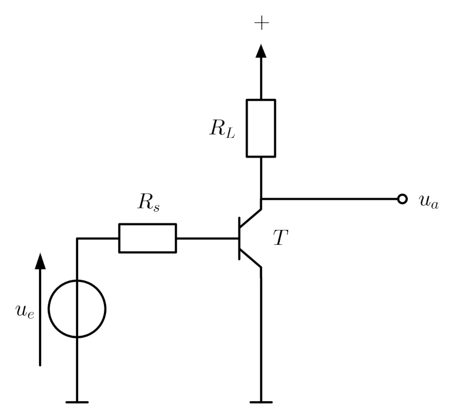
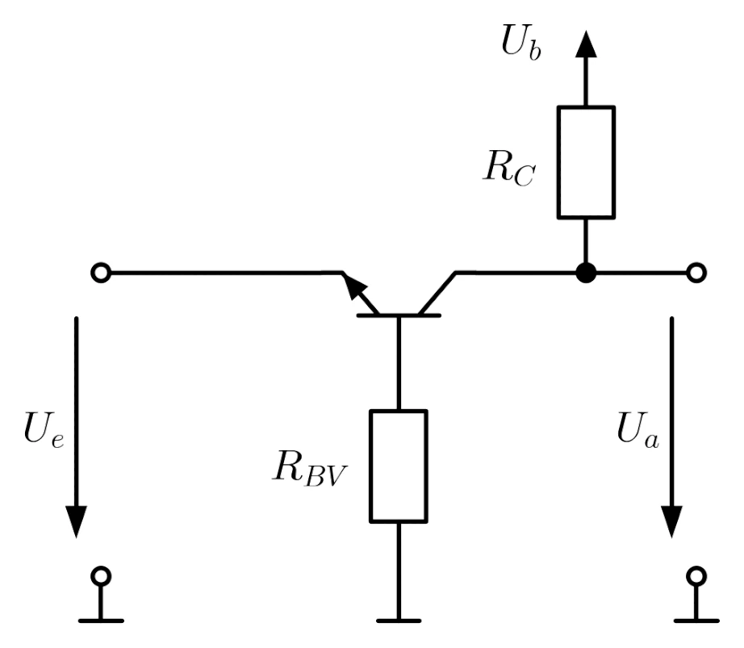
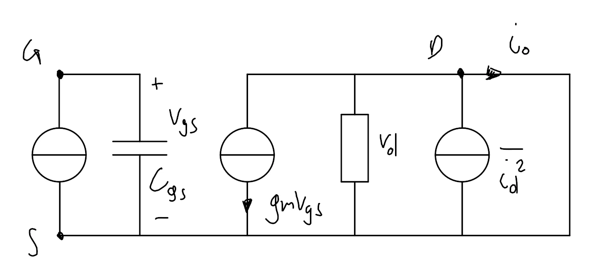

public:: true
icon:: 🔌
inherit-color-icon-from:: [[logseq-page-color-red]]
tags:: uni
alias:: ST, schaltungstechnik lva

- [📁 folder](file://C:\Users\Matteo\Documents\Uni\Schaltungstechnik)
- ## vorlesungen
- ## beispiele
	- ### Verstärkungsfehler
	  background-color:: green
		- a) Zeichnen Sie eine Invertierende OV-Grundschaltung
		  background-color:: green
		- b) und berechnen Sie den Einfluss einer endlichen Geradeaus-Leerlaufverstärkung.
		  background-color:: green
			- formeln
				- $u_{en}=-\frac{u_{a}}{v_{g}}$
				  tags:: [[formel]], [[opv]]
				  bezeichnung:: potential am negativen [[opv]] kontakt, wenn $u_{ep}=0$ [(ref)](((666c479b-dc31-47d7-afdf-857e3e084817))) [V]
					- $u_a$ ... ausgangsspannung $\mathrm{[V]}$
					  $v_g$ ... geradeaus-leerlaufverstärkung $\mathrm{[-]}$
				- ${v_{g}=\frac{u_{a}}{u_{ep}-u_{en}}}$
				  tags:: [[formel]], [[vv-opv]], [[opv]]
				  bezeichnung:: geradeaus leerlaufverstärkung (open loop gain) (wenn ideal, $v_{g\infty}=\infty$) $\mathrm{[-]}$
				  id:: 666c479b-dc31-47d7-afdf-857e3e084817
					- $u_{en}$ ... potential am negativen [[opv]] kontakt $\mathrm{[V]}$
					  $u_{ep}$ ... potential am positiven [[opv]] kontakt  $\mathrm{[V]}$
					  $u_{a}$ ... ausgangsspannung $\mathrm{[V]}$
				- ${{v_{gt}=\frac{2\cdot u_{a}}{u_{ep}-u_{en}}}}$
				  tags:: [[formel]], [[vv-opv]], [[opv]]
				  bezeichnung:: gleichtaktverstärkung (open loop gain) (wenn ideal, $v_{gt\infty}=0$) $\mathrm{[-]}$
					- $u_{en}$ ... potential am negativen [[opv]] kontakt $\mathrm{[V]}$
					  $u_{ep}$ ... potential am positiven [[opv]] kontakt $\mathrm{[V]}$
					  $u_{a}$ ... ausgangsspannung $\mathrm{[V]}$
				- ${v_{r}=\frac{u_{a}}{u_{e}}}$
				  tags:: [[formel]], [[vv-opv]], [[opv]]
				  bezeichnung:: verstärkung/übertragungsfunktion (closed loop gain) (wenn ideal, $v_{r\infty}$) $\mathrm{[-]}$
					- $u_{e}$ ... eingangsspannung $\mathrm{[V]}$
					  $u_{a}$ ... ausgangsspannung $\mathrm{[V]}$
				- ${v_{s}=\beta\cdot v_{g}}$
				  tags:: [[formel]], [[vv-opv]], [[opv]]
				  bezeichnung:: schleifen verstärkung (loop gain) (wenn ideal, ??) $\mathrm{[-]}$
				  id:: 6676c9a3-b64a-4899-92bd-d0463f4b9f84
					- $\beta$ ... schleifen verstärkung $\mathrm{[-]}$
					  $v_{g}$ ... geradeaus leerlaufverstärkung $\mathrm{[-]}$
		- c) Berechnen Sie den Fehlerfaktor $F$.
		  background-color:: green
		- canvas
			- [[draws/2024-06-13-16-48-03.excalidraw]]
		- d) kreuzen sie den richtigen an.
		  background-color:: green
			- formeln
				- $\beta=-\frac{u_{ed}}{u_{a}}$
				  tags:: [[formel]], [[opv]]
				  bezeichnung:: rückkopplungsfaktor (feedback ratio) $\mathrm{[-]}$
					- $u_{ed}$ ... differenzenspannung an [[opv]] $\mathrm{[V]}$
					  $u_a$ ... ausgangsspannung $\mathrm{[V]}$
			- 
			- [📚 2024-06-14 18h23m.xopp](../assets/documents/2024-06-14 18h23m.xopp)
			- 
	- ### Integration von Systemen
	  background-color:: green
		- Berechnen Sie den Widerstand einer 200nm weiten und 1µm langen Leiterbahn, wenn sie einen Schichtwiderstand von 1Ω/□ aufweist.
		  background-color:: green
			- formeln
				- $R_{\square}=\frac{\rho}{H}$
				  tags:: [[formel]]
				  bezeichnung:: [[Schichtwiderstand]] einer Leiterbahn [Ω]
					- $\rho$ ... Spezifischer Widerstand [Ω⋅m]
					- $H$ ... Höhe des Leiters
				- $R=R_{\square}\cdot\frac{L}{W}$
				  tags:: formel
				  bezeichnung:: Leiterbahn widerstand aufgrund des [[Schichtwiderstands]] [Ω]
					- $R_{\square}$ ... [[Schichtwiderstand]] [Ω/□]
					- $L$ ... Länge der Leiterbahn $\mathrm{[m]}$
					- $W$ ... Weite/Breite der Leiterbahn $\mathrm{[m]}$
		- [📚 2024-06-16 20h34m.xopp](../assets/documents/2024-06-16 20h34m.xopp)
		- 
	- ### Verstärker
	  background-color:: green
		- 
		- a) Berechnen Sie die Ausgangsspannung in Abhängigkeit von den Eingangsspannungen mittels Superposition
		  background-color:: green
		- b) Berechnen Sie $R_1$ und $R_3$
		  background-color:: green
		  für $f=0$:
		  $u_{a}\left(0\right)=u_{e1}-0.5u_{e2}$
		  
		  für $f\gg f_{g}$:
		  ${u_{a}\left(\infty\right)=1.5u_{e1}-0.5u_{e2}}$
		- $R_1=\text{10k}\Omega;R_3=\text{10k}\Omega$
		  background-color:: red
		- c) Berechnen Sie die Grenzfrequenzen $f_{g1}$ und $f_{g2}$
		  background-color:: green
			- formeln
				- $G=\frac{1}{1+j\frac{\omega}{\omega_{g}}}$
				  tags:: formel, Kreisfrequenz, Frequenz, [[übertragungsfunktion]], Tiefpass, wip
				  bezeichnung:: Standard Darstellung der [[Übertragungsfunktion]] des [[Tiefpasses]], um [[Grenzkreisfrequenz]] abzulesen
					- ${}\omega$ ... Kreisfrequenz. Freie Variable [rad/s]
					- ${}\omega_{g}$ ... Grenzkreisfreuquenz [rad/s]
				- ${G=j\frac{\omega}{\omega_{g}}}$
				  tags:: formel, Kreisfrequenz, Frequenz, [[übertragungsfunktion]], wip
				  bezeichnung:: Standard der [[übertragungsfunktion]] des Hochpasses, um Grenzkreisfrequenz abzulesen
					- ${}\omega$ ... Kreisfrequenz. Freie Variable [rad/s]
					- ${}\omega_{g}$ ... Grenzkreisfreuquenz [rad/s]
				- ${}\omega=2\cdot\pi\cdot f$
				  tags:: formel, Kreisfrequenz, Frequenz, [[übertragungsfunktion]]
				  bezeichnung:: Kreisfrequenz [rad/s]
					- ${}f$ ... Frequenz $\mathrm{[Hz]}$
		- d) Wie groß ist der Fehler der Verstärkung $v_1=\frac{u_{a1}}{u_{e1}}$ (Abweichung Ist-Wert vom Soll-Wert) bei 10MHz?
		  background-color:: green
		- e) Zeichnen Sie den Betragsfrequenzgang (Knickzugnäherung!) von $v_1=\frac{u_{a1}}{u_{e1}}$
		  background-color:: green
		- f) Zeichnen Sie den Phasengang (Knickzugnäherung!) von $v_1=\frac{u_{a1}}{u_{e1}}$
		  background-color:: green
		- [📚 2024-06-17 10h14m.xopp](../assets/documents/2024-06-17 10h14m.xopp)
		- 
	- ### Komplexer Rückkopplungsfaktor
	  background-color:: green
		- 
		- a) Berechnen Sie den komplexen Rückkopplungsfaktor $\beta$ der gegebenen Schaltung (symbolisch).
		  background-color:: green
		- b) Berechnen Sie die [[grenzfrequenz]] des Poles des Rückkopplungsfaktors
		  background-color:: green
		- [📚 2024-06-18 17h45m.xopp](../assets/documents/2024-06-18 17h45m.xopp)
		- 
	- ### zeichnen Sie ein ESB eines [[bipolar transistor]] mit aquivalenten Eingangsrauschquellen ein und leiten Sie diese aus den Rauschgeneratoren ab
	  background-color:: green
		- {{embed ((6671b8bb-800c-461e-91dd-48a72f080ce5))}}
	- ### zeichnen Sie ein ESB eines [[feldeffekt transistor]] mit aquivalenten Eingangsrauschquellen ein und leiten Sie diese aus den Rauschgeneratoren ab
	  background-color:: green
		- {{embed ((6673e06c-7213-47d6-bed7-1743a3123e42))}}
	- ### Welche Ausgangsspannung liefert die Schaltung?
	  background-color:: green
		- 
		- [📚 2024-06-21 15h56m.xopp](../assets/documents/2024-06-21 15h56m.xopp)
		- 
	- ### Welche Ausgangsspannung liefert die Schaltung?
	  background-color:: green
		- 
		- [📚 2024-06-21 16h18m.xopp](../assets/documents/2024-06-21 16h18m.xopp)
		- 
	- ### [[Tiefpassfilter]]
	  background-color:: green
		- a) Zeichnen sie die Schaltung eines invertierenden Tiefpassfilters mit OPV!
		  background-color:: green
		- b) dimensionieren sie den Filter so, dass er folgende Ubertragungsfunktion hat! (OPV idealisiert) $\\ \frac{-10}{1+\frac{j2\pi f}{1\text{kHz}}}$
		  background-color:: green
		- [📚 2024-06-22 17h08m.xopp](../assets/documents/2024-06-22 17h08m.xopp)
		- 
	- ### [[Bodediagramm]] Schleifenverstärkung
	  background-color:: green
		- a) Zeichnen Sie in das gegeben [[Bodediagramm]] die Schleifenverstärkung ein
		  background-color:: green
		- b) Geben Sie die Formel für die Schleifenverstärkung an
		  background-color:: green
		- c) Zeichnen Sie die [[Phasenreserve]] ein.
		  background-color:: green
			- formeln
				- ${}\Delta\varphi=\arg\left(v_{s}\right)$ wenn $|v_{s}|=1$ bzw. $|v_{s\text{ dB}}|=0$
				  tags:: formel, [[Bodediagramm]]
				  bezeichnung:: Phasenreserve  [°]
					- $v_s$ ... [Schleifenverstärkung](((6676c9a3-b64a-4899-92bd-d0463f4b9f84))) $\mathrm{[dB]}$
			- [📚 2024-06-23 11h25m.xopp](../assets/documents/2024-06-23 11h25m.xopp)
			- 
	- ### Sensorschaltung
	  background-color:: green
		- 
		- Mit der angegebenen schaltung sollen die spannungsausgänge von 3 sensoren gewichtet addiert werden
		  background-color:: green
			- $|A_1|=|\frac{\underline{U}_{a1}}{\underline{U}_{e1}}|=2$, $|A_2|=|\frac{\underline{U}_{a1}}{\underline{U}_{e2}}|=1$, $|A_3|=|\frac{\underline{U}_{a1}}{\underline{U}_{e3}}|=1.333$
			- Die sensorsignale treten mit einer maximalen frequenz von $f_{sens}=50\text{kHz}$ auf. eine nahegelegene schaltung verursacht auf der störfrequenz $f_{stör}=50\text{MHz}$ eine störung die mindestens 100-fach gegenüber dem Nutzsignal abgeschwächt werden soll. der betrag der niederfrequenten verstärkung des OV2 ${|A_{OV2}|=|\frac{\underline{U}_{a2}}{\underline{U}_{a1}}|}$ soll 10 betragen
			- weiters gegeben sind: $R_3=2\text{k}\Omega$, $R_5=10 \text{k} \Omega$, $R_6=1 \text{k}\Omega$, $R_8=10 \text{k} \Omega$
		- a) opvs ideal. berechne $R_1$
		  background-color:: green
		- b) opvs ideal. berechne $R_2$
		  background-color:: green
		- c) opvs ideal. berechne $R_4$
		  background-color:: green
		- d) opvs ideal. berechne die [[grenzfrequenz]] $f_{g}$, dass die obigen bedingungen eingehalten werden
		  background-color:: green
		- e) opvs ideal. berechne $R_7$
		  background-color:: green
		- f) opvs ideal. berechne $C$
		  background-color:: green
		- g) opvs ideal. zeichne den betragsfrequenzgang der verstärkung $|\frac{\underline{U}_{a2}}{\underline{U}_{e3}}|$ (knickzugnäherung)
		  background-color:: green
		- h) opvs ideal. zeichne den phasenfrequenzgang der verstärkung $|\frac{\underline{U}_{a2}}{\underline{U}_{e3}}|$ (knickzugnäherung)
		  background-color:: green
		- [📚 2024-06-23 18h58m.xopp](../assets/documents/2024-06-23 18h58m.xopp)
		- 
	- ### Slew Rate
	  background-color:: green
		- a) wie groß ist die maximale frequenz für unverzerrte sinusförmige vollaussteuerung ($U_{a}= \hat{U}_{a} \cdot \sin \left( \omega t\right)$)
		  background-color:: green
		- b) zeichne die auswirkung auf ein sinusförmiges signal $U_{a}= \hat{U}_{a} \cdot \sin \left( \omega_1 t\right)$ mit $\omega_{p}=$ maximale unverzerrt übertragbare kreisfrequenz
		  background-color:: green
		- [📚 2024-06-25 18h01m.xopp](../assets/documents/2024-06-25 18h01m.xopp)
		- 
	- ### Hochpassfilter #wip
	  background-color:: green
		- [📚 2024-06-26 10h59m.xopp](../assets/documents/2024-06-26 10h59m.xopp)
		- 
	- ### CMOS multiplexer
	  background-color:: green
		- [📚 2024-06-26 11h16m.xopp](../assets/documents/2024-06-26 11h16m.xopp)
		- 
- ## flashcards
	- ### index
		- {{query (and [[flashcard]] (page [[schaltungstechnik]]))}}
		  query-table:: true
		  query-properties:: [:block :tags]
		  query-sort-by:: block
		  query-sort-desc:: false
	- welche arten des [[rauschens]] gibt es? 
	  deck:: Uni::Schaltungstechnik_Theorie
	  tags:: flashcard
		- ((667b092b-dad5-493e-b7c7-d98cdefef492))
		- ((667b08a1-5da1-445d-9e45-897c1f96e825))
		- ((667b11a2-3589-4353-aeed-70fac1313b8a))
		- ((667afa05-a7fb-4630-9979-446113e45ff7))
		- ((667b11a2-0e7c-4d83-b124-2abb6a47676f))
		- ((667b09c0-6b33-4154-aef3-ded0255ace46))
	- wie kann man Stabilität im Bodediagramm feststellen?
	  deck:: Uni::Schaltungstechnik_Theorie
	  tags:: flashcard
		- Schwingungsbedingung
			- wenn bei $|G|=1$ die phase $\varphi=180\degree$ erreicht ist, dann ist die schaltung instabil, da mitkopplung
	- Zeichne das Kleinsignalersatzschaltbild inklusive aller Rauschgeneratoren und Formeln
	   
	  deck:: Uni::Schaltungstechnik_Theorie
	  tags:: flashcard, schaltung, [[bipolar transistor]]
		- 
	- kollektorschaltung
	  deck:: Uni::Schaltungstechnik_Theorie
	  tags:: flashcard, bidirectional, [[transistor]], [[schaltung]], [[bipolar transistor]]
		- 
	- emitterschaltung
	  deck:: Uni::Schaltungstechnik_Theorie
	  tags:: flashcard, bidirectional, [[transistor]], [[schaltung]], [[bipolar transistor]]
		- 
	- basisschaltung
	  deck:: Uni::Schaltungstechnik_Theorie
	  tags:: flashcard, bidirectional, [[transistor]], [[schaltung]], [[bipolar transistor]]
		- 
	- [[stromverteilungs rauschen]] ([[partition noise]])
	  deck:: Uni::Schaltungstechnik_Theorie
	  tags:: flashcard, [[rauschen]]
	  id:: 667afa05-a7fb-4630-9979-446113e45ff7
		- wenn Ladungsträger, die den [[Strom]] $I$ tragen, auf zwei verschiedenen Elektroden landen können, dann wird durch die statistischen Schwankungen der Stromverteilung ein zusätzliches [[rauschen]] hervorgerufen
		- typischer fall ist der [[bipolar transistor]], wo sich der strom auf [[Basis]] und [[Kollektor]] aufteilen kann
	- [[lawinen rauschen]] ([[avalanche noise]])
	  deck:: Uni::Schaltungstechnik_Theorie
	  tags:: flashcard, [[rauschen]]
	  id:: 667b11a2-0e7c-4d83-b124-2abb6a47676f
		- tritt auf bei zener dioden oder avalanche durchbruch im pn-übergang
		- kann durch einen einzelnes $e^{-}$ verursacht werden -> lawinenmultiplikation
	- Warum werden parallel geschaltene [[transistoren]] verwendet? Vorteile, Nachteile?
	  deck:: Uni::Schaltungstechnik_Theorie
	  tags:: flashcard, [[transistor]]
		- bei Hochleistungsverstärker kann oft ein [[Transistor]] die last nicht alleine tragen, daher müssen mehrere parallel geschalten werden.
		- vorteile
			- skalierbar. man kann im nachhinein mehr leistungsfähigkeit hinzufügen
		- nachteile
			- komplexer
			- geringerer [[wirkungsgrad]] aufgrund von $R_{E}$
		- 
	- Durch welche Maßnahmen lässt sich der Einfluss des Leitwiderstandes der Analogschalter weitgehend eliminieren?
	  
	  deck:: Uni::Schaltungstechnik_Theorie
	  tags:: flashcard
		- in dem ein weiterer schalter eingebaut wird um den selben spannungsabfall zu erzeugen
		- 
	- was ist der stromflusswinkel und wie schaut er für den a/ab/b betrieb aus?
	  deck:: Uni::Schaltungstechnik_Theorie
	  tags:: flashcard
		- 
		- der stromflusswinkel ist definiert, als jener strom der durch den "ausgangstransistor" in einer periode fließt
		- [hier](((82ad4c74-8901-4beb-8e30-8f952015e015))) ist grün der a-betrieb, gelb der ab-betreib, rot der b-betrieb
		- {{embed ((666bec6f-8035-4981-a281-6440fe48db6e))}}
		- {{embed ((666bec6f-5a7a-4513-87df-2a7b0293fc97))}}
		- {{embed ((666bec6f-f6b7-41e7-95b9-ede73db9ff4d))}}
	- was ist die slew rate?
	  deck:: Uni::Schaltungstechnik_Theorie
	  tags:: flashcard
		- das ist die maximale rate mit der das ausgangssignal ansteigen kann
		- sie hängt von der korrektur kapazität $C_{k}$ ab. der maximale [[basis]][[strom]] begrenzt die umladegeschwindigkeit des [[kondensators]]
		- ${SR= \left. \frac{\text{d}U_{a}}{\text{d}t} \right\rvert_{max}}$
		  tags:: formel
		  bezeichnung:: maximale anstiegsgeschwindigkeit (slew rate) [V/s]
			- $U_a$ ... ausgangsspannung $\mathrm{[V]}$
			- $\frac{\text{d}}{\text{d}t}$ ... zeit ableitung $\mathrm{[s]}$
	- um welche schaltungen handelt es sich?
	  deck:: Uni::Schaltungstechnik_Theorie
	  tags:: flashcard, bidirectional
	  
		- elektrometer verstärker
		- beweis, dass das, das selbe ist
			- [📚 2024-06-25 17h17m.xopp](../assets/documents/2024-06-25 17h17m.xopp)
			- 
	- Beschreibe die Vor- und Nachteile der Kaskodenschaltung, das Funktionsprinzip und wo sie eingesetzt werden
	  deck:: Uni::Schaltungstechnik_Theorie
	  tags:: flashcard
		- vorteile
			- hohe [[verstärkung]] durch hohen [[Ausgangswiderstand]]
			- geringe rückkopplung an den eingang durch kompensation der [[Miller-Kapazität]]
		- nachteil
			- geringerer ausgangsspannungshub durch zusätzlichen [[transistor]] $T_2$
		- funktionsweise
			- der [[transistor]] $T_1$ arbeitet in emitterschaltung, bei der der [[transistor]] $T_2$ den
			  [[kollektor]][[widerstand]] ersetzt. $T_2$ arbeitet in [[basis]][[schaltung]]. im arbeitspunkt fließt durch
			  beide [[transistoren]] der gleiche strom, wenn man den basisstrom von $T_2$ vernachlässigt.
		- einsatz [link](https://en.wikipedia.org/wiki/Cascode#Other_applications)
			- in stromspiegeln bei [[MOSFET]]s
			- in okmbination mit spannungs leitern, können auch hochspannungs transistoren aufgebaut werden
	- um welche schaltung handelt es sich?
	   
	  deck:: Uni::Schaltungstechnik_Theorie
	  tags:: flashcard, bidirectional
		- kaskodenschaltung
	- komplementärer emitterfolger im ab-betrieb
	  deck:: Uni::Schaltungstechnik_Theorie
	  tags:: flashcard, [[transistor]]
		- 
		- die schaltung hat ähnlichkeiten zu jener im b-betrieb, nur dass zwischen den basis kontakten von $T_1$ und $T_2$ eine offset spannung erzeugt werden muss um die [[transistoren]] "vorzuladen". dafür wird die flussspannung der dioden verwendet
	- komplementärer emitterfolger im b-betrieb
	  deck:: Uni::Schaltungstechnik_Theorie
	  tags:: flashcard, bidirectional, [[transistor]]
		- 
	- betriebsbereiche auf der arbeitsgeraden
	  deck:: Uni::Schaltungstechnik_Theorie
	  tags:: flashcard, [[transistor]]
		- 
	- emitterfolger im a-betrieb
	  deck:: Uni::Schaltungstechnik_Theorie
	  tags:: flashcard, [[transistor]]
		- 
		- arbeitspunkteinstellung mittels $R_{a}$ und $R_{b}$
	- Ausgangskennlinienfeld eines [[feldeffekttransistor]] mit Early-Spannung
	  deck:: Uni::Schaltungstechnik_Theorie
	  tags:: flashcard, [[feldeffekt transistor]]
		- 
	- Ausgangskennlinienfeld eines [[bipolartransistors]] mit Early-Spannung
	  deck:: Uni::Schaltungstechnik_Theorie
	  tags:: flashcard, [[bipolar transistor]]
		- 
	- was ist die korrekte Ersatzschaltung für die Berechnung der Eingangsrauschgrößen der Gesamtschaltung
	  $\bar{v_{ia}}^2$, $\bar{i_{ia}}^2$ ... Eingangsrauschgrößen des Verstärkers
	  
	  deck:: Uni::Schaltungstechnik_Theorie
	  tags:: flashcard
		- 
	- Was ist das Problem bei der Integration von Frequenzgangskompensation? Abhilfe?
	  deck:: Uni::Schaltungstechnik_Theorie
	  tags:: flashcard
		- Es können keine Grenzfrequenzen $f_{g1}$ zustande kommen, welche sehr große Kapazitäten benötigen, da die chipfläche dafür nicht ausreicht.
		- Durch [Pole-splitting](((6676c9a3-b141-486d-bed1-f2178e1cf8d6))) wird der [[Miller-Effekt]] ausgenützt, wodurch die [[Miller-Kapazität]], um die Spannungsverstärkung vergrößert wird. außerdem bewirkt der effekt, eine gegenkopplung die $R_{a}$ reduziert. dadurch erhöht sich die Frequenz $f_{g2}$ (pole splitting)
		- die kritische frequenz $f_{k}$ wird, dann durch $f_{g3}$ statt $f_{g2}$ bestimmt.
		  background-color:: yellow
	- was ist die angepasste Freqeunzgangskorrektur, worin besteht der Unterschied zur universellen Freqeunzgangskorrektur?
	  deck:: Uni::Schaltungstechnik_Theorie
	  tags:: flashcard, stabilität
		- Universelle Frequenzgangskompensation
			- für alle äußeren ohmschen Beschaltungen stabil
		- Angepasste Frequenzgangkorrektur
			- nur für $A_0>1$ stabil, aber dafür größere Bandbreite
			- $f_{g1}$ kann um $A_0$ größer gewählt werden
		- 
	- was ist die Frequenzgangskompenstaion mit Pole Splitting und warum ist sie notwendig?
	  deck:: Uni::Schaltungstechnik_Theorie
	  tags:: flashcard, stabilität
	  id:: 6676c9a3-b141-486d-bed1-f2178e1cf8d6
		- die frequenzgangskompensation ist eine methode um im aktiven verstärkerbereich des OPVs ($v_{g}\ge0\text{dB}$) nur einen Pol wirksam zu machen. Der Verstärker ist durch den modifizieren Frequenzgang, selbst bei gegenkopplung stabil.
			- frequenzgangskompensation ist notwendig um stabilität zu gewährleisten
		- pole splitting bezieht sich daruaf, dass die pole $f_{g1}$ und $f_{g2}$ auseinander geschoben werden.
		- dabei soll die verstärkung $=0\text{dB}$ bei $f_{g2}$ sein
		  background-color:: yellow
		- 
	- Um welche Schaltung handelt es sich?
	   
	  deck:: Uni::Schaltungstechnik_Theorie
	  tags:: flashcard, schaltung, wip
		- Komplementärer [[Emitterfolger]] im [[AB-Betrieb]] mit 2 [[dioden]]
	- Um welche Schaltung handelt es sich?
	   
	  deck:: Uni::Schaltungstechnik_Theorie
	  tags:: flashcard, schaltung, wip
		- Komplementärer [[Emitterfolger]] im [[AB-Betrieb]]
		- variable z-diode
	- Um welche Schaltung handelt es sich?
	   
	  deck:: Uni::Schaltungstechnik_Theorie
	  tags:: flashcard, opv, schaltung
		- vv-opv
		- breitband operationsverstärker
	- Um welche Schaltung handelt es sich?
	   
	  deck:: Uni::Schaltungstechnik_Theorie
	  tags:: flashcard, opv, schaltung
		- vc-opv
		- transkonduktanz verstärker
	- Um welche Schaltung handelt es sich?
	   
	  deck:: Uni::Schaltungstechnik_Theorie
	  tags:: flashcard, opv, schaltung
		- cv-opv
		- transimpedanz verstärker
	- Um welche Schaltung handelt es sich?
	  deck:: Uni::Schaltungstechnik_Theorie
	  tags:: flashcard, opv, schaltung
	  
		- cc-opv
		- stromverstärker
	- pnp [[transistor]]
	  deck:: Uni::Schaltungstechnik_Theorie
	  tags:: flashcard, [[bipolar transistor]] , transistor
		- 
		- [[eselsbrücke]]: ***P***feil ***N***ach ***P***ipi (innen)
		- $U_{f}<0$ und $U_{BE}\le U_{f}$
		  tags:: formel
		  bezeichnung:: bedingungen für das durchschalten eines npn [[transistors]]
			- $U_{f}$ ... fluss spannung $\mathrm{[V]}$
			- $U_{BE}$ ... [[Basis]]-[[Emitter]] spannung $\mathrm{[V]}$
	- npn [[transistor]]
	  deck:: Uni::Schaltungstechnik_Theorie
	  tags:: flashcard, [[bipolar transistor]] , transistor
		- 
		- [[eselsbrücke]]: ***N***icht ***P***feil ***N***ach innen
		- $U_{f}>0$ und $U_{BE}\ge U_{f}$
		  tags:: formel
		  bezeichnung:: bedingungen für das durchschalten eines npn [[transistors]]
			- $U_{f}$ ... fluss spannung $\mathrm{[V]}$
			- $U_{BE}$ ... [[Basis]]-[[Emitter]] spannung $\mathrm{[V]}$
	- p-Kanal MOSFET enhancement mode (selbstsperrend) schaltzeichen und bedingung
	  deck:: Uni::Schaltungstechnik_Theorie
	  tags:: flashcard, MOSFET, transistor, FET
		- 
		- der freie [[Bulk]] anschluss macht nicht wirklich was. er sollte nur gelten $\varphi_{B}\ge\varphi_{S}$
		- $U_{th}<0$ und ${}U_{GS}\le U_{th}$
		  tags:: formel
		  bezeichnung:: bedingungen für das durchschalten eines nMOS [[transistors]]
			- $U_{th}$ ... threshold spannung $\mathrm{[V]}$
			- $U_{GS}$ ... [[Gate]]-[[Source]] spannung $\mathrm{[V]}$
	- n-Kanal MOSFET enhancement mode (selbstsperrend) schaltzeichen und bedingung
	  deck:: Uni::Schaltungstechnik_Theorie
	  tags:: flashcard, MOSFET, transistor, FET
		- 
		- [[eselsbrücke]]: pfeil geht rei***N***
		- der freie [[Bulk]] anschluss macht nicht wirklich was. er sollte nur gelten $\varphi_{B}\le\varphi_{S}$
		- $U_{th}>0$ und ${}U_{GS}\ge U_{th}$
		  tags:: formel
		  bezeichnung:: bedingungen für das durchschalten eines nMOS [[transistors]]
			- $U_{th}$ ... threshold spannung $\mathrm{[V]}$
			- $U_{GS}$ ... [[Gate]]-[[Source]] spannung $\mathrm{[V]}$
	- ${\bar{v_{b}}^2}$ ... Spannungsquadrat des Rauschgenerators an der [[Basis]] eines [[BJT]] im [[kleinsignal]] [[ersatzschaltbild]] $\mathrm{[V]}$
	  deck:: Uni::Schaltungstechnik_Theorie
	  tags:: flashcard, [[bipolar transistor]]
		- ${}\bar{v_{b}}^2=4kTr_{b}\Delta f$
		  tags:: formel, [[rauschen]], [[BJT]], wip
		  bezeichnung:: Spannungsquadrat des Rauschgenerators an der [[Basis]] eines [[BJT]] im [[kleinsignal]] [[ersatzschaltbild]] ([[thermisches rauschen]]) [V]
		  id:: 67595b68-f21a-4b53-857e-73495668e87d
			- $k$ ... Boltzmannkonstante [J/K]
			- ${}T$ ... [[Temperatur]] $\mathrm{[K]}$
			- ${}r_{b}$ ... Basis Widerstand des [[BJT]] im [[kleinsignal]] modell [Ω]
			- $\Delta f$ ... [[bandbreite]] in der die Schaltung betrieben werden soll $\mathrm{[Hz]}$
		- terme:
			- [[thermisches rauschen]]
	- $\bar{i_{c}}^2$ ... Stromquadrat des Rauschgenerators am [[Kollektor]] eines [[BJT]] im [[kleinsignal]] [[ersatzschaltbild]] $\mathrm{[V]}$
	  deck:: Uni::Schaltungstechnik_Theorie
	  tags:: flashcard, [[bipolar transistor]]
		- $\bar{i}_{c}^2=2qI_{C}\Delta f$
		  id:: 67595b68-be94-4d00-a26f-1910e44d1b75
		  tags:: formel, [[rauschen]], [[BJT]], wip
		  bezeichnung:: Stromquadrat des Rauschgenerators am [[Kollektor]] eines [[BJT]] im [[kleinsignal]] [[ersatzschaltbild]] ([[schrot rauschen]])
			- $\bar{i}_{c}^2$ ... Stromquadrat des Rauschgenerators $\mathrm{\left[V\right]}$
			- $q$ ...  []
			- ${}I_C$ ... []
			- $\Delta f$ ... [[bandbreite]] in der die Schaltung betrieben werden soll $\mathrm{[Hz]}$
		- terme:
			- [[schrot rauschen]]
	- $\bar{i_{b}}^2$ ... Stromquadrat des Rauschgenerators an der [[Basis]] eines [[BJT]] im [[kleinsignal]] [[ersatzschaltbild]] $\mathrm{[V]}$
	  deck:: Uni::Schaltungstechnik_Theorie
	  tags:: flashcard, [[bipolar transistor]]
		- $\bar{i_{b}}^2=2qI_{B}\Delta f+K_1\frac{I_{B}^{a}}{f}\Delta f+K_2 \frac{I_{B}^{c}}{1+\left(\frac{f}{f_{c}}\right)^2}\Delta f$
		  tags:: formel, [[rauschen]], [[BJT]], wip
		  bezeichnung:: Stromquadrat des Rauschgenerators an der [[Basis]] eines [[BJT]] im [[kleinsignal]] [[ersatzschaltbild]] (terme: [[schrot rauschen]] , [[funkel rauschen]], [[telegrafen rauschen]]) [A²]
		  id:: 67595b68-86c8-4cb2-a777-f98b4457e311
			- $q$ ...  []
			- $I_B$ ... [[Basis]]strom $\mathrm{[A]}$
			- $\Delta f$ ... [[bandbreite]] in der die Schaltung betrieben werden soll $\mathrm{[Hz]}$
			- $K_1$ ... empirischer korrektur faktor je nach bauelement $\mathrm{[-]}$
				- hängt vom herstellungsprozess des bauelementes bzw. des ics ab und kann für bauelemente auf einem wafer wegen kontamination (am jeweiligen ort vorhanden/nicht vorhanden) stark streuen. für rauscharme niederfrequenzschaltungen, die aus diskreten bauelementen oder standard-ics aufgebaut werden, lassen sich die komponenten deshalb bezüglich geringstem 1/f-rauschen selektieren. die amplitudenverteilung des [[1\/f-rauschens]] ist nicht gaussisch.
			- $a$ ... eine konstante von $0.5-2$ $\mathrm{[-]}$
			- $f$ ... $\mathrm{\left[\placeholder{}\right]}$
			- $K_2$ ... $\mathrm{\left[\placeholder{}\right]}$
			- $I_{B}^{c}$ ... $\mathrm{\left[\placeholder{}\right]}$
			- $f_{c}$ ... $\mathrm{\left[\placeholder{}\right]}$
		- terme:
			- [[schrot rauschen]]
			- [[funkel rauschen]]
			- [[telegrafen rauschen]]
	- ${\bar{i_{d}}^2}$ ... Stromquadrat des Rauschgenerators am [[Drain]] eines [[FET]] im [[kleinsignal]] [[ersatzschaltbild]] $\mathrm{[V]}$
	  deck:: Uni::Schaltungstechnik_Theorie
	  tags:: flashcard, [[feldeffekt transistor]]
		- $\bar{i_{d}}^2=4kT\frac23g_{m}\Delta f+K_1\frac{I_{D}^{a}}{f}\Delta f$
		  tags:: formel, [[rauschen]], [[BJT]], wip
		  bezeichnung:: Stromquadrat des Rauschgenerators am [[Drain]] eines [[FET]] im [[kleinsignal]] [[ersatzschaltbild]] (terme: [[thermisches rauschen]], [[funkel rauschen]]) [V]
		  id:: 67595b68-323e-4a7b-94c3-4b9773d4a963
			- $k$ ... Boltzmannkonstante [J/K]
			- ${}T$ ... [[Temperatur]] $\mathrm{[K]}$
			- $g_{m}$ ... [[transkonduktanz]] $\mathrm{[S]}$
			- $\Delta f$ ... [[bandbreite]] in der die Schaltung betrieben werden soll $\mathrm{[Hz]}$
			- $K_1$ ...
			- $f$ ... frequenz $\mathrm{\left[Hz\right]}$
		- terme
			- [[thermisches rauschen]]
			- [[funkel rauschen]]
	- $\bar{i_{g}}^2$ ... Stromquadrat des Rauschgenerators am [[Gate]] eines [[FET]] im [[kleinsignal]] [[ersatzschaltbild]] $\mathrm{[V]}$
	  deck:: Uni::Schaltungstechnik_Theorie
	  tags:: flashcard, [[feldeffekt transistor]]
		- $\bar{i_{g}}^2=2qI_{G}\Delta f$
		  tags:: formel, [[rauschen]], [[BJT]], wip
		  bezeichnung:: Stromquadrat des Rauschgenerators am [[Kollektor]] eines [[FET]] im [[kleinsignal]] [[ersatzschaltbild]] ([[schrot rauschen]]) [V]
		  id:: 67595b68-20a8-40dc-b540-37cec1aedce1
			- $q$ ...  []
			- ${}I_G$ ... []
			- $\Delta f$ ... [[bandbreite]] in der die Schaltung betrieben werden soll $\mathrm{[Hz]}$
		- terme:
			- [[schrot rauschen]]
	- [[Transmissiongate]] und dessen [[Ausgangswiderstand]] in Abhängigkeit der [[Eingangsspannung]] 
	  deck:: Uni::Schaltungstechnik_Theorie
	  tags:: flashcard, FET, Schaltung
		- 
		- 
	- [[feldeffekttransistor]] als Serienschalter, Funktionsweise und Ausgangswiderstand
	  deck:: Uni::Schaltungstechnik_Theorie
	  tags:: flashcard, FET, Schalter, Schaltung
		- 
		- für $U_{st}-U_{e}>U_{th}$ sperrt; $r_{a}=R$
		- für $U_{st}-U_{e}<U_{th}$ leitet; $r_{a}=R\parallel r_{ds}$
	- vollständiges Kleinsignalersatzschaltbild mit Rauschgeneratoren [[bipolar transistor]]
	  deck:: Uni::Schaltungstechnik_Theorie
	  tags:: flashcard, [[bipolar transistor]], schaltung
		- 
	- Kleinsignalersatzschaltbild mit äquivalenten (b) Rauschgeneratoren [[bipolar transistor]] (Eingangsrauschquellen)
	  deck:: Uni::Schaltungstechnik_Theorie
	  tags:: flashcard, [[bipolar transistor]], schaltung
		- 
	- vollständiges Kleinsignalersatzschaltbild mit Rauschgeneratoren [[FET]]
	  deck:: Uni::Schaltungstechnik_Theorie
	  tags:: flashcard, [[feldeffekt transistor]] , schaltung
		- 
	- Kleinsignalersatzschaltbild mit äquivalenten (b) Rauschgeneratoren [[FET]] (Eingangsrauschquellen)
	  deck:: Uni::Schaltungstechnik_Theorie
	  tags:: flashcard, [[feldeffekt transistor]] , schaltung
		- 
	- leiten Sie aus den Rauschgeneratoren die äquivalenten Eingangsrauschquellen des [[BJT]] ab
	  deck:: Uni::Schaltungstechnik_Theorie
	  tags:: flashcard , [[bipolar transistor]], [[rauschen]], [[transistor]]
	  id:: 6671b8bb-800c-461e-91dd-48a72f080ce5
		- 
		  id:: 6673c33b-d1b0-4c8e-a98e-4242de035fab
		- vereinfachungen:
			- $C_{\mu}$ wird vernachlässigt
			- kurzschlusslast wird betrachtet
		- äquivalenten Eingangsrauschgeneratoren Erzeugen gleiches Ausgangsrauschen bei idealer Schaltung, wie die Originalrauschgeneratoren
		- Bei der Berechnung der äquivalenten Eingangsrauschgeneratoren kann man folgendermaßen vorgehen:
			- Eingang beider Schaltungen (a) und (b) kurzschließen und Ausgangsrausch strom $i_{o}$ berechnen, um $\bar{v_{i}}^2$ zu erhalten.
			  logseq.order-list-type:: number
				- vereinfachung:
					- der rauschstrom kommt von einer konstant stromquelle. dadurch, dass $r_{b}\ll r_{\pi}$, fließt der strom hauptsächlich über $r_{b}$. der spannungsabfall daran ist dann sehr klein im vergleich zum spannungsabfall an $r_{\pi}$. daher wird der einfluss von $i_{b}^2$ und $r_{b}$ vernachlässigt.
				- ausgehend von [a)](((6673c33b-d1b0-4c8e-a98e-4242de035fab))), wird der eingang kurzgeschlossen
				- 
				- gesamt rauschstrom am ausgang soll bei beiden schaltungen gleich sein
					- $i_o=g_{m}v_{b}+i_{c}=g_{m}v_{i}$
					- $v_{i}=v_{b}+\frac{i_{c}}{g_{m}}$
				- $v_{b}$ und $i_{c}$ sind unabhängige generatoren daher
					- $\bar{v_{i}}^2=\bar{v_{b}}^2+\frac{\bar{i_{c}}^2} {g_{m}^2}$
				- jetzt werden ((67595b68-f21a-4b53-857e-73495668e87d)) und ((67595b68-be94-4d00-a26f-1910e44d1b75)) eingesetzt
					- $v_{i}^2=4kTr_{b}\Delta f+\frac{2qI_{C}\Delta f}{g_{m}^2}$
					- $\frac{v_{i}^2}{\Delta f}=4kT\left(r_{b}+\frac{qI_{C}}{2kTg_{m}^2}\right)$
						- $\frac{kTg_{m}}{qI_{C}}$ das muss irgend eine größe sein die ich nicht kenne
					- ${\frac{v_{i}^2}{\Delta f}=4kT\left(r_{b}+\frac{1}{2g_{m}}\right)}$
					  background-color:: yellow
						- daraus sieht man, dass die spektrale dichte der äquivalenten rauschspannung von einem Eingangsrauschwiderstand $R_{eq}$ kommt
						- ${{\frac{v_{i}^2}{\Delta f}=4kTR_{eq}}}$
					-
			- Eingang beider Schaltungen (a) und (b) öffnen und $i_{o}$ berechnen um auf $\bar{i_{i}}^2$ zu kommen
			  logseq.order-list-type:: number
				- vereinfachung:
					- die rausch spannungsquelle $\bar{v_{b}}^2$ und der [[Basis]][[widerstand]] $r_{b}$ fallen weg, da der eingang offen ist.
				- ausgehend von [a)](((6673c33b-d1b0-4c8e-a98e-4242de035fab))), bleiben die eingänge offen
				- 
				- gesamt rauschstrom am ausgang soll bei beiden schaltungen gleich sein
					- $i_o=i_c+\beta(j\omega)i_b=\beta(j\omega)i_i$
					  bezeichnung:: rauschstrom am ausgang
					  tags:: formel
						- $i_{c}$ ... [[Kollektor]] rauschstrom $\mathrm{[A]}$
						- $\beta(j\omega)$ ... Stromverstärkung (frequenzabhängig)
						- $i_{b}$ ... [[Basis]] rauschstrom $\mathrm{[A]}$
						- $i_{i}$ ... äquivalenter eingangs rauschstrom $\mathrm{[A]}$
					- $i_{i}=i_{b}+\frac{i_{c}}{\beta\left(j\omega\right)}$
					- $i_{b}$ und $i_{c}$ sind unabhängige generatoren daher
						- ${\bar{i_{i}}^2=\bar{i_{b}}^2+\frac{\bar{i_{c}}^2}{\left|\beta(j\omega)\right|^2}}$
							- $\beta\left(j\omega\right)=\frac{\beta_0}{1+\frac{\omega}{\omega_\beta}}$
					- jetzt werden ((6673c33b-6cae-4a2a-8395-caeb1633cf30)) und ((66730f82-8ebf-44b4-8dc1-c6ffb19cfd68)) eingesetzt
						- [[burst noise]] wird vernachlässigt
						- $\bar{i_{i}}^2=2qI_{B}\Delta f+K_1\frac{I_{B}^{a}}{f}\Delta f+\frac{2qI_{C}\Delta f}{|\beta\left(j\omega\right)|^2}$
						- $\frac{\bar{i_{i}}^2}{\Delta f}=2q\left(I_{B}+\frac{K_1}{2q}\frac{I_{B}^{a}}{f}+\frac{I_{C}}{|\beta\left(j\omega\right)|^2}\right)$
							- daraus sieht man, dass die spektrale dichte des äquivalenten rauschstroms von einem äquivalenten Eingangs-schrot-rauschstrom $I_{eq}$ kommt
							- ${\frac{i_{i}^2}{\Delta f}=2qI_{eq}}$
							-
	- leiten Sie aus den Rauschgeneratoren die äquivalenten Eingangsrauschquellen des [[FET]] ab
	  deck:: Uni::Schaltungstechnik_Theorie
	  tags:: flashcard, wip , [[feldeffekt transistor]] , [[rauschen]], [[transistor]]
		- 
		- vereinfachungen:
			- $C_{gd}$ wird vernachlässigt
			- kurzschlusslast wird betrachtet
		- äquivalenten Eingangsrauschgeneratoren Erzeugen gleiches Ausgangsrauschen bei idealer Schaltung, wie die Originalrauschgeneratoren
		- Bei der Berechnung der äquivalenten Eingangsrauschgeneratoren kann man folgendermaßen vorgehen:
			- Eingang beider Schaltungen (a) und (b) kurzschließen und Ausgangsrausch strom $i_{o}$ berechnen, um $\bar{v_{i}}^2$ zu erhalten.
			  logseq.order-list-type:: number
			  id:: 6673e94c-9857-44f4-b1d9-59ec665faf69
				- vereinfachung:
					- der [[Gate]] rauschstromgenerator wird [kurzgeschlossen](((6673e94c-9857-44f4-b1d9-59ec665faf69))), daher fällt er weg
				- ausgehend von [a)](((c4ee6e12-bbfe-493b-9d00-5fb1a69f697e))), wird der eingang kurzgeschlossen
				- 
				- gesamt rauschstrom am ausgang soll bei beiden schaltungen gleich sein
					- $i_{o}=i_{d}=g_{m}v_{i}$
					- ${v_{i}=\frac{i_{d}}{g_{m}}}$
					- ${\bar{v_{i}}^2=\frac{\bar{i_{d}}^2}{g_{m}^2}}$
				- jetzt wird ((67595b68-323e-4a7b-94c3-4b9773d4a963)) eingesetzt
					- $v_{i}^2=\frac{4kT\frac23g_{m}\Delta f+K_1\frac{I_{D}^{a}}{f}\Delta f}{g_{m}^2}$
					- ${\frac{v_{i}^2}{\Delta f}=4kT\frac23\frac{1}{g_{m}}+K_1\frac{I_{D}^{a}}{f}\frac{1}{g_{m}^2}}$
					- $\frac{v_{i}^2}{\Delta f}=4kT\left(\frac23\frac{1}{g_{m}}+K_1\frac{I_{D}^{a}}{f}\frac{1}{g_{m}^2}\frac{1}{4kT}\right)$
					  background-color:: yellow
						- daraus sieht man (angeblich), dass die spektrale dichte der äquivalenten rauschspannung von einem Eingangsrauschwiderstand $R_{eq}$ kommt
						- ${{\frac{v_{i}^2}{\Delta f}=4kTR_{eq}}}$
			- Eingang beider Schaltungen (a) und (b) öffnen und $i_{o}$ berechnen um auf $\bar{i_{i}}^2$ zu kommen
			  logseq.order-list-type:: number
				- ausgehend von [a)](((c4ee6e12-bbfe-493b-9d00-5fb1a69f697e))), bleiben die eingänge offen
				- 
				- gesamt rauschstrom am ausgang soll bei beiden schaltungen gleich sein
					- $i_{o}=i_{d}+i_{g}\frac{g_{m}}{j\omega C_{gs}}=i_{i}\frac{g_{m}}{j\omega C_{gs}}$
					  bezeichnung:: rauschstrom am ausgang
					  tags:: formel
						- $i_{g}$ ... [[Gate]] rauschstrom $\mathrm{[A]}$
						- $C_{gs}$ ... [[Gate]]-[[Source]] [[Kapazität]] $\mathrm{[F]}$
						- $i_{d}$ ... [[Drain]] rauschstrom $\mathrm{[A]}$
						- $i_{i}$ ... äquivalenter eingangs rauschstrom $\mathrm{[A]}$
					- $i_{o}=i_{g}+i_{d}\frac{j\omega Cgs}{g_{m}}=i_{i}$
					- $i_{g}$ und $i_{d}$ sind unabhängige generatoren daher
						- $\bar{i_{i}}^2=\bar{i_{g}}^2+\bar{i_{d}}^2\frac{\omega^2C_{gs}^2}{g_{m}^2}$
					- jetzt werden ((67595b68-323e-4a7b-94c3-4b9773d4a963)) und ((67595b68-323e-4a7b-94c3-4b9773d4a963)) eingesetzt
						- ${\bar{i_{i}^2}=2qI_{G}\Delta f+\frac{\omega^2C_{gs}^2}{g_{m}^2}^{}\left(4kT\frac23g_{m}\Delta f+K_1\frac{I_{D}^{a}}{f}\Delta f\right)}$
						- $\frac{\bar{i_{i}^2}}{\Delta f}=2qI_{G}+\frac{\omega^2C_{gs}^2}{g_{m}^2}^{}\left(4kT\frac23g_{m}+K_1\frac{I_{D}^{a}}{f}\right)$
						  background-color:: yellow
	- Schritte im Schaltungs Entwurf
	  deck:: Uni::Schaltungstechnik_Theorie
	  tags:: flashcard, schaltungs design
		- 
	- Electrical Rule Check erklären
	  deck:: Uni::Schaltungstechnik_Theorie
	  tags:: flashcard, [[schaltungs design]]
		- Der Electrical Rule Check (ERC) dient zur Überprüfung des Layouts auf elementare elektrische Fehler, wozu Unterbrechungen, Kurzschlüsse und falsche Bauelementparameter gehören. Die dafür benötigten elektrischen Regeln sind in der Technologiedatei enthalten. Eine Untersuchung des Schaltungsverhaltens wie bei der Simulation ist mit dem ERC nicht möglich.
	- Design Rule Check erklären
	  deck:: Uni::Schaltungstechnik_Theorie
	  tags:: flashcard, [[schaltungs design]]
		- Mit dem Design Rule Check (DRC) wird überprüft, ob das erzeugte Layout den Entwurfsregeln der zugrundeliegenden Technologie genügt. Der DRC geschieht auf rein geometrischer Basis und wird daher in der Regel vor den weiterführenden elektrischen Überprüfungen durchgeführt. Die geometrischen Entwurfsregeln definieren für die verschiedenen Arten von Strukturen bestimmte Mindestgrößen und -abstände, die nicht unterschritten werden dürfen. Im Einzelnen unterscheidet man zwischen folgenden Arten von Regeln:
			- Breite (Width) eines Gebiets, z.B. einer Metallisierung
			- Abstand (Spacing) zwischen zwei Gebieten, z.B. Metallisierungen/Überlappung (Overlap) unterschiedlicher Gebiete, z.B. zwischen Metallisierung und kontaktiertem Diffusionsgebiet
			- Einschluss (Enclosure) eines Gebiets in einem anderen, z.B. eines Kontaktlochs in der kontaktierten Metallisierung
	- Layout vs. Schematic Check erklären
	  deck:: Uni::Schaltungstechnik_Theorie
	  tags:: flashcard, [[schaltungs design]]
		- Der Netzlistenvergleich oder Layout vs. Schematic Check (LVS Check) ist der umfassendste der drei Verifikationsschritte und wird daher meist als letzter durchgeführt.
		  Beim LVS Check wird die Übereinstimmung des erzeugten Layouts mit dem spezifizierten (ursprünglichen) Schaltplan überprüft. Die Regeln für den LVS Check sind ebenfalls in der Technologiedatei enthalten. Konkret werden beim LVS Check die Netzliste der Spezifikation und die aus der Extraktion des Layouts gewonnene Netzliste miteinander verglichen. Probleme können sich aufgrund der parasitären Elemente und der zusätzlichen Knoten in der extrahierten Netzliste ergeben, die bei einem zu empfindlich eingestellten Vergleich leicht zu Fehlmeldungen führen.
	- Extraktion erklären
	  deck:: Uni::Schaltungstechnik_Theorie
	  tags:: flashcard, [[schaltungs design]]
		- Als Synthese wird allgemein die Umsetzung einer Beschreibung auf einer höheren Ebene in eine niedrigere bezeichnet, also die praktische Realisierung des Top-down-Entwurfs. Die Umkehrung dieses Vorgangs heißt Extraktion. Im engeren Sinn bezeichnet Extraktion die ==Identifizierung von Elementen im Layout== und ihre Umsetzung als Schaltbild
	- ASIC (application specific integrated circuit) Entwurf erklären
	  deck:: Uni::Schaltungstechnik_Theorie
	  tags:: flashcard, [[integration von systemen]]
		- Full Custom:
			- vollständig aufgrund der Spezifikationen des Anwenders entworfen, ohne dabei auf standard Zellen oder Blöcke zurückzugreifen.
			- Chipfläche: klein
		- Semi Custom:
			- Standardzellen:
				- zugriff auf Bibliotheken mit standardisierten Funktionen
			- Gate-Arrays:
				- Regelmäßige meist matrixförmige Anordnungen von Gatterstrukturen und einzelnen Transistoren/passiven Bauelementen
			- Chipfläche: mittel
		- Programmable logic device (PLD):
			- Logikschaltungen
			- Chipfläche: groß
	- Post Layout Simulation erklären
	  deck:: Uni::Schaltungstechnik_Theorie
	  tags:: flashcard, [[schaltungs design]]
		- Simulations nach der Verifikation des Layouts, um parasitäre Effekte zu untersuchen und zu schauen ob noch immer das spezifizierte Verhalten gewährleistet ist
	- Stromflusswinkel, Ruhestrom - AB-Betrieb
	  deck:: Uni::Schaltungstechnik_Theorie
	  tags:: flashcard, [[transistor]]
	  id:: 666bec6f-5a7a-4513-87df-2a7b0293fc97
		- Stromflusswinkel $>180\degree$
		- Ruhestrom klein
	- Stromflusswinkel, Ruhestrom - A-Betrieb
	  deck:: Uni::Schaltungstechnik_Theorie
	  tags:: flashcard, [[transistor]]
	  id:: 666bec6f-8035-4981-a281-6440fe48db6e
		- Stromflusswinkel $=360\degree$
		- Ruhestrom groß
	- Stromflusswinkel, Ruhestrom - B-Betrieb
	  deck:: Uni::Schaltungstechnik_Theorie
	  tags:: flashcard, [[transistor]]
	  id:: 666bec6f-f6b7-41e7-95b9-ede73db9ff4d
		- Stromflusswinkel $<180\degree$
		- Ruhestrom klein (tatsächlich =0)
	- Arten des Rauschens im FET
	  deck:: Uni::Schaltungstechnik_Theorie
	  tags:: flashcard, [[feldeffekt transistor]]
		- {{embed ((667b092b-dad5-493e-b7c7-d98cdefef492))}}
		- {{embed ((667b09c0-6b33-4154-aef3-ded0255ace46))}}
		- {{embed ((667b08a1-5da1-445d-9e45-897c1f96e825))}}
	- [[funkel rauschen]] ([[flicker noise]], [[1/f noise]])
	  deck:: Uni::Schaltungstechnik_Theorie
	  tags:: flashcard, [[rauschen]]
	  id:: 667b08a1-5da1-445d-9e45-897c1f96e825
		- In der Festkörpertechnologie spricht man vom 1/f-Rauschen, das in aktiven Bauelementen und Kohlewiderständen auftritt.
		- entsteht durch ==fluktuierende Umladung von Störstellen== und Oberflächenzuständen und ist proportional zu 1/f.
			- Bipolartransistor: durch Verunreinigungen und Kristallfehler
			- JFET: durch tiefe Störstellen im Kanal
			- MOSFET: durch Si/SiO2-Interface Zustände im Kanal
		- Das [[1\/f-rauschen]] ist bei niedrigen Frequenzen stark und immer mit Stromfluss verbunden
	- [[thermisches rauschen]] ([[johnson noise]])
	  deck:: Uni::Schaltungstechnik_Theorie
	  tags:: flashcard, [[rauschen]]
	  id:: 667b092b-dad5-493e-b7c7-d98cdefef492
		- verursacht durch Schwingungen in Körpern aufgrund der thermischen Energie
		- direkt proportional zu $T$
		- zufälliger prozess > weißes rauschen
	- [[schrotrauschen]] ([[shot noise]])
	  deck:: Uni::Schaltungstechnik_Theorie
	  tags:: flashcard, [[rauschen]]
	  id:: 667b09c0-6b33-4154-aef3-ded0255ace46
		- beruht auf der endlichen Größe der Elementarladung q. Die Struktur der Ladung ist "körnig" (sie entspricht "Schrotkörnern").
		- Schrotrauschen tritt immer bei fließen eines Stromes auf. Es ist in Dioden und Transistoren vorhanden (wegen pn übergang)
		- zufälliger prozess > weißes rauschen
		- ich kann theoretisch formeln die aus mehreren termen aus unterschiedlichen topics einfach referenzieren und so die formel aufbauen. formel reference test #logseq
			- ((667b0f07-887e-4fbc-8f69-76f7b0dee63f)) $+$ ((667b1127-ca10-42fe-9e94-ead01edb4972)) $+$ ((667b1139-139a-48fc-9bab-78b4f6c84dfb))
			  tags:: formel, test
			  bezeichnung:: ein test um zu sehen wie das ausschaut wenn man terme mit referenzen anschreibt
			- $2qI\Delta f$
			  id:: 667b0f07-887e-4fbc-8f69-76f7b0dee63f
			  tags:: formel, [[rauschen]], wip
			  bezeichnung:: Stromquadrat des Rauschgenerators aufgrund von [[schrot rauschen]]
				- $\bar{i}^2$ ... Stromquadrat des Rauschgenerators aufgrund von [[schrot rauschen]] $\mathrm{\left[A^2\right]}$
				- $q$ ...  []
				- $I$ ... relevanter strom $\mathrm{[A]}$
				- $\Delta f$ ... [[bandbreite]] in der die Schaltung betrieben werden soll $\mathrm{[Hz]}$
				- $K_1$ ... empirischer korrektur faktor je nach bauelement $\mathrm{[-]}$
					- hängt vom herstellungsprozess des bauelementes bzw. des ICs ab und kann für bauelemente auf einem wafer wegen kontamination (am jeweiligen ort vorhanden/nicht vorhanden) stark streuen. für rauscharme niederfrequenzschaltungen, die aus diskreten bauelementen oder standard-ics aufgebaut werden, lassen sich die komponenten deshalb bezüglich geringstem 1/f-rauschen selektieren. die amplitudenverteilung des [[1\/f-rauschens]] ist nicht gaussisch.
				- $c$ ... eine konstante von $0.5-2$ $\mathrm{[-]}$
				- $f$ ... []
				- $K_2$ ... []
				- $f_{c}$ ... []
			- $K_1\frac{I^{a}}{f}\Delta f$
			  tags:: formel, [[rauschen]], wip
			  bezeichnung:: text
			- $K_2 \frac{I^{c}}{1+\left(\frac{f}{f_{c}}\right)^2}\Delta f$
			  tags:: formel, [[rauschen]], wip
			  bezeichnung:: text
	- [[telegrafen rauschen]] ([[popcorn noise]], [[burst rauschen]])
	  deck:: Uni::Schaltungstechnik_Theorie
	  tags:: flashcard, [[rauschen]]
		- äußert sich als unregelmäßige spitzen im strom
			- -> ist immer mit stromfluss verbunden
		- tritt eher bei niedrigeren frequenzen auf (einige Hz bis kHz)
		- verusacht durch z.B. schwermetall kontamination
	- typischer Verlauf der äquivalenten Eingangsrauschspannung für einen [[FET]] mit wesentlichen Verursachern des Rauschen in den Abschnitten der Kurve
	  deck:: Uni::Schaltungstechnik_Theorie
	  tags:: flashcard, [[FET]], [[transistor]], [[rauschen]]
		- 
	- [[Bodediagramm]] Verlauf von $G=\frac{sT}{1+sT}$ (Hochpass)
	  deck:: Uni::Schaltungstechnik_Theorie
	  tags:: flashcard, bidirectional, Bodediagramm, Hochpass
		- 
	- [[Bodediagramm]] Verlauf von $G=\frac{1}{1+sT}$ (Tiefpass)
	  deck:: Uni::Schaltungstechnik_Theorie
	  tags:: flashcard, bidirectional, Bodediagramm, Tiefpass
		- 
	- [[Bodediagramm]] Verlauf von $G=sT$ (D-Glied)
	  deck:: Uni::Schaltungstechnik_Theorie
	  tags:: flashcard, bidirectional, Bodediagramm, D-Glied
		- 
	- [[Bodediagramm]] Verlauf von $G=K$ (P-Glied)
	  deck:: Uni::Schaltungstechnik_Theorie
	  tags:: flashcard, bidirectional, Bodediagramm, P-Glied
		- 
	- [[Bodediagramm]] Verlauf von $G=\frac{1}{sT}$ (I-Glied)
	  deck:: Uni::Schaltungstechnik_Theorie
	  tags:: flashcard, bidirectional, Bodediagramm, I-Glied
		- 
	- [[Bodediagramm]] Verlauf von ${G=1+sT}$ (PD-Glied)
	  deck:: Uni::Schaltungstechnik_Theorie
	  tags:: flashcard, bidirectional, Bodediagramm, PD-Glied
		- 