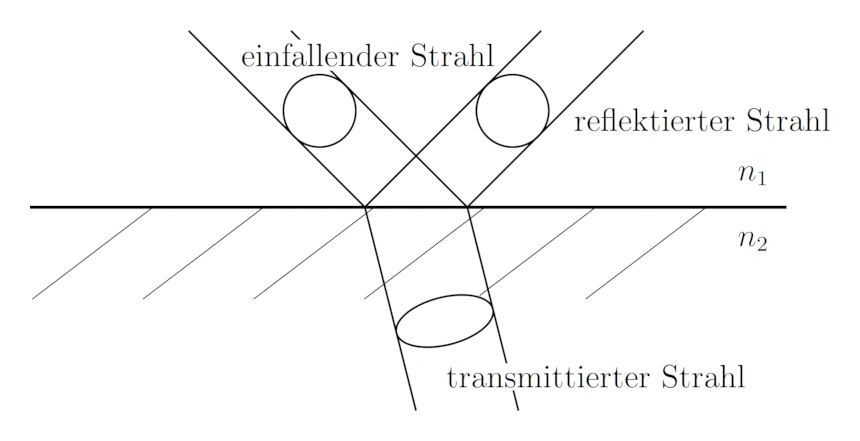
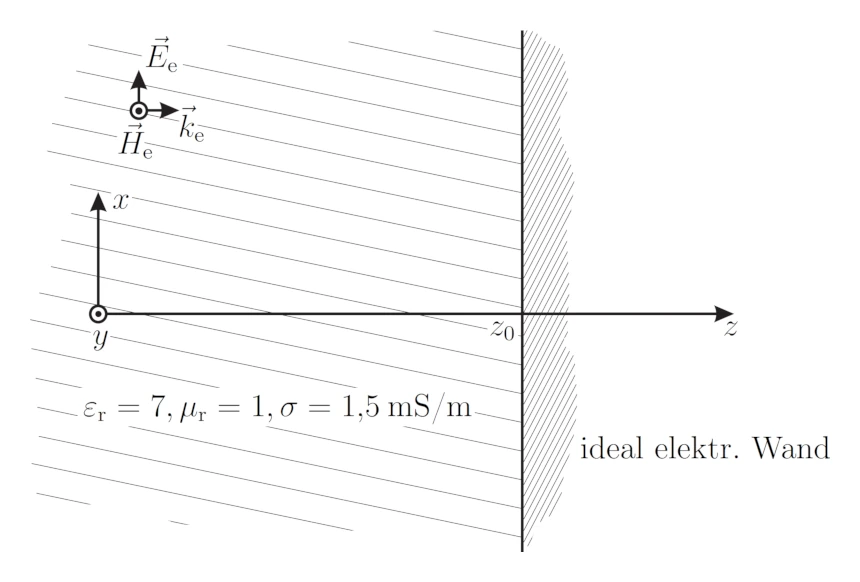

icon:: 🛜
inherit-color-icon-from:: [[logseq-page-color-purple]]
tags:: uni
alias:: wave propagation, wellenausbreitungs

- ## vorlesungen
	- 
	- [[wellen vo temp]]
- ## beispiele
	- Übergang von Vakuum nach Glas
	  background-color:: green
		- Variante 1) Eine zirkular polarisierte Welle mit einem Querschnitt von $A = \mathrm{3~mm^2}$ und einer Leistung von $P = \mathrm{10~mW}$ wird unter dem Brewster-Winkel auf eine Grenzfläche zwischen Vakuum ($n_1 = \mathrm{1}$) und Glas ($n_2 = \mathrm{1.6}$) eingestrahlt.
		  background-color:: green
		  {:width 400}
			- a) Berechnen Sie Einfallswinkel $\Theta_e$, Reflexionswinkel $\Theta_r$ und Austrittswinkel $\Theta_t$ und zeichnen Sie diese in die Skizze ein!
			  background-color:: green
				- formeln
					- $\Theta_i = \Theta_r$
					  tags:: formel
					  bezeichnung:: Reflektions gesetz
						- $\Theta_i$ ... einfallswinkel (***i***nbound) $\mathrm{[°]}$
						- $\Theta_r$ ... reflektionswinkel (***r***eflected) $\mathrm{[°]}$
					- ((6734720f-e42f-46c0-a512-3075ea423042))
					- $\Theta_{b}=\arctan\left(\frac{n_2}{n_1}\right)$
					  tags:: formel
					  bezeichnung:: [[brewster winkel]]
						- $\Theta_b$ ... Brewster winkel $\mathrm{[°]}$
						- $n_1$ ... [[brechungsindex]] $\mathrm{[-]}$
						- $n_2$ ... [[brechungsindex]] $\mathrm{[-]}$
			- b) Berechnen Sie die Querschnitsfläche $A$ des transmittierten Strahls!
			  background-color:: green
				- formeln
					- ((6734720b-5c51-4f95-ac33-ed541e99c1ca))
			- c) Berechnen Sie die Leistungen $P_{\mathrm{TE,t}}$ und $P_{\mathrm{TM,t}}$ der transmittierten Wellen!
			  background-color:: green
				- formeln
					- ((6735b379-5292-4604-baef-85a4c9a6fc3f))
					- ((6735b379-80fa-4b2a-be2d-af5089fe1fa8))
					- ((6735b379-8ba8-4a90-b5e2-8b5b38036526))
					- ((6735b379-1a1f-417e-8323-7fe94bd9e2cf))
					- $\vect{P}_{\mathrm{t}} = \vect{P}_{\mathrm{TE,t}} + \vect{P}_{\mathrm{TM,t}}$
					  id:: 673b6e21-b584-4162-9dee-58697f01a4bb
					  tags:: formel
					  bezeichnung:: leistung der transmittierten welle
					  collapsed:: true
						- $\vect{P}_{\mathrm{t}}$ ... gesamte leistung der transmittierten Welle $\mathrm{\left[ W \right]}$
						- $\vect{P}_{\mathrm{TE,t}}$ ... leistung der transmittierten TE Welle $\mathrm{\left[ W \right]}$
						- $\vect{P}_{\mathrm{TM,t}}$ ... leistung der transmittierten TM Welle $\mathrm{\left[ W \right]}$
					- ((6735b379-9a02-48b3-997c-2ecd856cb257))
					- ((67360de7-70f6-457a-b7e1-e13b553b5d80))
			- [📚 2024-11-12 16h29m.xopp](../assets/documents/2024-11-12 16h29m.xopp)
			- 
		- Variante 2) Eine zirkular polarisierte Welle mit einem Querschnitt von $A = \mathrm{2~mm^2}$ und einer Leistung von $P = \mathrm{1~mW}$ wird unter dem Brewster-Winkel auf eine Grenzfläche zwischen Vakuum ($n_1 = \mathrm{1}$) und Glas ($n_2 = \mathrm{1.5}$) eingestrahlt.
		  background-color:: green
		  id:: 673c4ed2-b233-4982-9c12-8768a4de297f
		  {:width 400}
			- a) Berechnen Sie Einfallswinkel $\Theta_e$, Reflexionswinkel $\Theta_r$ und Austrittswinkel $\Theta_t$ und zeichnen Sie diese in die Skizze ein!
			  background-color:: green
				- formeln
					- $\Theta_i = \Theta_r$
					  tags:: formel
					  bezeichnung:: Reflektions gesetz
						- $\Theta_i$ ... einfallswinkel (***i***nbound) $\mathrm{[°]}$
						- $\Theta_r$ ... reflektionswinkel (***r***eflected) $\mathrm{[°]}$
					- ((6734720f-e42f-46c0-a512-3075ea423042))
					- $\Theta_{b}=\arctan\left(\frac{n_2}{n_1}\right)$
					  tags:: formel
					  bezeichnung:: [[brewster winkel]] [link](((6735b379-a4a2-48f4-800f-7b9292b7a3a1)))
						- $\Theta_b$ ... Brewster winkel $\mathrm{[°]}$
						- $n_1$ ... [[brechungsindex]] $\mathrm{[-]}$
						- $n_2$ ... [[brechungsindex]] $\mathrm{[-]}$
			- b) Berechnen Sie die TE und TM-Anteile ($E$ und $H$) der reflektierten und der transmittierten Welle!
			  background-color:: green
			  id:: 673c4ed2-dc05-4f5a-9d66-ba650eefaef8
				- formeln
				  id:: 673c4ed2-0871-43a6-bce8-22143bd350d7
					- ((6735b379-5292-4604-baef-85a4c9a6fc3f))
					- ((6735b379-80fa-4b2a-be2d-af5089fe1fa8))
					- ((6735b379-8ba8-4a90-b5e2-8b5b38036526))
					- ((6735b379-1a1f-417e-8323-7fe94bd9e2cf))
					- $\Gamma_{TM} = 0$
					  tags:: formel
					  bezeichnung:: reflektionsfaktor wenn einfallswinkel = [[brewster winkel]] [FS](((6735b379-a4a2-48f4-800f-7b9292b7a3a1)))
						- $\Gamma_{TM}$ ... reflektionsfaktor $\mathrm{\left[ - \right]}$
					- ((6735b379-9a02-48b3-997c-2ecd856cb257))
					- $\eta H = E$
					  tags:: formel, wip
					  bezeichnung:: abgeleitet von hier [link](((6735b379-187a-4654-8126-efd8a322477b)))
					  collapsed:: true
						- $\eta$ ... [[wellenwiderstand]] $\mathrm{\left[ \Omega \right]}$
						- $H$ ... magnetsiche feldstärke $\mathrm{\left[ \frac{A}{m} \right]}$
						- $E$ ... elektrische feldstärke $\mathrm{\left[ \frac{V}{s} \right]}$
					- ((67360de7-70f6-457a-b7e1-e13b553b5d80))
			- c) Berechnen Sie die Elliptizität der reflektierten und der transmittierten Welle in $\mathrm{dB}$!
			  background-color:: green
			  collapsed:: true
				- formeln
					- ((67360dd7-52ba-4a90-a63b-ad4871a896af))
			- [📚 2024-11-18 17h41m.xopp](../assets/documents/2024-11-18 17h41m.xopp)
			- 
		- Variante 3) Ein Lichtstrahl der Sonne (unpolarisiert, aber TM, TE gleich stark) fällt zu später Stunde ($\Theta_e = 75°$) auf einen See ($n_2 = 1.33$). An der glatten Wasseroberfläche wird er reflektiert. Zwei Fotografen fotografieren diese Landschaft. Der zweite verwendet ein ideales Polarisationsfilter um die Reflexion der Sonne im Wasser zu unterdrücken.
		  background-color:: green
		  {:width 400, :height 213}
			- a) Wie groß ist die (gesamte) reflektierte Lichtleistung im Verhältnis zur eingestrahlten (in $\mathrm{dB}$)? Zeichnen Sie alle verwendeten Winkel ein.
			  background-color:: green
				- formeln
				  collapsed:: true
					- $\Theta_i = \Theta_r$
					  tags:: formel
					  bezeichnung:: Reflektions gesetz
						- $\Theta_i$ ... einfallswinkel (***i***nbound) $\mathrm{[°]}$
						- $\Theta_r$ ... reflektionswinkel (***r***eflected) $\mathrm{[°]}$
					- ((6734720f-e42f-46c0-a512-3075ea423042))
					- ((6735b379-8ba8-4a90-b5e2-8b5b38036526))
					- ((6735b379-5292-4604-baef-85a4c9a6fc3f))
					- ((6735b379-9a02-48b3-997c-2ecd856cb257))
				- lösung
					- ```python
					  import math
					  
					  def cos(x):
					      return math.cos(x)
					  def sin(x):
					      return math.sin(x)
					  def asin(x):
					      return math.asin(x)
					  def sqrt(x):
					      return math.sqrt(x)
					  def pow2(x):
					      return math.pow(x,2)
					  def log10(x):
					      return math.log10(x)
					  
					  n1 = 1
					  n2 = 1.33
					  n = n2/n1
					  theta1 = math.radians(75)
					  theta2 = asin(n1/n2 * sin(theta1))
					  "theta2: " + str(math.degrees(theta2))
					  ```
						- {{evalparent}}
					- ```python
					  gammaTE = (( n1 * cos(theta1) - n2 * cos(theta2) ) /
					             ( n1 * cos(theta1) + n2 * cos(theta2) ))
					  "gammaTE: " + str(gammaTE)
					  ```
						- {{evalparent}}
					- ```python
					  gammaTM = (( n2*cos(theta1)-n1*cos(theta2) ) /
					             ( n2*cos(theta1)+n1*cos(theta2) ))
					  "gammaTM: " + str(gammaTM)
					  ```
						- {{evalparent}}
					- ```python
					  R = round(10 * log10((gammaTE**2+gammaTM**2)/2),3)
					  "R: " + str(R) + " dB"
					  ```
						- {{evalparent}}
			- b) Wie gut kann das ideal eingesetzte Polarisationsfilter des zweiten Fotografen die Reflexion im Vergleich zum ersten Fotografen unterdrücken (in $\mathrm{dB}$)?
			  background-color:: green
				- es geht hierbei darum, dass ein filter verwendet wird welches den TM oder TE anteil filtert
				- lösung
					- ```python
					  # gammaTM = 0
					  R_TM=round(10 * log10((gammaTE**2)/2),3)
					  "R_TM: " + str(R_TM) + " dB"
					  ```
						- {{evalparent}}
					- ```python
					  # gammaTE = 0
					  R_TE = round(10 * log10((gammaTM**2)/2),3)
					  "R_TE: " + str(R_TE) + " dB"
					  ```
						- {{evalparent}}
					- ```python
					  # R_TE negativer
					  "Photograf2/Photograf1: " + str(R_TE-R) + " dB"
					  ```
						- {{evalparent}}
			- [📚 2024-11-20 19h04m.xopp](../assets/documents/2024-11-20 19h04m.xopp)
			- 
	- Stehende Welle im verlustbehafteten Medium
	  background-color:: green
		- Eine sich im verlustbehafteten Medium (z.B.: trockener Erdboden) ausbreitende ebene Welle mit $f = \mathrm{20~MHz}$ wird von einer auf die Ausbreitungsrichtung senkrecht stehenden metallischen Wand mit unendlicher Leitfähigkeit reflektiert (siehe Abbildung). Die Amplitude der einfallenden Welle bei $z = 0$ beträgt $\mathrm{5~V/m}$.
		  background-color:: green
		  Hinweis: $\varepsilon_0 = \mathrm{8,854· 10^{−12}~As/Vm}$, $µ0 = \mathrm{4π · 10^{−7}~Vs/Am}$.
		  {:width 400}
			- a) Wie groß ist die Phasengeschwindigkeit $v_P$?
			  background-color:: green
			- b) Setzten Sie die einfallende Welle an ($E_e$ und $H_e$) und berechnen Sie die Wellenzahl $k_e$. Wie groß ist die Dämpfung in $\mathrm{dB/m}$
			  background-color:: green
			- c) Berechnen Sie die komplexe Amplitude und den zeitlichen Verlauf der einfallenden Welle am Ort der metallischen Wand $z_0 = \mathrm{8~m}$!
			  background-color:: green
			- d) Finden Sie einen Ansatz für die reflektierte Welle ($E_r$ und $H_r$)! Wie muss der zeitliche Verlauf der reflektierten Welle aussehen, damit die Randbedingungen erfüllt sind?
			  background-color:: green
			- e) Berechnen Sie die Hüllkurve des Gesamtfeldes
			  background-color:: green
- ## flashcards
	- ### index
		- query-table:: true
		  collapsed:: true
		  #+BEGIN_QUERY
		  {
		  :title [:b "all flashcards"]
		  :query [:find (pull ?block [*])
		  :where
		  [?block :block/content ?blockcontent]
		  [?block :block/page ?page]
		  [?page :block/name ?pagename]
		  [?block :block/path-refs [:block/name "flashcard"]]
		  ( or
		  (property ?block :deck "Uni::Automatisierungstechnik_Theorie")
		  (property ?block :deck "Uni::Mathematik_Theorie")
		  )
		  ( not
		  (?page :page/name "templates-uni")
		  )
		  ]
		  }
		  #+END_QUERY
		- query-table:: true
		  query-properties:: [:block :tags]
		  collapsed:: true
		  #+BEGIN_QUERY
		  {
		  :title [:b "all flashcards defined here"]
		  :query [:find (pull ?block [*])
		  :where
		  [?block :block/content ?blockcontent]
		  [?block :block/page ?page]
		  [?page :block/name ?pagename]
		  [?block :block/path-refs [:block/name "flashcard"]]
		  ( or
		  (property ?block :deck "Uni::Automatisierungstechnik_Theorie")
		  (property ?block :deck "Uni::Mathematik_Theorie")
		  )
		  [?page :page/name "automatisierungstechnik"]
		  ]
		  }
		  #+END_QUERY
	- wofür stehen TM, TE und TEM? 
	  deck:: Uni::Wellenausbreitung_Theorie
	  tags:: flashcard
	  id:: 6736247d-67c9-4c4e-ba0e-2d9d5c1a369d
	  collapsed:: true
		- TM
			- ***T***ransversal ***M***agnetische Welle
			- $H_z=0$ also der magnetische feldstärke vektor ist komplett transversal ($90°$) zur ausbreitungsrichtung (hier $z$)
		- TE
			- ***T***ransversal ***E***lektrische Welle
			- $E_z=0$ also der elektrische feldstärke vektor ist komplett transversal ($90°$) zur ausbreitungsrichtung (hier $z$)
		- TEM
			- ***T***ransversal ***E***lektro-***M***agnetische Welle
			- $H_z = E_z = 0$ also der magnetische und elektrische feldstärke vektor ist komplett transversal ($90°$) zur ausbreitungsrichtung (hier $z$)
	- wie teilt sich die leistung einer welle bei zitkular polarisierten welle auf?
	  deck:: Uni::Wellenausbreitung_Theorie
	  tags:: flashcard
	  collapsed:: true
		- die TE und TM Wellen haben die gleiche leistung
		- ((673b6e21-b584-4162-9dee-58697f01a4bb))
	- welcher faktor ($\Gamma_{\mathrm{TM}},~\Gamma_{\mathrm{TE}}, ~T_{\mathrm{TM}},~T_{\mathrm{TE}}$) ist unter einfall des [[brewster winkels]] gleich $0$?
	  deck:: Uni::Wellenausbreitung_Theorie
	  tags:: flashcard
		- $\Gamma_{\mathrm{TM}}$