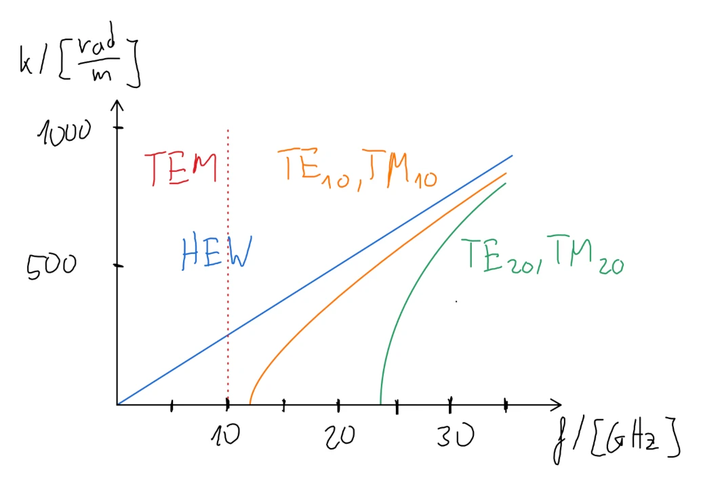
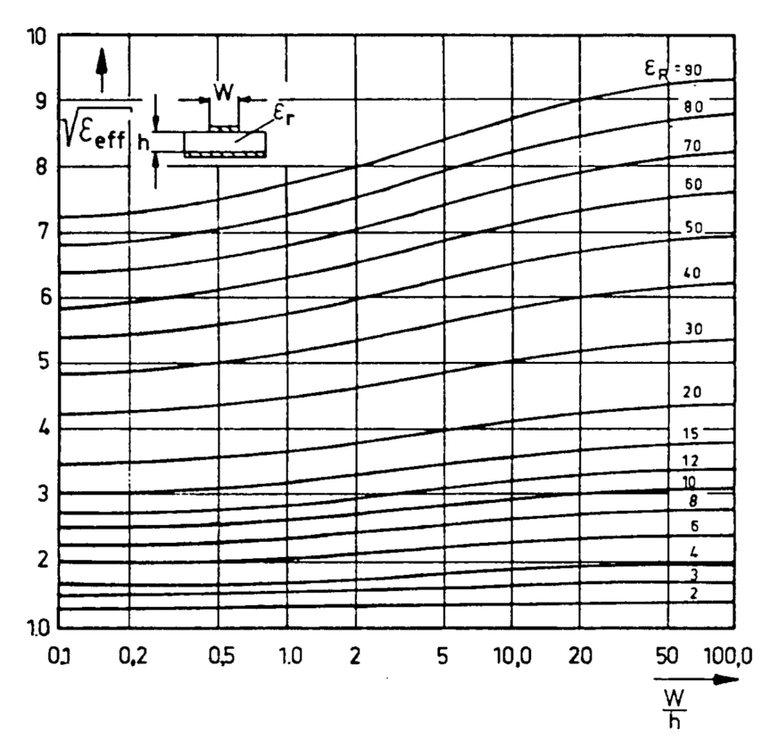

public:: true
icon:: 🛜
inherit-color-icon-from:: [[logseq-page-color-purple]]
tags:: uni
alias:: wave propagation, wellenausbreitungs, wellenausbreitung lva, WA

- ## vorlesungen
	- 
	- [[wellen vo temp]]
- ## beispiele
	- 
	- 
	- Übergang von Vakuum nach Glas
	  background-color:: green
	  collapsed:: true
		- Variante 1) Eine zirkular polarisierte Welle mit einem Querschnitt von $A = \mathrm{3~mm^2}$ und einer Leistung von $P = \mathrm{10~mW}$ wird unter dem Brewster-Winkel auf eine Grenzfläche zwischen Vakuum ($n_1 = \mathrm{1}$) und Glas ($n_2 = \mathrm{1.6}$) eingestrahlt.
		  background-color:: green
		  collapsed:: true
		  
			- {{evalpage}}
			- a) Berechnen Sie Einfallswinkel $\Theta_e$, Reflexionswinkel $\Theta_r$ und Austrittswinkel $\Theta_t$ und zeichnen Sie diese in die Skizze ein!
			  background-color:: green
			  collapsed:: true
				- formeln
				  collapsed:: true
					- $\Theta_i = \Theta_r$
					  tags:: formel
					  bezeichnung:: Reflektions gesetz
					  collapsed:: true
						- $\Theta_i$ ... einfallswinkel (***i***nbound) $\mathrm{[°]}$
						- $\Theta_r$ ... reflektionswinkel (***r***eflected) $\mathrm{[°]}$
					- ((6734720f-e42f-46c0-a512-3075ea423042))
					- $\Theta_{b}=\arctan\left(\frac{n_2}{n_1}\right)$
					  tags:: formel
					  bezeichnung:: [[brewster winkel]]
					  collapsed:: true
						- $\Theta_b$ ... Brewster winkel $\mathrm{[°]}$
						- $n_1$ ... [[brechungsindex]] $\mathrm{[-]}$
						- $n_2$ ... [[brechungsindex]] $\mathrm{[-]}$
			- b) Berechnen Sie die Querschnitsfläche $A$ des transmittierten Strahls!
			  background-color:: green
			  collapsed:: true
				- formeln
				  collapsed:: true
					- ((6734720b-5c51-4f95-ac33-ed541e99c1ca))
			- c) Berechnen Sie die Leistungen $P_{\mathrm{TE,t}}$ und $P_{\mathrm{TM,t}}$ der transmittierten Wellen!
			  background-color:: green
			  collapsed:: true
				- formeln
				  collapsed:: true
					- ((6735b379-5292-4604-baef-85a4c9a6fc3f))
					- ((6735b379-80fa-4b2a-be2d-af5089fe1fa8))
					- ((6735b379-8ba8-4a90-b5e2-8b5b38036526))
					- ((6735b379-1a1f-417e-8323-7fe94bd9e2cf))
					- $\vect{P}_{\mathrm{t}} = \vect{P}_{\mathrm{TE,t}} + \vect{P}_{\mathrm{TM,t}}$
					  tags:: formel
					  bezeichnung:: leistung der transmittierten welle
					  id:: 675ac3d6-3993-4c69-a300-cc0df932374a
					  collapsed:: true
						- $\vect{P}_{\mathrm{t}}$ ... gesamte leistung der transmittierten Welle $\iu{ W }$
						- $\vect{P}_{\mathrm{TE,t}}$ ... leistung der transmittierten TE Welle $\iu{ W }$
						- $\vect{P}_{\mathrm{TM,t}}$ ... leistung der transmittierten TM Welle $\iu{ W }$
					- ((6735b379-9a02-48b3-997c-2ecd856cb257))
					- ((67360de7-70f6-457a-b7e1-e13b553b5d80))
			- [📚 2024-11-12 16h29m.xopp](../assets/documents/2024-11-12 16h29m.xopp)
			- 
		- Variante 2) Eine zirkular polarisierte Welle mit einem Querschnitt von $A = \mathrm{2~mm^2}$ und einer Leistung von $P = \mathrm{1~mW}$ wird unter dem Brewster-Winkel auf eine Grenzfläche zwischen Vakuum ($n_1 = \mathrm{1}$) und Glas ($n_2 = \mathrm{1.5}$) eingestrahlt.
		  background-color:: green
		  collapsed:: true
		  
			- {{evalpage}}
			- a) Berechnen Sie Einfallswinkel $\Theta_e$, Reflexionswinkel $\Theta_r$ und Austrittswinkel $\Theta_t$ und zeichnen Sie diese in die Skizze ein!
			  background-color:: green
			  collapsed:: true
				- formeln
				  collapsed:: true
					- $\Theta_i = \Theta_r$
					  tags:: formel
					  bezeichnung:: Reflektions gesetz
					  collapsed:: true
						- $\Theta_i$ ... einfallswinkel (***i***nbound) $\mathrm{[°]}$
						- $\Theta_r$ ... reflektionswinkel (***r***eflected) $\mathrm{[°]}$
					- ((6734720f-e42f-46c0-a512-3075ea423042))
					- $\Theta_{b}=\arctan\left(\frac{n_2}{n_1}\right)$
					  tags:: formel
					  bezeichnung:: [[brewster winkel]] [link](((6735b379-a4a2-48f4-800f-7b9292b7a3a1)))
					  collapsed:: true
						- $\Theta_b$ ... Brewster winkel $\mathrm{[°]}$
						- $n_1$ ... [[brechungsindex]] $\mathrm{[-]}$
						- $n_2$ ... [[brechungsindex]] $\mathrm{[-]}$
			- b) Berechnen Sie die TE und TM-Anteile ($E$ und $H$) der reflektierten und der transmittierten Welle!
			  background-color:: green
			  collapsed:: true
				- formeln
				  collapsed:: true
					- ((6735b379-5292-4604-baef-85a4c9a6fc3f))
					- ((6735b379-80fa-4b2a-be2d-af5089fe1fa8))
					- ((6735b379-8ba8-4a90-b5e2-8b5b38036526))
					- ((6735b379-1a1f-417e-8323-7fe94bd9e2cf))
					- $\Gamma_{TM} = 0$
					  tags:: formel
					  bezeichnung:: reflektionsfaktor wenn einfallswinkel = [[brewster winkel]] [FS](((6735b379-a4a2-48f4-800f-7b9292b7a3a1)))
					  collapsed:: true
						- $\Gamma_{TM}$ ... reflektionsfaktor $\iu{ - }$
					- ((6735b379-9a02-48b3-997c-2ecd856cb257))
					- $\eta H = E$
					  tags:: formel, wip
					  bezeichnung:: abgeleitet von hier [link](((6735b379-187a-4654-8126-efd8a322477b)))
					  collapsed:: true
						- $\eta$ ... [[wellenwiderstand]] $\iu{ \Omega }$
						- $H$ ... magnetsiche feldstärke $\iu{ \frac{A}{m} }$
						- $E$ ... elektrische feldstärke $\iu{ \frac{V}{s} }$
					- ((67360de7-70f6-457a-b7e1-e13b553b5d80))
			- c) Berechnen Sie die Elliptizität der reflektierten und der transmittierten Welle in $\mathrm{dB}$!
			  background-color:: green
			  collapsed:: true
				- formeln
				  collapsed:: true
					- ((67360dd7-52ba-4a90-a63b-ad4871a896af))
			- [📚 2024-11-18 17h41m.xopp](../assets/documents/2024-11-18 17h41m.xopp)
			- 
		- Variante 3) Ein Lichtstrahl der Sonne (unpolarisiert, aber TM, TE gleich stark) fällt zu später Stunde ($\Theta_e = 75°$) auf einen See ($n_2 = 1.33$). An der glatten Wasseroberfläche wird er reflektiert. Zwei Fotografen fotografieren diese Landschaft. Der zweite verwendet ein ideales Polarisationsfilter um die Reflexion der Sonne im Wasser zu unterdrücken.
		  background-color:: green
		  collapsed:: true
		  
			- {{evalpage}}
			- a) Wie groß ist die (gesamte) reflektierte Lichtleistung im Verhältnis zur eingestrahlten (in $\mathrm{dB}$)? Zeichnen Sie alle verwendeten Winkel ein.
			  background-color:: green
			  collapsed:: true
				- formeln
				  collapsed:: true
					- $\Theta_i = \Theta_r$
					  tags:: formel
					  bezeichnung:: Reflektions gesetz
					  collapsed:: true
						- $\Theta_i$ ... einfallswinkel (***i***nbound) $\mathrm{[°]}$
						- $\Theta_r$ ... reflektionswinkel (***r***eflected) $\mathrm{[°]}$
					- ((6734720f-e42f-46c0-a512-3075ea423042))
					- ((6735b379-8ba8-4a90-b5e2-8b5b38036526))
					- ((6735b379-5292-4604-baef-85a4c9a6fc3f))
					- ((6735b379-9a02-48b3-997c-2ecd856cb257))
				- code
				  collapsed:: true
					- {{clearnamespace python-clear-namespace}}{{loadunipackages python-load-uni-packages}}
					- collapsed:: true
					  ```python
					  printer.seek(0); printer.truncate(0)
					  
					  n1 = 1
					  n2 = 1.33
					  n = n2/n1
					  theta1 = 75 * degree
					  theta2 = arcsin(n1/n2 * sin(theta1))
					  resPrint('θ_2', round(theta2 / degree,3), '°')
					  
					  printer.getvalue()
					  ```
						- {{evalparent}}
					- collapsed:: true
					  ```python
					  printer.seek(0); printer.truncate(0)
					  
					  gammaTE = (( n1 * cos(theta1) - n2 * cos(theta2) ) /
					             ( n1 * cos(theta1) + n2 * cos(theta2) ))
					  
					  resPrint('Γ_TE', gammaTE, '')
					  
					  printer.getvalue()
					  ```
						- {{evalparent}}
					- collapsed:: true
					  ```python
					  printer.seek(0); printer.truncate(0)
					  gammaTM = (( n2*cos(theta1)-n1*cos(theta2) ) /
					             ( n2*cos(theta1)+n1*cos(theta2) ))
					  resPrint('Γ_TM', gammaTM, '')
					  printer.getvalue()
					  ```
						- {{evalparent}}
					- collapsed:: true
					  ```python
					  printer.seek(0); printer.truncate(0)
					  R = round(10 * log10((gammaTE**2+gammaTM**2)/2),3)
					  "R: " + str(R) + " dB"
					  resPrint('R', R, 'dB')
					  
					  printer.getvalue()
					  ```
						- {{evalparent}}
			- b) Wie gut kann das ideal eingesetzte Polarisationsfilter des zweiten Fotografen die Reflexion im Vergleich zum ersten Fotografen unterdrücken (in $\mathrm{dB}$)?
			  background-color:: green
			  collapsed:: true
				- es geht hierbei darum, dass ein filter verwendet wird welches den TM oder TE anteil filtert
				- code
				  collapsed:: true
					- collapsed:: true
					  ```python
					  printer.seek(0); printer.truncate(0)
					  
					  # gammaTM = 0
					  R_TM = round(10 * log10((gammaTE**2)/2),3)
					  resPrint('R_TM', R_TM, 'dB')
					  printer.getvalue()
					  ```
						- {{evalparent}}
					- collapsed:: true
					  ```python
					  printer.seek(0); printer.truncate(0)
					  
					  # gammaTE = 0
					  R_TE = round(10 * log10((gammaTM**2)/2),3)
					  resPrint('R_TM', R_TM, 'dB')
					  printer.getvalue()
					  ```
						- {{evalparent}}
					- collapsed:: true
					  ```python
					  printer.seek(0); printer.truncate(0)
					  
					  # R_TE negativer
					  resPrint('Photograf2/Photograf1', R_TE-R, 'dB')
					  printer.getvalue()
					  ```
						- {{evalparent}}
			- [📚 2024-11-20 19h04m.xopp](../assets/documents/2024-11-20 19h04m.xopp)
			- 
	- Stehende Welle im verlustbehafteten Medium
	  background-color:: green
	  collapsed:: true
		- Eine sich im [verlustbehafteten Medium](((6740c4fa-4d26-4310-b196-321b7391feb6))) (z.B.: trockener Erdboden) ausbreitende ebene Welle mit $f = \mathrm{20~MHz}$ wird von einer auf die Ausbreitungsrichtung senkrecht stehenden [metallischen Wand mit unendlicher Leitfähigkeit](((67405634-4634-4d0d-b586-6a52b1bb7c75))) reflektiert (siehe Abbildung). Die Amplitude der einfallenden Welle bei $z = 0$ beträgt $\mathrm{5~V/m}$.
		  background-color:: green
		  collapsed:: true
		  Hinweis: $\varepsilon_0 = \mathrm{8,854· 10^{−12}~As/Vm}$, $µ0 = \mathrm{4π · 10^{−7}~Vs/Am}$.
		  
			- skript
			  collapsed:: true
				- ((67405657-2347-4d8b-93f5-98a6b52c836c))
				  id:: 67405634-4634-4d0d-b586-6a52b1bb7c75
				- ((6740c51b-b09e-4b73-b018-e2d77efe468b))
				  id:: 6740c4fa-4d26-4310-b196-321b7391feb6
			- {{evalpage}}
			- a) Wie groß ist die Phasengeschwindigkeit $v_P$?
			  background-color:: green
			  collapsed:: true
				- formeln
				  collapsed:: true
					- ((673e3379-4b5b-475a-91a4-08da8e21eb58))
				- code
				  collapsed:: true
					- {{clearnamespace python-clear-namespace}}{{loadunipackages python-load-uni-packages}}
					- collapsed:: true
					  ```python
					  printer.seek(0); printer.truncate(0)
					  
					  epsr = 7
					  mur = 1
					  
					  v_p = 1/((epsilon_0 * epsr * mu_0 * mur)**(1/2))
					  resPrint('v_p',v_p,'m/s')
					  printer.getvalue()
					  ```
						- {{evalparent}}
			- b) Setzten Sie die einfallende Welle an ($E_e$ und $H_e$) und berechnen Sie die Wellenzahl $k_e$. Wie groß ist die Dämpfung in $\mathrm{dB/m}$
			  background-color:: green
			  collapsed:: true
				- formeln
				  collapsed:: true
					- ((67404a07-268a-4632-b86f-c136cdfaf0eb))
					- ((673e3379-7ae8-425b-bf90-a176d50f983b))
					- ((673e3379-65ec-4bba-988b-f6a5d8499e68)) [FS](((6745a2d1-96eb-4141-93fd-4c8e10df8d94)))
					- ((674496c6-ef08-4cfe-8444-ef86aadf0f47)) [FS](((6740c68b-e124-4f93-b1f1-9c8be879951c)))
					- ((67459ac7-d3b4-47bf-9ac5-0379a5e2e1e8)) [FS](((673e3379-64cb-4d50-98c9-668f6b9fd3fd)))
				- code
				  collapsed:: true
					- collapsed:: true
					  ```python
					  printer.seek(0); printer.truncate(0)
					  
					  mu = mur * mu_0
					  eps = epsr * epsilon_0
					  f = 20E6
					  w = 2 * pi * f
					  ke = w * sqrt(mu * eps)
					  resPrint('ke', ke, 'rad/m')
					  printer.getvalue()
					  ```
						- {{evalparent}}
					- collapsed:: true
					  ```python
					  printer.seek(0); printer.truncate(0)
					  
					  # bei z = 0
					  E0 = 5
					  sig = 1.5e-3
					  alpha = 0
					  
					  s = sig / (eps * w)
					  jke=1j*ke*sqrt(1-1j*s)
					  alpha = real(jke)
					  beta = imag(jke)
					  
					  resPrint('α', alpha, 'rad/m',
					           'β', beta, 'rad/m')
					  printer.getvalue()
					  ```
						- {{evalparent}}
					- collapsed:: true
					  ```python
					  printer.seek(0); printer.truncate(0)
					  
					  D = 20 * log10(E0 / (E0 * e**-alpha))
					  
					  resPrint('D',D, 'dB')
					  printer.getvalue()
					  ```
						- {{evalparent}}
						- ich weiß leider nicht warum man genau die Dämpfung so ausrechnet und warum man genau $\alpha$ verwendet #wip
			- c) Berechnen Sie die komplexe Amplitude und den zeitlichen Verlauf der einfallenden Welle am Ort der metallischen Wand $z_0 = \mathrm{8~m}$!
			  background-color:: green
			  collapsed:: true
				- formeln
				  collapsed:: true
					- ((673e3379-7ae8-425b-bf90-a176d50f983b))
					- ((673e3379-9e8e-4059-b99e-e764c678fa51))
					- ((673e3379-54d5-49f8-b0db-18b82bf799c4))
				- code
				  collapsed:: true
					- collapsed:: true
					  ```python
					  printer.seek(0); printer.truncate(0)
					  
					  z0 = 8
					  z = z0
					  Ee = E0 * e**(-jke*z)
					  
					  resPrint('Ee(z=8)',Ee,'V/m',
					           'abs(Ee)', abs(Ee), 'V/m')
					  printer.getvalue()
					  ```
						- {{evalparent}}
					- collapsed:: true
					  ```python
					  printer.seek(0); printer.truncate(0)
					  T = 1/f
					  t = linspace(0, 2*T , 500)  # Generate 500 points between 0 and 4π
					  y = E0*e**(-alpha*z0)*cos(w*t-beta*z0)
					  
					  # Create the plot
					  plt.clf()
					  plt.plot(t, y)  # Plot y = sin(x)
					  plt.xlabel('$t$')  # Label the x-axis
					  plt.ylabel('$E_e(z_0, t)$')  # Label the y-axis
					  plt.grid(True)  # Add a grid
					  showPlot()
					  #printer.getvalue()
					  ```
						- {{evalparent}}
			- d) Finden Sie einen Ansatz für die reflektierte Welle ($E_r$ und $H_r$)! Wie muss der zeitliche Verlauf der reflektierten Welle aussehen, damit die Randbedingungen erfüllt sind?
			  background-color:: green
			  collapsed:: true
				- formeln
				  collapsed:: true
					- ((67459ac8-e918-4a08-8003-07057ff681d6))
					- ((6745a3c5-baa9-4655-ac6f-92348bdacfc0))
					- $E_{r}=Ae^{jk_{z}\left(z_0-z\right)}$
					  tags:: formel
					  bezeichnung:: ansatz für die reflektierte/rücklaufende welle
					  collapsed:: true
						- $E_r$ ... reflektierte/rücklaufende welle des [[elektrischen feldes]] $\iu{ \frac{V}{m} }$
						- $A$ ... anfangs amplitude der reflektierten welle. entspricht der einfallenden welle $\iu{ \frac{V}{m} }$
						- $k_z$ ... [[komplexe]] [[wellenzahl]] $\iu{ \frac{rad}{m} }$
						- $z$ ... entfernung in ausbreitungsrichtung (hier $z$-Achse) $\iu{ m }$
						- $z_0$ ... entfernung zur stelle an der die reflexion stattfindet $\iu{ m }$
				- code
				  collapsed:: true
					- collapsed:: true
					  ```python
					  printer.seek(0); printer.truncate(0)
					  t = sp.symbols('t')
					  z = sp.symbols('z', real=True)
					  z0 = 8
					  
					  # Expression
					  # gesamt feld momentanwert
					  eges = E0 * sp.exp(-alpha * z0) * sp.cos(w * t - beta * z0) * (1 - sp.exp(-alpha * (z0 - z)) * sp.cos(w * t - beta * (z0 - z)))
					  eges = eges.subs(z, z0)
					  # einfallendes feld momentanwert
					  ee = E0 * sp.exp(-alpha * z0) * sp.cos(w * t - beta * z0)
					  ee = ee.subs(z,z0)
					  # reflektiertes feld momentanwert
					  er = -E0 * sp.exp(-alpha * z0) * sp.cos(w * t - beta * z0) * sp.exp(-alpha * (z0 - z)) * sp.cos(w * t - beta * (z0 - z))
					  er = er.subs(z,z0)
					  
					  # Convert to numerical function
					  numerical_eges = lambdify(t, eges)
					  numerical_ee = lambdify(t, ee)
					  numerical_er = lambdify(t, er)
					  
					  # Numerical plotting
					  T=1/f
					  t_vals = linspace(-T+8, 8, 500)
					  
					  plt.clf()
					  y_vals = numerical_eges(t_vals)
					  plt.plot(t_vals, y_vals, label='eges')
					  y_vals = numerical_ee(t_vals)
					  plt.plot(t_vals, y_vals, label='ee')
					  y_vals = numerical_er(t_vals)
					  plt.plot(t_vals, y_vals, label='er')
					  
					  plt.xlabel("t")
					  plt.grid(True)
					  plt.legend()
					  
					  showPlot()
					  #printer.getvalue()
					  ```
						- {{evalparent}}
				- verstehe das beispiel nicht. da ist was an der reflektierten welle falsch
			- e) Berechnen Sie die Hüllkurve des Gesamtfeldes
			  background-color:: green
			  collapsed:: true
				- formeln
				  collapsed:: true
					- $|E_{ges}|^2 = \vect{E}(z) \cdot \vect{E}^*(z)$
					  tags:: formel
					  bezeichnung:: analyse der hüllkurve des [elektrischen gesamtfeldes]([[elektrisches feld]])
					  collapsed:: true
						- $|E_{ges}|^2$ ... betrags quadrat des gesamten [[elektrischen feldes]] $\iu{ \frac{V}{m} }$
						- $\vect{E}(z)$ ... [[komplexe]] amplitude des [[elektrischen feldes]] $\iu{ \frac{V}{m} }$
				- code
				  collapsed:: true
					- meine lösung
					  collapsed:: true
						- collapsed:: true
						  ```python
						  printer.seek(0); printer.truncate(0)
						  
						  # meine lösung
						  # symbolic math
						  E_s = sp.symbols('E')
						  E0_s = sp.symbols('E0', positive = True)
						  a_s = sp.symbols('α', real = True)
						  b_s = sp.symbols('β', real = True)
						  z_s = sp.symbols('z', real = True)
						  z0_s = sp.symbols('z0', real = True)
						  jke_s = a_s + 1j * b_s
						  
						  E_s = E0_s * (sp.exp(-jke_s*z_s) \
						            -sp.exp(-jke_s*(z0_s-z_s)))
						  Eabs_s = sp.simplify(sp.conjugate(E_s)*E_s)
						  
						  symPrint(Eabs_s)
						  printer.getvalue()
						  ```
							- {{evalparent}}
							- $E_{0}^{2} \cdot \left(1 - e^{\left(2 z - z_{0}\right) \left(α - 1.0 i β\right)}\right) \left(1 - e^{\left(2 z - z_{0}\right) \left(α + 1.0 i β\right)}\right) e^{- 2 z α}$
						- collapsed:: true
						  ```python
						  printer.seek(0); printer.truncate(0)
						  
						  # plot
						  # bei z = z0
						  lam = 2*pi / ke
						  z = linspace(-4*lam+z0,z0, 1000)
						  
						  E = E0 * e**(-jke*z0)*(1 - e**(-jke*(z0-z)))
						  absE2 = E*conj(E)
						  
						  y = absE2
						  
						  # Create the plot
						  plt.clf()
						  plt.plot(z, y)
						  plt.plot(z, -y)
						  plt.xlabel('z') 
						  plt.ylabel('E')
						  plt.grid(True)
						  
						  showPlot()
						  printer.getvalue()
						  ```
							- {{evalparent}}
					- ausarbeitung
					  collapsed:: true
						- collapsed:: true
						  ```python
						  printer.seek(0); printer.truncate(0)
						  # lösung aus ausarbeitung
						  Eabs_s  =E0_s**2 * (sp.exp(-2 * a_s * z_s) + \
						                      sp.exp(-2 * a_s * (z0_s - z_s)) - \
						                      2 * sp.exp(-2 * a_s * z0_s) * sp.cos(2*b_s*(z0_s-z_s)))
						  
						  symPrint(Eabs_s)
						  printer.getvalue()
						  ```
							- {{evalparent}}
							- $E_{0}^{2} \left(e^{- 2 α \left(- z + z_{0}\right)} - 2 e^{- 2 z_{0} α} \cos{\left(2 β \left(- z + z_{0}\right) \right)} + e^{- 2 z α}\right)$
						- collapsed:: true
						  ```python
						  printer.seek(0); printer.truncate(0)
						  # plot
						  # bei z = z0
						  lam = 2*pi / ke
						  z = linspace(-4*lam+z0,z0, 1000)
						  
						  absE2  =E0**2 * (exp(-2 * alpha * z) + \
						                     exp(-2 * alpha * (z0 - z)) - \
						                      2 * exp(-2 * alpha * z0) * cos(2*beta*(z0-z)))
						  y = absE2
						  
						  # Create the plot
						  plt.clf()
						  plt.plot(z, y)
						  plt.plot(z, -y)
						  plt.xlabel('z') 
						  plt.ylabel('E')
						  plt.grid(True)
						  
						  showPlot()
						  #printer.getvalue()
						  ```
							- {{evalparent}}
			- [📚 2024-11-21 18h45m.xopp](../assets/documents/2024-11-21 18h45m.xopp)
			- 
	- Rechteckhohlleiter
	  background-color:: green
	  collapsed:: true
		- TODO this
		- Variante 1) Untersuchen Sie die Ausbreitung von $\mathrm{TE}_{m,n}$ Wellen in $z$ Richtung im skizzierten Rechteckhohlleiter.
		  background-color:: green
		  collapsed:: true
		  
			- Finden Sie einen geeigneten Ansatz für die Komponenten der gewünschten Moden in Ausbreitungsrichtung, der die Wellengleichung erfüllt. Ermitteln Sie die Separationsbedingungen.
			  background-color:: green
			  collapsed:: true
				- formeln
				  collapsed:: true
					-
				- code
			- Leiten Sie daraus die restlichen Feldkomponenten her und passen Sie an den Rand an! Welche Komponenten verschwinden?
			  background-color:: green
			- Berechnen Sie die Hohlleiterwellenlängen, die Grenzwellenlängen und die Grenzfrequenzen aller gefragter Moden als Funktion von $m$ und $n$! Ist ein TEM Modus ausbreitungsfähig? Wieso? Wenn ja, welche Grenzwellenlänge bzw. Feldwellenwiderstand hat er?
			  background-color:: green
			- Berechnen und skizzieren Sie das Dispersionsdiagramm für die $\mathrm{TE}_{10}$, $\mathrm{TE}_{11}$, $\mathrm{TE}_{20}$ Moden für $a = 4 \mathrm{cm}$, $b = 3\mathrm{cm}$, $\varepsilon_r = 3$, $\mu_r = 1$, $\varepsilon_0 = 8,854 \cdot 10^{−12} \mathrm{As/Vm}$, $\mu_0 = 4\pi \cdot 10^{−7} \mathrm{Vs/Am}$. Achten Sie auf die Beschriftung! Geben Sie die Grenzfrequenzen an! In welchem Frequenzbereich ist nur ein einziger Modus ausbreitungsfähig? Welcher?
			  background-color:: green
		- Variante 2)
		  background-color:: green
		- Variante 3)
		  background-color:: green
		- Variante 4)
		  background-color:: green
	- Hohlraumresonator
	  background-color:: green
	  collapsed:: true
		- Variante 1) Berechnen Sie den Grundmodus $\mathrm{TE_{101}}$ eines luftgefüllten ($\varepsilon_r = 1$) Hohlraumresonators (Abmessungen: $a = 4\mathrm{cm}$, $b = 2\mathrm{cm}$, $c = 4\mathrm{cm}$) mit $\mathbb{R}_M = 20\mathrm{m\Omega}$.
		  background-color:: green
		  collapsed:: true
		  
			- a) Berechnen Sie die Resonanzfrequenz!
			  background-color:: green
			  collapsed:: true
				- formeln
				  collapsed:: true
					- ((6745a3c5-c443-4fb4-bbea-b455958f827a))
					- ((673e3379-4b5b-475a-91a4-08da8e21eb58))
					- ((674b703d-c8a8-4814-8c70-f8289a9b6bdf))
				- code
				  collapsed:: true
					- {{clearnamespace python-clear-namespace}}{{loadunipackages python-load-uni-packages}}
					- collapsed:: true
					  ```python
					  printer.seek(0); printer.truncate(0)
					  
					  # angabe
					  a = 4E-2
					  b = 2E-2
					  c = 4E-2
					  mur = 1
					  mu = mu_0 * mur
					  epsr = 1
					  eps = epsilon_0 * epsr
					  Rm = 20E-3
					  # TE_101
					  m = 1
					  n = 0
					  p = 1
					  
					  # rechnung
					  vp = 1 / sqrt((eps * mu))
					  wmnp = pi * vp * sqrt((m/a)**2 + (n/b)**2 + (p/c)**2)
					  fmnp = wmnp / (2 * pi)
					  resPrint('f_mnp', fmnp, 'Hz')
					  printer.getvalue()
					  ```
						- {{evalparent}}
			- b) Berechnen Sie die unbelastetet Güte! Vereinfachen Sie zuerst die Formel unter der Berücksichtigung $a = c$! Setzen Sie dann Zahlenwerte ein!
			  background-color:: green
			  collapsed:: true
				- formeln
				  collapsed:: true
					- ((6745a3c5-66f7-450b-94fe-f6068dde589d))
				- code
				  collapsed:: true
					- collapsed:: true
					  ```python
					  printer.seek(0); printer.truncate(0)
					  
					  Rm_s, a_s, b_s, c_s, eta_s = sp.symbols('R_m a b c eta', 
					                                          real=True, 
					                                          positive=True)
					  eta = 377
					  Q0 = (
					    (pi * eta) / (2 * Rm) * 
					      (
					        (b * sqrt((a**2 + c**2)**3)) / 
					        (a * c * (a**2 + c**2) + 2 * b * (a**3 + c**3))
					      )
					  )
					  
					  Q0_s = (
					    (sp.pi * eta_s) / (2 * Rm_s) *
					    (
					      b_s * sp.sqrt((a_s**2 + c_s**2)**3) /
					      (a_s * c_s * (a_s**2 + c_s**2) + 2 * b_s * (a_s**3 + c_s**3))
					    )
					  )
					  Q0_s_sim = Q0_s.subs(c_s, a_s)
					           
					  Q0_s_sim = sp.simplify(Q0_s_sim)
					  symPrint(Q0_s)
					  symPrint(Q0_s_sim)
					  printer.getvalue()
					  ```
						- {{evalparent}}
						- $\frac{\pi b \eta \left(a^{2} + c^{2}\right)^{\frac{3}{2}}}{2 Rm \left(a c \left(a^{2} + c^{2}\right) + 2 b \left(a^{3} + c^{3}\right)\right)}$
						- $\frac{\sqrt{2} \pi b \eta}{2 R_{m} \left(a + 2 b\right)}$
					- collapsed:: true
					  ```python
					  Q0_s_sim.subs(a_s, a).subs(b_s,b).subs(Rm_s, Rm).subs(eta_s, eta).evalf(n=5)
					  ```
						- {{evalparent}}
			- c) Berechnen Sie die Resonanzfrequenz und die unbelastete Güte, wenn der Hohlraumresonator mit einem verlustlosen Dielektrikum $\varepsilon_r = 2.5$ gefüllt ist!
			  background-color:: green
			  collapsed:: true
				- formeln
				  collapsed:: true
					- ((6745a3c5-c443-4fb4-bbea-b455958f827a))
					- ((6745a3c5-66f7-450b-94fe-f6068dde589d))
					- ((673c4eb2-5827-434c-a323-0ff29f347504))
				- code
				  collapsed:: true
					- collapsed:: true
					  ```python
					  printer.seek(0); printer.truncate(0)
					  
					  # resonanzfrequenz
					  epsr = 2.5
					  eps = epsilon_0 * epsr
					  
					  # rechnung
					  vp = 1 / sqrt((eps * mu))
					  wmnp = pi * vp * sqrt((m/a)**2 + (n/b)**2 + (p/c)**2)
					  fmnp = wmnp / (2 * pi)
					  resPrint('f_mnp', fmnp, 'Hz')
					  printer.getvalue()
					  ```
						- {{evalparent}}
					- collapsed:: true
					  ```python
					  printer.seek(0); printer.truncate(0)
					  
					  # unbelastete güte
					  eta = sqrt(mu/eps)
					  Q0 = (
					    (pi * eta) / (2 * Rm) * 
					      (
					        (b * sqrt((a**2 + c**2)**3)) / 
					        (a * c * (a**2 + c**2) + 2 * b * (a**3 + c**3))
					      )
					  )
					  resPrint('Q_0', Q0, '')
					  printer.getvalue()
					  ```
						- {{evalparent}}
		- Variante 2) Berechnen Sie den Grundmodus $\mathrm{TE_{101}}$ eines luftgefüllten ($\varepsilon_r = 1$) Hohlraumresonators (Abmessungen: $a = 2b=c$, $\mathbb{R}_M = 30\mathrm{m\Omega}$).
		  background-color:: green
		  collapsed:: true
		  
			- a) Berechnen Sie die Abmessungen $a, b, c$ für eine Resonanzfrequenz von $20 \mathrm{GHz}$!
			  background-color:: green
			  collapsed:: true
				- formeln
				  collapsed:: true
					- ((6745a3c5-c443-4fb4-bbea-b455958f827a))
					- ((673e3379-4b5b-475a-91a4-08da8e21eb58))
					- ((674b703d-c8a8-4814-8c70-f8289a9b6bdf))
				- code
				  collapsed:: true
					- {{clearnamespace python-clear-namespace}}{{loadunipackages python-load-uni-packages}}
					- collapsed:: true
					  ```python
					  printer.seek(0); printer.truncate(0)
					  
					  # angabe
					  mur = 1
					  mu = mu_0 * mur
					  epsr = 1
					  eps = epsilon_0 * epsr
					  Rm = 30E-3
					  fR = 20E9
					  wmnp = 2 * pi * fR
					  # TE_101
					  m = 1
					  n = 0
					  p = 1
					  
					  Rm_s, a_s, b_s, c_s, vp_s ,m_s, n_s, p_s = sp.symbols('R_m a b c v_p m n p', 
					                                                       real=True, 
					                                                       positive=True)
					  
					  # rechnung
					  vp = 1 / sqrt((eps * mu))
					  wmnp_s = ( sp.pi * vp_s * sp.sqrt(
					              (m_s/a_s)**2 + (n_s/b_s)**2 + (p_s/c_s)**2
					             )
					           )
					  fmnp_s = wmnp_s / (2 * sp.pi)
					  
					  # werte einsetzen
					  fmnp_s = (fmnp_s.subs(m_s,m)
					                  .subs(n_s,n)
					            	    .subs(p_s,p)
					            	    .subs(c_s,a_s)
					           		.subs(b_s,a_s/2)
					           		.subs(vp_s, vp))
					  eqn = sp.Eq(fmnp_s,fR)
					  solution = sp.solve(eqn, a_s)
					  a = float(solution[0])
					  b = a/2
					  c = a
					  resPrint('a', a*100, 'cm',
					           'b', b*100, 'cm',
					           'c', c*100, 'cm')
					  printer.getvalue()
					  ```
						- {{evalparent}}
			- b) Berechnen Sie die unbelastetet Güte! Vereinfachen Sie zuerst die Formel unter der Berücksichtigung $a = 2b = c$!
			  background-color:: green
			  collapsed:: true
				- formeln
				  collapsed:: true
					- ((6745a3c5-66f7-450b-94fe-f6068dde589d))
				- code
				  collapsed:: true
					- collapsed:: true
					  ```python
					  printer.seek(0); printer.truncate(0)
					  
					  eta_s = sp.symbols('eta', real=True, positive=True)
					  Q0_s = (
					    (sp.pi * eta_s) / (2 * Rm_s) *
					    (
					      b_s * sp.sqrt((a_s**2 + c_s**2)**3) /
					      (a_s * c_s * (a_s**2 + c_s**2) + 2 * b_s * (a_s**3 + c_s**3))
					    )
					  )
					  Q0_s_sim = Q0_s.subs(c_s, a_s).subs(b_s, a_s/2)
					           
					  Q0_s_sim = sp.simplify(Q0_s_sim)
					  
					  symPrint(Q0_s)
					  symPrint(Q0_s_sim)
					  printer.getvalue()
					  ```
						- {{evalparent}}
						- $\frac{\pi b \eta \left(a^{2} + c^{2}\right)^{\frac{3}{2}}}{2 Rm \left(a c \left(a^{2} + c^{2}\right) + 2 b \left(a^{3} + c^{3}\right)\right)}$
						- $\frac{\sqrt{2} \pi \eta}{8 R_{m}}$
					- collapsed:: true
					  ```python
					  printer.seek(0); printer.truncate(0)
					  
					  eta = sqrt(mu/eps)
					  resPrint('Q0_s', 
					           Q0_s_sim.subs(a_s, a).subs(b_s,b).subs(Rm_s, Rm).subs(eta_s, eta).evalf(n=5),
					           '')
					  printer.getvalue()
					  ```
						- {{evalparent}}
			- c) Berechnen Sie die relative Dielektrizitätskonstante und die unbelastete [[Güte]], wenn der Hohlraumresonator mit einem verlustlosen Dielektrikum gefüllt ist, um die Resonanzfrequenz auf $15 \mathrm{GHz}$ zu reduzieren!
			  background-color:: green
			  collapsed:: true
				- formeln
				  collapsed:: true
					- ((6745a3c5-c443-4fb4-bbea-b455958f827a))
					- ((6745a3c5-66f7-450b-94fe-f6068dde589d))
					- ((673c4eb2-5827-434c-a323-0ff29f347504))
				- code
				  collapsed:: true
					- collapsed:: true
					  ```python
					  printer.seek(0); printer.truncate(0)
					  
					  # dielektrizitätskonstante
					  fR = 15E9
					  
					  epsr_s = sp.symbols('eps_r', real=True, positive=True)
					  eps_s = epsr_s * epsilon_0
					  vp_s = 1 / sp.sqrt((eps_s * mu))
					  wmnp_s = ( sp.pi * vp_s * sp.sqrt(
					              (m_s/a_s)**2 + (n_s/b_s)**2 + (p_s/c_s)**2
					             )
					           )
					  fmnp_s = wmnp_s / (2 * sp.pi)
					  
					  # werte einsetzen
					  fmnp_s = (fmnp_s.subs(m_s,m)
					                  .subs(n_s,n)
					            	    .subs(p_s,p)
					            		.subs(a_s,a)
					            	    .subs(c_s,c)
					           		.subs(b_s,b))
					  eqn = sp.Eq(fmnp_s,fR)
					  solution = sp.solve(eqn, epsr_s)
					  epsr = float(solution[0])
					  
					  resPrint('ɛ_r', epsr, '')
					  printer.getvalue()
					  ```
						- {{evalparent}}
					- collapsed:: true
					  ```python
					  printer.seek(0); printer.truncate(0)
					  
					  # unbelastete güte
					  eps = epsr * epsilon_0
					  eta = sqrt(mu/eps)
					  Q0 = (
					    (pi * eta) / (2 * Rm) * 
					      (
					        (b * sqrt((a**2 + c**2)**3)) / 
					        (a * c * (a**2 + c**2) + 2 * b * (a**3 + c**3))
					      )
					  )
					  resPrint('Q0', Q0, '')
					  printer.getvalue()
					  ```
						- {{evalparent}}
			- [📚 2024-12-01 16h11m.xopp](../assets/documents/2024-12-01 16h11m.xopp)
			- 
	- [[Koaxialkabel]]
	  background-color:: green
	  collapsed:: true
		- Variante 1)
		  background-color:: green
		  collapsed:: true
		  
			- a) Bestimmen Sie einen geeigneten Innenradius $r_i$ des abgebildeten Koaxialkabels für $Z_L = 60 \mathrm{\Omega}$. Der Außenradius sei $r_a = 8.5 \mathrm{mm}$, das verwendete Dielektrikum sei Luft mit $\varepsilon_r = 1$.
			  background-color:: green
			  collapsed:: true
				- formeln
				  collapsed:: true
					- ((6745a3c5-c563-4874-8d5b-50fee6812aea))
				- code
				  collapsed:: true
					- {{clearnamespace python-clear-namespace}}{{loadunipackages python-load-uni-packages}}
					- collapsed:: true
					  ```python
					  printer.seek(0); printer.truncate(0)
					  
					  # angabe
					  ZL = 60
					  ra = 8.5E-3
					  epsr = 1
					  eps = epsr * epsilon_0
					  mur = 1
					  mu = mur * mu_0
					  eta = sqrt(mu/eps)
					  
					  eta_s, ra_s, ri_s = sp.symbols('eta r_a r_i', 
					                                 real=True, 
					                                 positive=True)
					  ZL_s = eta_s/(2*pi) * sp.ln(ra_s / ri_s)
					  
					  eqn = sp.Eq(ZL_s, ZL)
					  sol = sp.solve(eqn, ri_s)
					  ri_s = sol[0]
					  
					  # werte einsetzen
					  ri = (ri_s.subs(ra_s, ra)
					          	.subs(eta_s, eta)).evalf(n=4)
					  
					  resPrint('r_i', ri*1000, 'mm')
					  symPrint(ri_s)
					  printer.getvalue()
					  ```
						- {{evalparent}}
						- $r_{a} e^{- \frac{376.991118430776}{\eta}}$
			- b) Die Innen- bzw. Außenleiter bestehen aus Kupfer mit $\sigma = 57 \cdot 10^6 \mathrm{S/m}$. Wie groß ist die Eindringtiefe bei $f = 5 \mathrm{GHz}$? Berechnen Sie die ohmschen Verluste des Kabels in $\mathrm{dB/m}$.
			  background-color:: green
			  collapsed:: true
				- formeln
				  collapsed:: true
					- ((674d7759-c315-4a22-a755-be7a35c4b441))
					- ((674d7759-1d40-46b8-9d39-cbf868cd298e))
					- ((674d7759-4a7e-4220-b396-27bd49ccaa45))
					- ((674de501-a2a9-4e7a-8a81-892354262c7e))
				- code
				  collapsed:: true
					- collapsed:: true
					  ```python
					  printer.seek(0); printer.truncate(0)
					  
					  sig = 57E6
					  f = 5E9
					  w = 2*pi*f
					  d = sqrt(2/(w*mu*sig))
					  resPrint('d', d*1E9, 'nm')
					  printer.getvalue()
					  ```
						- {{evalparent}}
					- collapsed:: true
					  ```python
					  printer.seek(0); printer.truncate(0)
					  R = (sqrt((w * mu)/(2 * sig))*
					       1 / (2 * pi) * (1 / ri + 1 / ra))
					  
					  alphaR = R/(2*ZL)
					  
					  resPrint('αR', alphaR, 'Np/m',
					           'αR', alphaR*20/log(10), 'dB/m')
					  printer.getvalue()
					  ```
						- {{evalparent}}
			- c) Ein Ende der Koaxialleitung wird mit Hilfe einer kreisförmigen Scheibe aus Graphit abgeschlossen. Die Scheibe habe ein $R_\square  = 120\pi \mathrm{\Omega}$. Welchen ohmschen Widerstand hat die kreisförmige Scheibe für eine einfallende $\mathrm{TEM}$ Welle?
			  background-color:: green
			  collapsed:: true
				- 
				- formeln
				  collapsed:: true
					- ((674d7759-2399-4628-94f1-400ee5be7c0e))
				- code
				  collapsed:: true
					- collapsed:: true
					  ```python
					  printer.seek(0); printer.truncate(0)
					  Rsq = 120*pi
					  r_s = sp.symbols('r', positive=True, real=True)
					  R = sp.integrate(Rsq/(2*pi*r_s), (r_s,ri,ra))
					  resPrint('R', R, 'Ω')
					  printer.getvalue()
					  ```
						- {{evalparent}}
			- d) Wie groß ist der Reflexionsfaktor am Ende der Koaxialleitung auf Grund des Abschlusswidertandes der kreisförmigen Scheibe? In welchem Frequenzbereich gilt dieser Reflexionsfaktor?
			  background-color:: green
			  collapsed:: true
				- formeln
				  collapsed:: true
					- $\rho_{A} = \frac{R_{A}-Z_{L}}{R_{A}+Z_{L}}$
					  tags:: formel
					  bezeichnung:: reflexionsfaktor am ende einer [[koaxialleitung]]
					  collapsed:: true
						- $R_A$ ... Abschlusswiderstrand $\iu{\Omega}$
						- $Z_L$ ... leitungsimpedanz $\iu{\Omega}$
						- skript
						  collapsed:: true
							- ((674ec847-fd7d-4084-915e-8421e8671ad5))
				- code
				  collapsed:: true
					- collapsed:: true
					  ```python
					  printer.seek(0); printer.truncate(0)
					  RA = R # wert der vorher berechnet wurde
					  rA = (RA-ZL)/(RA+ZL)
					  resPrint('r', rA*1E4,'e-4')
					  printer.getvalue()
					  ```
						- {{evalparent}}
						- es ist schwierig den frequenzbereich abzuschätzen, da $R_A$ und $Z_L$ von der frequenz abhängen
		- Variante 2)
		  background-color:: green
		  collapsed:: true
		  
			- a) Bestimmen Sie einen geeigneten Innenradius $r_i$ des abgebildeten Koaxialkabels für $Z_L = 50 \mathrm{\Omega}$. Der Außenradius sei $r_a = 7.3 \mathrm{mm}$, das verwendete Dielektrikum sei Luft mit $\varepsilon_r = 2.35$.
			  background-color:: green
			  collapsed:: true
				- formeln
				  collapsed:: true
					- ((6745a3c5-c563-4874-8d5b-50fee6812aea))
				- code
				  collapsed:: true
					- {{clearnamespace python-clear-namespace}}{{loadunipackages python-load-uni-packages}}
					- collapsed:: true
					  ```python
					  printer.seek(0); printer.truncate(0)
					  
					  # angabe
					  ZL = 50
					  ra = 7.3E-3
					  epsr = 2.35
					  eps = epsr * epsilon_0
					  mur = 1
					  mu = mur * mu_0
					  eta = sqrt(mu/eps)
					  
					  eta_s, ra_s, ri_s = sp.symbols('eta r_a r_i', 
					                                 real=True, 
					                                 positive=True)
					  ZL_s = eta_s/(2*pi) * sp.ln(ra_s / ri_s)
					  
					  eqn = sp.Eq(ZL_s, ZL)
					  sol = sp.solve(eqn, ri_s)
					  ri_s = sol[0]
					  
					  # werte einsetzen
					  ri = (ri_s.subs(ra_s, ra)
					          	.subs(eta_s, eta)).evalf(n=4)
					  
					  resPrint('r_i', ri*1000,'mm')
					  symPrint(ri_s)
					  
					  printer.getvalue()
					  ```
						- {{evalparent}}
						- $r_{a} e^{- \frac{314.15926535898}{\eta}}$
			- b) Berechnen Sie die ohmschen Verluste $\alpha_R$ des Kabels für eine Leitfähigkeit des Innen- bzw. Außenleiters von $\sigma=5.7\cdot10^7\mathrm{S/m}$ bei $8\mathrm{GHz}$ in $\mathrm{dB/m}$.
			  background-color:: green
			  collapsed:: true
				- formeln
				  collapsed:: true
					- ((674d7759-1d40-46b8-9d39-cbf868cd298e))
					- ((674d7759-4a7e-4220-b396-27bd49ccaa45))
					- ((674de501-a2a9-4e7a-8a81-892354262c7e))
				- code
				  collapsed:: true
					- collapsed:: true
					  ```python
					  printer.seek(0); printer.truncate(0)
					  sig = 57E6
					  f = 8E9
					  w = 2*pi*f
					  R = (sqrt((w * mu)/(2 * sig))*
					       1 / (2 * pi) * (1 / ri + 1 / ra))
					  resPrint("R'",R,'Ω/m')
					  
					  alphaR = R/(2*ZL)
					  resPrint('alphaR', alphaR, 'Np/m',
					           'alphaR', alphaR*20/log(10),'dB/m')
					  
					  printer.getvalue()
					  ```
						- {{evalparent}}
			- c) Berechnen Sie die dielektrischen Verluste $\alpha_G$ des Kabels für ein Dielektrikum mit $\tan\delta = 0.001 \mathrm{dB/m}$ in $\mathrm{dB/m}$.
			  background-color:: green
			  collapsed:: true
				- formeln
				  collapsed:: true
					- ((674d7759-056e-4bac-998e-f2bccdc83035))
				- code
				  collapsed:: true
					- collapsed:: true
					  ```python
					  printer.seek(0); printer.truncate(0)
					  
					  tand= 0.001
					  
					  G = w * (2 * pi * eps) / (log(ra/float(ri))) * tand
					  resPrint("G'",G*1E3,'mS/m')
					  a = G*ZL/2
					  resPrint('α_G',a*20/log(10),'dB/m') # bin mir hier nicht sicher ob die umrechnung nötig ist
					  printer.getvalue()
					  ```
						- {{evalparent}}
		- Variante 3)
		  background-color:: green
		  collapsed:: true
		   
			- a) Bestimmen Sie einen geeigneten Innenradius $r_i$ des abgebildeten Koaxialkabels für $Z_L = 50 \mathrm{\Omega}$. Der Außenradius sei $r_a = 6.3 \mathrm{mm}$, das verwendete Dielektrikum sei Luft mit $\varepsilon_r = 2.25$.
			  background-color:: green
			  collapsed:: true
				- formeln
				  collapsed:: true
					- ((6745a3c5-c563-4874-8d5b-50fee6812aea))
				- code
				  collapsed:: true
					- {{clearnamespace python-clear-namespace}}{{loadunipackages python-load-uni-packages}}
					- collapsed:: true
					  ```python
					  printer.seek(0); printer.truncate(0)
					  
					  # angabe
					  ZL = 50
					  ra = 6.3E-3
					  epsr = 2.25
					  eps = epsr * epsilon_0
					  mur = 1
					  mu = mur * mu_0
					  eta = sqrt(mu/eps)
					  
					  eta_s, ra_s, ri_s = sp.symbols('eta r_a r_i', 
					                                 real=True, 
					                                 positive=True)
					  ZL_s = eta_s/(2*pi) * sp.ln(ra_s / ri_s)
					  
					  eqn = sp.Eq(ZL_s, ZL)
					  sol = sp.solve(eqn, ri_s)
					  ri_s = sol[0]
					  
					  # werte einsetzen
					  ri = (ri_s.subs(ra_s, ra)
					          	.subs(eta_s, eta)).evalf(n=4)
					  
					  resPrint('r_i', ri*1000, 'mm')
					  symPrint(ri_s)
					  
					  printer.getvalue()
					  ```
						- {{evalparent}}
						- $r_{a} e^{- \frac{314.15926535898}{\eta}}$
			- b) Berechnen Sie die ohmschen Verluste $\alpha_R$ des Kabels für eine Leitfähigkeit des Innen- bzw. Außenleiters von $\sigma=5.7\cdot10^7\mathrm{S/m}$ bei $10\mathrm{GHz}$ in $\mathrm{dB/m}$.
			  background-color:: green
			  collapsed:: true
				- formeln
				  collapsed:: true
					- ((674d7759-1d40-46b8-9d39-cbf868cd298e))
					- ((674d7759-4a7e-4220-b396-27bd49ccaa45))
					- ((674de501-a2a9-4e7a-8a81-892354262c7e))
				- code
				  collapsed:: true
					- collapsed:: true
					  ```python
					  printer.seek(0); printer.truncate(0)
					  sig = 57E6
					  f = 10E9
					  w = 2*pi*f
					  R = (sqrt((w * mu)/(2 * sig))*
					       1 / (2 * pi) * (1 / ri + 1 / ra))
					  resPrint("R'",R, 'Ω/m')
					  
					  alphaR = R/(2*ZL)
					  resPrint('alphaR', alphaR, 'Np/m',
					           'alphaR', alphaR*20/log(10),'dB/m')
					  
					  printer.getvalue()
					  ```
						- {{evalparent}}
			- c) Berechnen Sie die dielektrischen Verluste $\alpha_G$ des Kabels für ein Dielektrikum mit $\tan\delta = 0.001 \mathrm{dB/m}$ in $\mathrm{dB/m}$.
			  background-color:: green
			  collapsed:: true
				- formeln
				  collapsed:: true
					- ((674d7759-056e-4bac-998e-f2bccdc83035))
				- code
				  collapsed:: true
					- collapsed:: true
					  ```python
					  printer.seek(0); printer.truncate(0)
					  
					  tand= 0.001
					  
					  G = w * (2 * pi * eps) / (log(ra/float(ri))) * tand
					  resPrint("G'",G*1E3,'mS/m')
					  a = G*ZL/2
					  resPrint('α_G',a*20/log(10),'dB/m') # bin mir hier nicht sicher ob die umrechnung nötig ist
					  printer.getvalue()
					  ```
						- {{evalparent}}
			- d) Berechnen Sie mittels der Power-Loss-Method den Dämpfungskoeffizienten des abgebildeten Rechteckhohlleiters mit den Abmessungen $a = 22.86 \mathrm{mm}$ und $b = 10.16 \mathrm{mm}$ bei $10 \mathrm{GHz}$ (Grundmodus $\mathrm{TE}_{10}$) in $\mathrm{dB/m}$. Erklären Sie dabei Ihre Vorgehensweise. Das Metall sei durch $\sigma = 5.7 \cdot 10^7 \mathrm{S/m}$ charakterisiert. Bei der gesuchten Ausbreitung in $z$-Richtung lauten die Feldkomponenten: $\\ E_x = 0 \\ E_{y}=-\frac{j\omega\mu}{\pi}a A \sin\left(\frac{\pi}{a}x\right)e^{-j k_{z}z} \\ E_z=0 \\ H_{x}=\frac{j k_{z}}{\pi}a A \sin\left(\frac{\pi}{a}x\right)e^{-j k_{z}z} \\ H_y = 0 \\ H_{z} = A \cos \left( \frac{\pi}{a}x \right) e^{-j k_{z}z}$
			  background-color:: green
			  collapsed:: true
				- TODO this
	- Dielektrische Platte
	  background-color:: green
	  collapsed:: true
		- TODO this
		- Berechnen Sie die Ausbreitungseigenschaften der $\mathrm{H}_{10}$-ähnlichen Grundwelle (siehe Rechteckhohlleiter), die von einer in $y$- und $z$-Richtung unbegrenzten und in $x$-Richtung $2d$ dicken dielektrischen Platte (Raum 1) geführt wird (Raum 2 ist Luft)!
		  background-color:: green
		  collapsed:: true
		  
			- a) Finden Sie einen Ansatz für die Komponenten des elektromagnetischen Feldes in Ausbreitungsrichtung (positive $z$-Richtung) $E_{z1}$, $E_{z2}$, $H_{z1}$ und $H_{z2}$ der die Wellengleichung erfüllt und geben Sie die Separationsbedingungen an! Nutzen Sie die Symmetrie der Platte und berücksichtigen Sie nur $x > −d$!
			  background-color:: green
			- b) Bestimmen Sie die restlichen Feldkomponenten!
			  background-color:: green
			- c) Gewinnen Sie aus den Stetigkeitsbedingungen an der Grenzfläche zwischen Luft und Dielektrikum weitere Beziehungen zur Bestimmung der Ausbreitungskonstanten. Reduzieren Sie die gewonnenen Beziehungen zu einer einzigen transzendenten Gleichung für die Ausbreitungskonstante in $x$-Richtung ausserhalb der Platte in Abhängigkeit der Frequenz $\omega$!
			  background-color:: green
			- d) Ermitteln Sie eine Gleichung für die [[grenzfrequenz]] der Grundwelle an. Die [[grenzfrequenz]] ist durch den Übergang von der geführten Welle zur ungedämpften Abstrahlung in den Raum neben der Platte definiert!
			  background-color:: green
	- Dielektrischer Wellenleiter
	  background-color:: green
	  collapsed:: true
		- Gegeben sei ein dielektrischer Wellenleiter der Dicke $d = 1\mathrm{cm}$ mit einer relativen Permittivität von $\varepsilon_2 = 2.26$. Oberhalb des Wellenleiters befinde sich Luft ($\varepsilon_3 = 1$), unterhalb ein idealer Leiter. Es breite sich eine Welle in $z$-Richtung aus!
		  background-color:: green
		  collapsed:: true
		  
			- a) Finden Sie den minimalen Ansatz für $\mathrm{TE}$-Wellen! Benennen Sie alle Terme!
			  background-color:: green
			  collapsed:: true
				- skript
				  collapsed:: true
					- ((67508335-6d86-4e15-a41a-550561c07696))
				- formeln
				  collapsed:: true
					- $H_{z1}=A_{1}~\mathrm{cos}\left(k_{x1}x\right)e^{-j k_{z}z} \\ H_{z2}=A_{2}~e^{-k_{x2}(x-d)}~e^{-j k_{z}z}$
					  tags:: formel, wellenausbreitung
					  bezeichnung:: ansatz für die $\mathrm{TE}$-welle in einem ebenen wellenleiter
					  id:: 67508103-1a02-4819-8b68-7d3d9cf8f041
					  collapsed:: true
						- $H_{z1}, H_{z2}$ ... magnetische feldstärkekomponente in medium 1 bzw 2 $\iu{\frac{A}{m}}$
						- $A_1, A_2$ ... amplitude in medium 1 bzw 2 $\iu{\frac{A}{m}}$
						- $k_{x1}, k_{x2}$ ... [[wellenzahl]] in medium 1 bzw 2 $\iu{\frac{rad}{m}}$
						- $z$ ... ausbreitungsrichtung $\iu{m}$
						- $d$ ... [[eindringtiefe]] $\iu{m}$
						- skript
						  collapsed:: true
							- ((675090f8-65ba-412b-8543-a560d7644e48))
				- code
				  id:: 67517609-f23a-458d-a213-d605769b4963
				- medium 2
				  collapsed:: true
					- da in $x$-richtung stehende wellen anzunehmen sind wird $\cos$ oder $\sin$ angestzt. da am metall die randbedingung $E_{tang}$ erfüllt sein muss ([link](((67459ac8-e918-4a08-8003-07057ff681d6)))), wird ein $\cos$ angesetzt
				- medium 3
				  collapsed:: true
					- in $x$-richtung dissipiert die welle mit einer $e$ potenz
			- b) Berechnen Sie die Separationsbedingungen und berechnen Sie die restlichen Feldkomponenten!
			  background-color:: green
			  collapsed:: true
				- formeln
				  collapsed:: true
					- ((6750988d-c460-4ec0-8652-1b15a9976b66))
					- $k_{x1}^{2}+k_{z}^{2} = k_1^2 = \omega^{2} \varepsilon_{1} \mu_{0} \\ -k_{x2}^{2} + k_{z}^{2} = k_2^2 = \omega^{2} \varepsilon_{2} \mu_{0}$
					  tags:: formel, wip
					  bezeichnung:: separationsbedingung für [[dielektrische wellenleiter]] [link](((674d7759-0e35-482f-8086-9026be01cd14)))
					  id:: 67509364-eaba-40b7-bcaa-fc7c23e9954a
					  collapsed:: true
						- $-$ ...
						- skript
						  collapsed:: true
							- ((67517642-4ec8-4409-ade6-cc8d78118a1e))
					- ((67508103-1a02-4819-8b68-7d3d9cf8f041))
				- code
				  collapsed:: true
					- {{clearnamespace python-clear-namespace}}{{loadunipackages python-load-uni-packages}}
					- collapsed:: true
					  ```python
					  printer.seek(0); printer.truncate(0)
					  
					  A2, kappa2, kx2, ky2, kz, k2, \
					  Ex2, Ey2, Ez2, Hx2, Hy2, Hz2, \
					  x, y, z, w, u = sp.symbols('A_2 κ_2 k_x2 k_y2 k_z k_2 \
					  						    E_x2 E_y2 E_z2 H_x2 H_y2 H_z2 \
					                              x y z ω μ', 
					                             real=True)
					  Ez2 = 0
					  Hz2 = A2*sp.cos(kx2*x)*sp.exp(-1j*kz*z)
					  eqn = sp.Eq(k2**2, kx2**2+kz**2)
					  k2 = sp.solve(eqn,k2)[1]
					  eqn = sp.Eq(kappa2**2, k2**2 - kz**2)
					  kappa2 = sp.solve(eqn,kappa2)[1]
					  
					  Ex2 = (-1j / kappa2**2 *
					    	  (
					          kz * sp.diff(Ez2,x) + 
					          w * u * sp.diff(Hz2,y) 
					        )
					  	 )
					  print("######  E_x2  ######")
					  symPrint(Ex2)
					  
					  Ey2 = (-1j / kappa2**2 *
					    	  (
					          kz * sp.diff(Ez2,y) + 
					          w * u * sp.diff(Hz2,x) 
					        )
					  	 )
					  print("\n######  E_y2  ######")
					  symPrint(Ey2)
					  
					  
					  Hx2 = (-1j / kappa2**2 *
					    	  (
					          kz * sp.diff(Hz2,x) + 
					          w * u * sp.diff(Ez2,y) 
					        )
					  	 )
					  print("\n######  H_x2  ######")
					  symPrint(Hx2)
					  
					  
					  Hy2 = (-1j / kappa2**2 *
					    	  (
					          kz * sp.diff(Hz2,y) + 
					          w * u * sp.diff(Ez2,x) 
					        )
					  	 )
					  print("\n######  H_y2  ######")
					  symPrint(Hy2)
					  
					  printer.getvalue()
					  ```
						- {{evalparent}}
					- collapsed:: true
					  ```python
					  printer.seek(0); printer.truncate(0)
					  
					  A3, kappa3, kx3, ky3, k3, \
					  Ex3, Ey3, Ez3, Hx3, Hy3, Hz3, d = sp.symbols('A_3 κ_3 k_x3 k_y3 k_3 \
					  											E_x3 E_y3 E_z3 H_x3 H_y3 H_z3 d', 
					                                             real=True)
					  Ez3 = 0
					  Hz3 = A3*sp.exp(-kx3*(x-d))*sp.exp(-1j*kz*z)
					  eqn = sp.Eq(k3**2, -kx3**2+kz**2)
					  k3 = sp.solve(eqn,k3)[1]
					  eqn = sp.Eq(kappa3**2, k3**2 - kz**2)
					  kappa3 = sp.solve(eqn,kappa3)[1]
					  
					  Ex3 = (-1j / kappa3**2 *
					    	  (
					          kz * sp.diff(Ez3,x) + 
					          w * u * sp.diff(Hz3,y) 
					        )
					  	 )
					  print("######  E_x3  ######")
					  symPrint(Ex3)
					  
					  Ey3 = (-1j / kappa3**2 *
					    	  (
					          kz * sp.diff(Ez3,y) + 
					          w * u * sp.diff(Hz3,x) 
					        )
					  	 )
					  print("\n######  E_y3  ######")
					  symPrint(Ey3)
					  
					  Hx3 = (-1j / kappa3**2 *
					    	  (
					          kz * sp.diff(Hz3,x) + 
					          w * u * sp.diff(Ez3,y) 
					        )
					  	 )
					  print("\n######  H_x3  ######")
					  symPrint(Hx3)
					  
					  Hy3 = (-1j / kappa3**2 *
					    	  (
					          kz * sp.diff(Hz3,y) + 
					          w * u * sp.diff(Ez3,x) 
					        )
					  	 )
					  print("\n######  H_y3  ######")
					  symPrint(Hy3)
					  
					  printer.getvalue()
					  ```
						- {{evalparent}}
			- c) Finden Sie die Randbedingungen!
			  background-color:: green
			  collapsed:: true
				- formeln
				  collapsed:: true
					- ((67459ac8-e918-4a08-8003-07057ff681d6))
					- $E_{\mathrm{tang1}} = E_{\mathrm{tang2}} \\ H_{\mathrm{tang1}} = H_{\mathrm{tang2}}$
					  tags:: formel
					  bezeichnung:: randbedingungen für den übergang einer welle an einer grenzfläche zwischen dielektrika
					  collapsed:: true
						- $E_{\mathrm{tang1}},E_{\mathrm{tang2}}$ ... tangential komponente des [[elektrischen feldes]] im medium 1 bzw 2 $\iu{\frac{V}{m}}$
						- $H_{\mathrm{tang1}},H_{\mathrm{tang2}}$ ... tangential komponente des [[magnetischen feldes]] im medium 1 bzw 2 $\iu{\frac{A}{m}}$
						- skript
						  collapsed:: true
							- ((6751d667-3181-4b73-87e6-9e864f549a9c))
							- ((6751d67e-65ca-4200-97c6-6e1dbfc841a2))
					- ((67508103-1a02-4819-8b68-7d3d9cf8f041))
				- code
				  collapsed:: true
					- collapsed:: true
					  ```python
					  printer.seek(0); printer.truncate(0)
					  # randbedingung für x = d
					  Ety2, Ety3, Hty2, Hty3, \
					  Etz2, Etz3, Htz2, Htz3, \
					  A2, A3, kx2, kx3, dd = sp.symbols('E_tang_x2 E_tang_x3 H_tang_x2 H_tang_x_3 \
					  							      E_tang_z2 E_tang_z3 H_tang_z2 H_tang_z3 \
					                                    A_2 A_3 k_x2 k_x3 d', 
					                                    real=True)
					  Etz2 = Etz3 # da TE welle = 0
					  Hty2 = Hty3 # oben berechnet = 0
					  
					  Ety2 = Ey2.subs(x,dd)
					  Ety3 = Ey3.subs(x,dd)
					  
					  Htz2 = Hz2.subs(x,dd)
					  Htz3 = Hz3.subs(x,dd)
					  
					  print("######  Ey  ######")
					  eqn = sp.Eq(Ety2,Ety3)
					  rBEy = sp.solve(eqn, A3)[A3]
					  symPrint(sp.trigsimp(rBEy))
					  
					  print("\n######  Hz  ######")
					  eqn = sp.Eq(Htz2,Htz3)
					  rBHz = sp.solve(eqn, A3)[A3]
					  eqn = sp.Eq(rBEy, rBHz)
					  rBHz = rBEy-rBHz
					  symPrint(sp.simplify(rBHz))
					  
					  printer.getvalue()
					  ```
						- {{evalparent}}
			- d) Bestimmen Sie die Dispersionsgleichung und die Grenzfrequenzen der ersten drei Moden! Skizzieren Sie das Dispersionsdiagramm!
			  background-color:: green
			  collapsed:: true
				- skript
				  collapsed:: true
					- ((675330c9-5692-476c-ab43-c0f8c7614a54))
				- formeln
				  collapsed:: true
					- ((674d7759-f065-41be-aa7b-2bb81097b152))
					- ((67509364-eaba-40b7-bcaa-fc7c23e9954a))
				- code
				  collapsed:: true
					- collapsed:: true
					  ```python
					  printer.seek(0); printer.truncate(0)
					  d_n = 1E-2
					  epsr2 = 2.26
					  epsr3 = 1
					  
					  m, w, k_tot, kz2, kz3 = sp.symbols('m w k_tot kz2 kz3', 
					                  			positive=True, 
					                  			real=True)
					  
					  eqn = sp.Eq(kx2**2 + kz**2, w**2 * epsr2 *mu_0)
					  kx2_t = sp.solve(eqn, kx2)[1]
					  kz2 = sp.solve(kx2_t)[1][kz]
					  sp.pprint(kz2, use_unicode=False)
					  kz2_n = lambdify(w, kz2)
					  
					  eqn = sp.Eq(-kx3**2 + kz**2, w**2 * epsr3 *mu_0)
					  kx3_t = sp.solve(eqn, kx3)[1]
					  kz3 = sp.solve(kx3_t)[1][kz]
					  sp.pprint(kz3, use_unicode=False)
					  kz3_n = lambdify(w, kz3)
					  
					  wcm = (
					    	    ((2 * m - 1) * pi) /
					          (2 * d_n * sp.sqrt(epsilon_0 * mu_0 * (epsr2 - epsr3)))
					        )
					  
					  fc1 = wcm.subs(m,1).evalf() / (2 * pi)
					  print(f"fc1 = {fc1/1E9:.4g}GHz")
					  fc2 = wcm.subs(m,2).evalf() / (2 * pi)
					  print(f"fc2 = {fc2/1E9:.4g}GHz")
					  fc3 = wcm.subs(m,3).evalf() / (2 * pi)
					  print(f"fc3 = {fc3/1E9:.4g}GHz")
					  printer.getvalue()
					  ```
						- {{evalparent}}
					- collapsed:: true
					  ```python
					  printer.seek(0); printer.truncate(0)
					  
					  w_n = linspace(0, 
					                 int(max(fc1,fc2,fc3)*1.2*(2*pi)), 
					                 1000)
					  
					  # Create the plot
					  plt.clf()
					  plt.plot(w_n, kz2_n(w_n), label='k_2')
					  plt.plot(w_n, kz3_n(w_n), label= 'k_3')
					  plt.plot([2*pi*fc1, 2*pi*fc1],
					           [0, kz3_n(2*pi*fc1)],
					           color='red',
					           linestyle='--',
					           label="fc1")
					  plt.scatter([2*pi*fc1, 2*pi*fc1],
					              [kz3_n(2*pi*fc1), kz3_n(2*pi*fc1)], 
					              color='red', zorder=5)
					  plt.plot([2*pi*fc2, 2*pi*fc2],
					           [0, kz3_n(2*pi*fc2)],
					           color='red',
					           linestyle='--',
					           label="fc2")
					  plt.scatter([2*pi*fc2, 2*pi*fc2],
					              [kz3_n(2*pi*fc2), kz3_n(2*pi*fc2)], 
					              color='red', zorder=5)
					  plt.plot([2*pi*fc3, 2*pi*fc3],
					           [0, kz3_n(2*pi*fc3)],
					           color='red',
					           linestyle='--',
					           label="fc3")
					  plt.scatter([2*pi*fc3, 2*pi*fc3],
					              [kz3_n(2*pi*fc3), kz3_n(2*pi*fc3)], 
					              color='red', zorder=5)
					  plt.xlabel('ω')  # Label the x-axis
					  plt.ylabel('k')  # Label the y-axis
					  plt.grid(True)  # Add a grid
					  plt.legend()
					  showPlot()
					  #printer.getvalue()
					  ```
						- {{evalparent}}
			- [📚 2024-12-05 11h58m.xopp](../assets/documents/2024-12-05 11h58m.xopp)
			- 
	- Parallelplattenleitung
	  background-color:: green
	  collapsed:: true
		- Es soll die Ausbreitungsfähigkeit des $\mathrm{TEM}$ Modus in $z$-Richtung auf dem abgebildeten Parallelplattenleiter (mit $\varepsilon_r = 3.5$) untersucht werden.
		  background-color:: green
		  collapsed:: true
		  Hinweis: $\varepsilon_0 = \mathrm{8.854· 10^{−12}~As/Vm}$, $µ0 = \mathrm{4π · 10^{−7}~Vs/Am}$.
		  
			- a) Berechnen Sie die Komponenten der gefragten Moden, finden Sie einen Ansatz der die Wellengleichung erfüllt, ermitteln Sie die Separationsbedingungen und passen Sie an den Rand an! Verwenden Sie dabei die Näherung $w \gg d$. Welche Komponenten verschwinden?
			  background-color:: green
				- formeln
					- ((673e3379-7ae8-425b-bf90-a176d50f983b))
					  id:: 67646c21-51cf-48bb-b84c-2196d75fba9e
					- ((6735b379-187a-4654-8126-efd8a322477b))
					- ((67403e6c-c82c-4ada-a67e-ba11b41ebcc8)) [FS](((67404a07-268a-4632-b86f-c136cdfaf0eb)))
				- der ansatz ist:
					- ((673e3379-7ae8-425b-bf90-a176d50f983b)) 
					  ((6735b379-187a-4654-8126-efd8a322477b))
				- separationsbedingungen:
					- ((67403e6c-c82c-4ada-a67e-ba11b41ebcc8)) [FS](((67404a07-268a-4632-b86f-c136cdfaf0eb)))
				- rand anpassen
					- da $w \gg d$ ist das feld zwischen den platten annähernd homogen, daher ist $E_x = 0$
			- b) Berechnen Sie den [[Mediumswiderstand]], den Leitungswellenwiderstand und die [[grenzfrequenz]] des gefragten Modus für $w = 12 \mathrm{mm}$, $d = 3 \mathrm{mm}$! Geben Sie alle zur Berechnung notwendigen Schritte an!
			  background-color:: green
				- formeln
					- ((673c4eb2-5827-434c-a323-0ff29f347504)) [FS](((67646b82-6d7d-47d2-bb9e-0000d5f455c2)))
					- ((677f880d-96b0-404f-aba0-4f8d87e354a1)) [FS](((677f8df3-6685-4052-a48a-f893c12cfc77)))
					- ((6780ec62-3611-4ae5-9d18-fac23a212ae4))
				- code
					- {{clearnamespace python-clear-namespace}}{{loadunipackages python-load-uni-packages}}
					- ```python
					  printer.seek(0); printer.truncate(0)
					  
					  mu = 1 * mu_0
					  eps_r = 3.5
					  eps = eps_r * epsilon_0
					  eta = sqrt(mu/eps)
					  
					  resPrint("η", eta, "Ω")
					  
					  w = 12E-3 
					  h = 3E-3
					  ZL = eta * h/w
					  
					  resPrint("Z_L", ZL, "Ω")
					  
					  resPrint("f_g",0, "Hz")
					  outputs=["ab = c","a     ccc ddd d b"]
					  print(max(outputs))
					  printer.getvalue()
					  ```
						- {{evalparent}}
			- c) Berechnen Sie mittels der [[Power Loss Method]] den Dämpfungskoeffizienten für den gefragten Modus in $\mathrm{dB/m}$. Das Metall sei durch $\sigma_{Cu} = 48 \cdot 10^6 \mathrm{S/m}$ charakterisiert, die Frequenz sei $7 \mathrm{GHz}$. Geben Sie alle zur Berechnung notwendigen Schritte an!
			  background-color:: green
				- forneln
				  collapsed:: true
					- ((67646b82-5793-44f2-bf08-2157166a28aa))
					- ((67646b82-fd98-4993-91b2-db2db6267fd3))
					- ((67646b82-afb7-461b-b7c5-33308e3f9af8))
				- schritte [link](((677ffa90-cda3-43fe-adf6-f66acaa766bc)))
					- ((677ffa90-8b80-4f55-84fd-04b043315ff2))
					  logseq.order-list-type:: number
					- ((677ffa90-906b-474f-bd86-9937b6d51c53))
					  logseq.order-list-type:: number
						- $P(z) = P_0 e^{−2αz} \quad / \ln$
						- $\ln (P(z)) = −2αz +\ln (P_0) \quad / \pdif{z}$
						- $\pdif{z}\ln(Pz)= - \pdif{z} 2 \alpha z + \pdif{z} \ln(P_0)$
						- $\frac{\pdif{z} P(z)}{P(z)}=-2\alpha \quad / \cdot \frac{1}{-2}$
					- ((67646b82-afb7-461b-b7c5-33308e3f9af8))
					  logseq.order-list-type:: number
					- ((67646b82-5793-44f2-bf08-2157166a28aa))
					  logseq.order-list-type:: number
				- code
					- ```python
					  printer.seek(0); printer.truncate(0)
					  
					  f= 7E9
					  omega = 2 * pi * f
					  sigma = 48E6
					  alpha_L = sqrt((omega*mu)/(2*sigma))*1/(eta*h)
					  
					  resPrint("α_L",
					           alpha_L, 
					           "Np/m", 
					           "α_L", 
					           alpha_L*20/log(10), 
					           "dB/m")
					  
					  printer.getvalue()
					  ```
						- {{evalparent}}
			- d) Zeichnen Sie die tatsächlichen Feldbilder ohne Verwendung der Näherung $w \gg d$ in zwei Ansichten! Welche Wellentypen sind prinzipiell auf dieser Leitung ausbreitungsfähig?
			  background-color:: green
				- es sind die $\mathrm{TEM}$, $\mathrm{TE}$ und $\mathrm{TM}$ wellen ausbreitungsfähig
				-  
		- Es soll die Ausbreitungsfähigkeit von $\mathrm{TEM}$, $\mathrm{TE}_m$ und $\mathrm{TM}_m$ Moden in $z$-Richtung auf dem abgebildeten Parallelplattenleiter (mit $\varepsilon_r = 1$) untersucht werden
		  background-color:: green
		  collapsed:: true
		  
			- Die Leitung soll von $10$ bis $12 \mathrm{GHz}$ im Monomodebetrieb eingesetzt werden. Dimensionieren Sie $d$ so, dass die Grenze für Monomodebetrieb $20\%$ über bzw. unter dem angegebenen Bereich liegt.
			  background-color:: green
				- formeln
					- ((67646b82-d905-4edd-915a-d4c002f45a0b))
					  id:: 6781497e-e0d9-41b2-81c2-a48dc4ecc371
				- Da es zwei voneinander isolierte Leiter gibt, ist eine $\mathrm{TEM}$-Welle ausbreitungsfähig. Die untere Grenzfrequenz liegt bei $0 \mathrm{Hz}$, sodass nur dafür gesorgt werden muss, dass sich keine $\mathrm{TE}$  bzw. $\mathrm{TM}$-Wellen ausbreiten können.
				- code
					- {{clearnamespace python-clear-namespace}}{{loadunipackages python-load-uni-packages}}
					- ```python
					  printer.seek(0); printer.truncate(0)
					  
					  fu= 10E9
					  fo=12E9
					  m = 1 # weil monomode
					  fG1 = 1.2 * fo
					  
					  d = m*c/2/fG1
					  
					  resPrint("d", d, "m")
					  
					  printer.getvalue()
					  ```
						- {{evalparent}}
			- Welche Moden sind bei der doppelten Betriebsfrequenz ausbreitungsfähig?
			  background-color:: green
				- formeln
					- ((67646b82-d905-4edd-915a-d4c002f45a0b))
				- code
					- ```python
					  printer.seek(0); printer.truncate(0)
					  
					  fGm = 2 * fo
					  m = int(fGm *2*d/c)
					  
					  resPrint("m", m, "")
					  
					  printer.getvalue()
					  ```
						- {{evalparent}}
					- die wellen moden sind so indiziert
						- $\mathrm{TE}_{mn}$
						- $\mathrm{TM}_{mn}$
					- also sind die $\mathrm{TEM}$, $\mathrm{TE}_{10}$ und $\mathrm{TM}_{10}$ ausbreitungsfähig
			- Zeichnen Sie ein Dispersionsdiagramm für die untersten $5$ Moden.
			  background-color:: green
				- formeln
					- ((67646b82-d905-4edd-915a-d4c002f45a0b))
					- ((67403e6c-c82c-4ada-a67e-ba11b41ebcc8)) [FS](((67404a07-268a-4632-b86f-c136cdfaf0eb)))
				- code
					- ```python
					  printer.seek(0); printer.truncate(0)
					  eps_r = 1
					  eps = epsilon_0 *eps_r
					  mu_r = 1
					  mu = mu_0 *mu_r
					  
					  fGm = 0
					  for m in range(1,3):
					    fGm = m*c/2/d
					    resPrint("fG"+str(m),
					           fGm/1E9,
					           "GHz")
					  w = 2 * pi * fGm
					  k = w * sqrt(eps * mu)
					  resPrint("k_max",
					           k,
					           "rad/m")
					  
					  printer.getvalue()
					  ```
						- {{evalparent}}
				- {:height 238, :width 331}
		- Es soll die Ausbreitungsfähigkeit von $\mathrm{TM}_n$ Moden auf dem abgebildeten Parallelplattenleiter (mit $\omega > d, \varepsilon_r = 1$) untersucht werden.
		  background-color:: green
		  collapsed:: true
		  
			- Finden Sie einen Ansatz für die gefragten Moden, der die Wellengleichung erfüllt, und überprüfen Sie dies. Berechnen Sie alle weiteren Komponenten. Ermitteln Sie die Separationsbedingungen und passen Sie an den Rand an.
			  background-color:: green
				- formeln
					- ((678194dd-cc06-4d4f-86fb-d2d5d226846f))
					- ((67646b82-91a5-483a-9d35-9669db690b89))
					- ((6750988d-c460-4ec0-8652-1b15a9976b66)) [FS](((674d7759-2ef6-4ef6-9620-b611b833d779)))
				- ansatz
					- $H_z=0$
					- $E_z = B \cdot \sin(k_y y) e^{-j k_z z}$
				- separationsbedingung
					- annahme: verlustlos, daher $\sigma =0$
					- $\nabla^{2} \vect{E} - \mu \varepsilon \pdiff{t} \vect{E} - \cc{\red}{\mu \sigma \frac{\partial}{\partial t} \vect{E}} = 0 \op{\sigma = 0}$
					- $\nabla^{2} \vect{E} = \mu \varepsilon \pdiff{t} \vect{E} \op{\vect{E} = E_z \cdot e^{j\omega t} \quad} \op{E_z = B \cdot \sin(k_y y) e^{-j k_z z}}$
					- $\nabla^{2} B \cdot \sin(k_y y) e^{-j k_z z} \cdot e^{j\omega t} = \mu \varepsilon \pdiff{t}\left( B \cdot \sin(k_y y) e^{-j k_z z} \cdot e^{j\omega t}\right)$
					- $B e^{j \omega t}\left(-k_y^2 \sin(k_y y) e^{-j k_z z} -  k_z^2 \sin(k_y y) e^{-j k_z z}\right)= - \mu \varepsilon B \cdot \sin(k_y y) e^{-j k_z z} \cdot \omega^2 e^{j\omega t}$
					- $B e^{j \omega t} \sin(k_y y) e^{-j k_z z} \left(-k_y^2  -  k_z^2\right)= - \mu \varepsilon  \omega^2 B \cdot \sin(k_y y) e^{-j k_z z} \cdot e^{j\omega t}$
					  id:: 6782b1c1-cef2-453f-abdb-82cc77cb0f2f
					- $\cc{\red}e_z (k_y^2 + k_z^2) = \mu \varepsilon \omega^2 \cc{\red}e_z$
					- $k_y^2 + k_z^2 = \mu \varepsilon \omega^2$
					  id:: 6782b286-917a-48a9-8ef0-ca93dbfd79be
					  background-color:: yellow
				- rand anpassen
					- $E_{\parallel}(y=0)=0$ und $E_{\parallel}(y=d)=0$
					- dafür muss $E_{z}(y=0)=0$ und $E_{z}\left(y=d\right)=0$
					  background-color:: yellow
						- bei $y=0$
							- passt schon
							- $\sin(k_{y}y)=0$
						- bei $y=d$
							- $\sin(k_{y} d)=0$
							- $k_{y}d=\pi n$
							- $k_{y}=\frac{\pi n}{d}$
							  background-color:: yellow
				- modale lösungen
					- $E_x$
						- $E_x = 0$
						  background-color:: yellow
					- $E_y$
						- $E_{y} = \frac{ - j}{\kappa^{2}} \left(k_{z} \pdif{y}E_{z} - \cc {\red}{\omega \mu \pdif{x}H_{z} }\right) \op{E_z = B \cdot \sin(k_y y) e^{-j k_z z}} \op{H_z=0}$
						- $E_{y} = \frac{ - j}{\kappa^{2}} \left(k_{z} \pdif{y} B \cdot \sin(k_y y) e^{-j k_z z} \right) \op{\kappa = k^2-k_z^2}$
							- keine ausbreitung in $x$ daher $\kappa = k_y$ [link](((6782b286-917a-48a9-8ef0-ca93dbfd79be)))
						- $E_{y} = \frac{ - j}{k_y^{\cc{\red} 2}} \left(k_{z} B \cdot \cc{\red} k_y \cos(k_y y) e^{-j k_z z} \right)$
						- $E_{y} = \frac{ - j k_z}{k_y}  B \left(\cos(k_y y) e^{-j k_z z} \right)$
						  background-color:: yellow
						  id:: 6782b182-e5b1-4ee5-8a19-ef54ec29d937
					- $H_x$
						- $H_{x} = \frac{ - j}{\kappa^{2}} \left(\cc{\red}{k_{z} \pdif{x}H_{z}} - \omega \delta \pdif{y}E_{z} \right) \op{E_z = B \cdot \sin(k_y y) e^{-j k_z z}} \op{H_z=0}$
						- $H_{x} = \frac{ - j}{\kappa^{2}} \left(- \omega \delta \pdif{y}\left( B \cdot \sin(k_y y) e^{-j k_z z}\right)\right)$
						- $H_{x} = \frac{ - j}{\kappa^{2}} \left(- \omega \delta B k_y \left(\cos(k_y y) e^{-j k_z z}\right)\right) \op{\kappa = k^2-k_z^2}$
							- keine ausbreitung in $x$ daher $\kappa = k_y$ [link](((6782b286-917a-48a9-8ef0-ca93dbfd79be)))
							  id:: 6782901b-5d68-4f1f-a7a8-74f5055cded5
						- $H_{x} = \frac{j}{k_y^{\cc{\red}2}} \left(\omega \delta B \cc{\red}k_y\left(\cos(k_y y) e^{-j k_z z}\right)\right)$
						- $H_{x} = \frac{j  \omega \delta}{k_y} B \left(\cos(k_y y) e^{-j k_z z}\right)$
						  background-color:: yellow
						  id:: 6782b182-90b1-4576-b364-681a47161c16
					- $H_y$
						- $H_y = 0$
						  background-color:: yellow
			- Berechnen Sie den Mediumswiderstand $\eta$, den Feldwellenwiderstand $Z_{W,n}$ und die Grenzfrequenz $f_g$, aller gefragten Moden!
			  background-color:: green
				- formeln
					- ((673c4eb2-5827-434c-a323-0ff29f347504))
					- ((67646b82-eb39-40e9-8c9c-8e081117f756))
					- ((6782b182-e5b1-4ee5-8a19-ef54ec29d937))
					- ((6782b182-90b1-4576-b364-681a47161c16))
					- ((67646b82-a752-4db8-b782-284ff6dc6db8))
					- ((67646b82-d9c1-4b67-aa1d-70d30b6541ec))
					- ((67646b82-d905-4edd-915a-d4c002f45a0b))
				- mediumswellenwiderstand
				  background-color:: green
					- $\eta = \eta_0 = 376.7 \Omega$
					  background-color:: yellow
				- feldwellenwiderstand
				  background-color:: green
					- $Z_{W} = - \cfrac{E_{y}}{H_{x}} = \cfrac{ \cfrac{ - \cc{\green}j k_z}{\cc{\red}k_y} \cc{\blue}{B \left( \cos(k_y y) e^{-j k_z z} \right)}}{\cfrac{\cc{\green}j  \omega \delta}{\cc{\red}k_y} \cc{\blue}{B \left(\cos(k_y y) e^{-j k_z z}\right)}}$
					- $Z_{W}=-\frac{k_{z}}{\omega\delta} \op{\delta = \varepsilon - j \frac{\sigma}{\omega}} \op{\sigma = 0 \quad\text{weil verlustlos}}$
					- $Z_{W}=-\frac{k_{z}}{\omega\varepsilon} \op {k_{z}=\sqrt{\omega^2\varepsilon\mu-\left(\frac{n\pi}{d}\right)^2}}$
						- separationsbedingung ((67646b82-a752-4db8-b782-284ff6dc6db8))
						- suchen die moden $n$
						- $\left(\frac{n \pi}{b} \right)^{2} = \omega^{2} \varepsilon \mu - k_{z}^{2} \op{+k_z^2} \op{-\left(\frac{n \pi}{b} \right)^{2}}$
						- $k_{z}^2=\omega^2\varepsilon\mu-\left(\frac{n\pi}{b}\right)^2 \op{b=d} \op{\sqrt{\square}}$
						- $k_{z}=\sqrt{\omega^2\varepsilon\mu-\left(\frac{n\pi}{d}\right)^2}$
					- $Z_{W}=\frac{\sqrt{\omega^2\varepsilon\mu-\left(\frac{n\pi}{d}\right)^2}}{\omega \varepsilon}$
					  background-color:: yellow
				- grenzfrequenz
				  background-color:: green
					- $f_{\mathrm{G},n}=\frac{\mathnormal{n}\mathit{c}}{2d}$
					  background-color:: yellow
		- Es soll die Ausbreitungsfähigkeit von $\mathrm{TE}_n$ Moden auf dem abgebildeten Parallelplattenleiter (mit $\omega > d, \varepsilon_r = 1$) untersucht werden.
		  background-color:: green
		  
			- Finden Sie einen Ansatz für die gefragten Moden, der die Wellengleichung erfüllt, und überprüfen Sie dies. Berechnen Sie alle weiteren Komponenten. Ermitteln Sie die Separationsbedingungen und passen Sie an den Rand an.
			  background-color:: green
				- formeln
					- ((6782b182-42d6-4423-bde1-d72287bf7080))
					- ((67646b82-91a5-483a-9d35-9669db690b89))
					- ((6750988d-c460-4ec0-8652-1b15a9976b66)) [FS](((674d7759-2ef6-4ef6-9620-b611b833d779)))
				- ansatz
					- $E_z=0$
					- $H_z = B \cdot \cos(k_y y) e^{-j k_z z}$
					- $H_{z,mom} = H_z \cdot e^{j \omega t} = B \cdot \cos(k_y y) e^{-j k_z z}\cdot e^{j \omega t}$
				- separationsbedingung
				  background-color:: green
					- $\nabla^{2} \vect{H} - \mu \varepsilon \pdiff{t} \vect{H} - \cc{\red} {\mu \sigma \frac{\partial}{\partial t} \vect{H}} = 0 \op{\sigma=0} \op{+\mu \varepsilon \pdiff{t} \vect{H}}$
						- separationsansatz
						  collapsed:: true
							- skript
								- ((6785692e-7da1-4bcb-8cee-c5ac910a4942))
							- video
								- {{renderer :media-timestamp, 14:52, ((67646c1d-7201-4f71-aa55-79cf2219f9a2))}}
						- verlustlos: $\sigma=0$
						- $\nabla^{2}{H}$
						  collapsed:: true
							- mit ((67646b82-b5eb-4e3f-abc8-275303abed5c))
							- $\nabla^2 {H} = \pdiff{x}H_x + \pdiff{y}H_y + \pdiff{z}H_z$
					- $\cc{\red}{\pdiff{x}H_{z,mom}} + \pdiff{y}H_{z,mom} + \pdiff{z}H_{z,mom} = \mu \varepsilon \pdiff{t} H_{z,mom} \quad / \pdiff{x}H_{z,mom}=0$
					  collapsed:: true
						- ((6750988d-c460-4ec0-8652-1b15a9976b66))
						- $\pdif{x} H_{z,mom} = \pdif{x} B \cdot \cos(k_y y) e^{-j k_z z} e^{j \omega t}= 0$
						- $\pdif{x} E_z = \pdif{x}0= 0$
					- $- B\cdot  e^{-j k_z z} e^{j \omega t} \cdot k_y^2 \cos(k_y y)  -B \cdot k_y \cos (k_y y) \cdot k_z^2 e^{-j k_z z} e^{j \omega t} = -\mu \varepsilon B \cdot \cos(k_y y) e^{-j k_z z}\cdot \omega^2 e^{j \omega t} \op{H_{z,mom}=B \cdot \cos(k_y y) e^{-j k_z z}\cdot e^{j \omega t}}$
						- $\pdiff{y}H_{z,mom} = \pdiff{y} B \cdot \cos(k_y y) e^{-j k_z z}\cdot e^{j \omega t}$
							- $\pdif{y} H_{z,mom}= - B\cdot k_y \sin(k_y y) \cdot e^{-j k_z z} e^{j \omega t}$
							- $\pdiff{y}H_{z,mom} = - B\cdot k_y^2 \cos(k_y y) \cdot  e^{-j k_z z} e^{j \omega t}$
						- $\pdiff{z}H_{z,mom} = \pdiff{z} B \cdot \cos(k_y y) e^{-j k_z z}\cdot e^{j \omega t}$
							- $\pdif{z} H_{z,mom}= -B \cdot k_y \cos (k_y y) \cdot j k_z e^{-j k_z z} e^{j \omega t}$
							- $\pdiff{z} H_{z,mom}= -B \cdot k_y \cos (k_y y) \cdot k_z^2 e^{-j k_z z} e^{j \omega t}$
						- $\pdiff{t}H_{z,mom} = \pdiff{t} B \cdot \cos(k_y y) e^{-j k_z z}\cdot e^{j \omega t}$
							- $\pdif{t}H_{z,mom} = B \cdot \cos(k_y y) e^{-j k_z z}\cdot j \omega e^{j \omega t}$
							- $\pdiff{t}H_{z,mom} = -B \cdot \cos(k_y y) e^{-j k_z z}\cdot \omega^2 e^{j \omega t}$
					- $\cc{\red}{H_{z,mom}} \left(-k_y^2 - k_z^2\right) = -\mu \varepsilon \omega^2 \cc{\red}{H_{z,mom}} \op{\cfrac{1}{H_{z,mom}}}$
					- $k_y^2 + k_z^2=\mu\varepsilon \omega^2$
					  background-color:: yellow
					  id:: 678585fb-4e4f-4638-a32d-289152681d32
				- rand anpassen
				  background-color:: green
					- $H_z$ muss bei $y=0$ und $y=d$ die maxima haben
					- $H_z= B \cdot \cos(k_y y) e^{-j k_z z} \overset{!}{=} \opn{max}H_z$
						- $\cos(k_y y) \overset{!}{=} 1$
							- bei $0$ oder $n\pi$
							- $y\in 0...d$
						- $k_y d \overset{!}{=}n\pi$
						- $k_y = \frac{n\pi}{d}$
						  background-color:: yellow
					- $E_\parallel = 0$
					  background-color:: yellow
				- modale lösungen
				  background-color:: green
					- $E_x$
						- $E_{x} = \frac{ - j}{\kappa^{2}} \left(k_{z} \pdif{x}E_{z} + \omega \mu \pdif{y}H_{z} \right) \op{E_z = 0}$
							- $\pdif{y} H_{z}= - B\cdot k_y \sin(k_y y) \cdot e^{-j k_z z}$
						- $E_x = \frac{j}{\kappa^2}\omega \mu B\cdot k_y \sin(k_y y) \cdot e^{-j k_z z} \op{\kappa^2 = k^2-k_z^2}$
							- keine ausbreitung in $x$ daher $\kappa = k_y$ [link](((6782b286-917a-48a9-8ef0-ca93dbfd79be)))
						- $E_x = \frac{j\omega\mu }{k_y^{\cc{\red}{2}}}B\cdot \cc{\red}{k_y} \sin(k_y y) \cdot e^{-j k_z z}$
						- $E_x = \frac{j\omega\mu}{k_y}B\cdot \sin(k_y y) \cdot e^{-j k_z z}$
						  background-color:: yellow
						  id:: 678585fb-fbec-486f-af8a-b60e8a233de0
					- $E_y$
						- $E_{y} = \frac{ - j}{\kappa^{2}} \left(\cc{\red}{k_{z} \pdif{y}E_{z}} - \omega \mu \pdif{x}H_{z} \right) \op{E_z = 0}$
						- $E_{y} = \frac{ j}{\kappa^{2}} \left(\cc{\red}{\omega \mu \pdif{x}H_{z}} \right) \op{\pdif{x}H_{z} =0}$
						- $E_y = 0$
						  background-color:: yellow
					- $H_x$
						- $H_{x} = \frac{ - j}{\kappa^{2}} \left(k_{z}\pdif{x}H_{z} - \cc{\red}{\omega \delta \pdif{y}E_{z}} \right) \op{E_x = 0}$
						- $H_{x} = \frac{ - j}{\kappa^{2}} \left(\cc{\red}{k_{z}\pdif{x}H_{z}} \right) \op{\pdif{x}H_{z} = 0}$
						- $H_x = 0$
						  background-color:: yellow
					- $H_y$
						- $H_{y} = \frac{ - j}{\kappa^{2}} \left( k_{z} \pdif{y} H_{z} + \cc{\red}{\omega \delta \pdif{x} E_{z}} \right)  \op{E_z = 0} \op{H_z = B \cdot \cos(k_y y) e^{-j k_z z}}$
						- $H_{y} = \frac{ - j}{\kappa^{2}} \left( k_{z} \pdif{y} H_{z} \right)  \op{\pdif{y} H_{z} = - B \cdot k_y  \sin(k_y y) e^{-j k_z z}}$
							- $\pdif{y} H_{z} = \pdif{y} B \cdot \cos(k_y y) e^{-j k_z z}$
							- $\pdif{y} H_{z} = - B \cdot k_y  \sin(k_y y) e^{-j k_z z}$
						- $H_{y} = - \frac{ - j}{\kappa^{2}} k_{z} B \cdot k_y  \sin(k_y y) e^{-j k_z z} \op{\kappa^2 = k^2-k_z^2}$
							- keine ausbreitung in $x$ daher $\kappa = k_y$ [link](((6782b286-917a-48a9-8ef0-ca93dbfd79be)))
						- $H_{y} = - \frac{ - j}{k_y^{\cc{\red}{2}}} k_{z} B \cdot \cc{\red}{k_y}  \sin(k_y y) e^{-j k_z z}$
						- $H_{y} = - \frac{ - j k_z}{k_y} B \cdot \sin(k_y y) e^{-j k_z z}$
						  background-color:: yellow
						  id:: 67861cf0-a4d2-4063-9a7b-c5f66442b559
			- Berechnen Sie den Mediumswiderstand $\eta$, den Feldwellenwiderstand $Z_{W,n}$ und die Grenzfrequenz $f_g$, aller gefragten Moden!
			  background-color:: green
				- formeln
					- ((673c4eb2-5827-434c-a323-0ff29f347504))
					- ((67646b82-eb39-40e9-8c9c-8e081117f756))
					- ((678585fb-fbec-486f-af8a-b60e8a233de0))
					- ((67861cf0-a4d2-4063-9a7b-c5f66442b559))
					- ((67646b82-a752-4db8-b782-284ff6dc6db8))
					- ((67646b82-d9c1-4b67-aa1d-70d30b6541ec))
					- ((67646b82-d905-4edd-915a-d4c002f45a0b))
				- mediumswellenwiderstand
				  background-color:: green
					- $\eta = \eta_0 = 376.7 \Omega$
					  background-color:: yellow
				- feldwellenwiderstand
				  background-color:: green
					- $Z_W = \frac{E_x}{H_y} = \frac{\frac{\cc{\red}{j}\omega\mu}{\cc{\green}{k_y}}\cc{\blue}{B\cdot \sin(k_y y) \cdot e^{j k_z z}}}{- \frac{ - \cc{\red}{j} k_z}{\cc{\green}{k_y}} \cc{\blue}{B \cdot \sin(k_y y) \cdot e^{-j k_z z}}}$
					- $Z_W = \frac{\omega \mu}{k_z} \op{k_z=\sqrt{\omega^2\varepsilon\mu-\left(\frac{n\pi}{d}\right)^2}}$
						- separationsbedingung ((67646b82-a752-4db8-b782-284ff6dc6db8))
						- wir suchen die moden $n$
						- $\left(\frac{n\pi}{b}\right)^2=\omega^2\varepsilon\mu-k_{z}^2 \op{+k_z^2} \op{-\left(\frac{n\pi}{b}\right)^2}$
						- $k_z^2=\omega^2\varepsilon\mu-\left(\frac{n\pi}{b}\right)^2 \op{b=d} \op{\sqrt{\square}}$
						- $k_z=\sqrt{\omega^2\varepsilon\mu-\left(\frac{n\pi}{d}\right)^2}$
					- $Z_W = \frac{\omega\mu}{\sqrt{\omega^2\varepsilon\mu-\left(\frac{n\pi}{d}\right)^2}}$
					  background-color:: yellow
				- grenzfrequenz
				  background-color:: green
					- ((67646b82-d905-4edd-915a-d4c002f45a0b))
	- Mikrostreifenleitung
	  background-color:: green
	  collapsed:: true
		- Dimensionieren Sie eine $50 \Omega$ Mikrostreifenleitung bei $9 \mathrm{GHz}$ mit Hilfe des abgebildeten Nomogramms. Als Trägermaterial ist ein $\mathrm{Al_2 O_3}$-Keramiksubstrat ($\varepsilon_r = \mathrm{9}$) vorgesehen. Die Höhe des Trägermaterials ist $h = 0.8 \mathrm{mm}$. Erklären Sie jeden Schritt Ihrer Vorgehensweise. 
		  background-color:: green
		  
		  
			- formeln
				- ((67869dba-8d1f-4175-9b8e-5be3bdf26257))
				- ((67646b82-7d16-4f2c-8ee2-9a3d830a3bc4))
				- ((67646b82-d0e0-4846-b3a4-95047ec3ffab))
			- $i=0$
				- $\varepsilon_{{\mathrm{eff}}} = \varepsilon_r = 9$
				- $Z_{L}=50\mathrm{\Omega}$ aus angabe
				- $Z_{L,0}=Z_{L}\cdot\sqrt{\varepsilon_{r}}$ 
				  ```calc
				  50 * sqrt(9)
				  ```
				- aus dem ([link](((67869f81-7c7c-4ec3-b139-dcffb333b423)) )), für $Z_L=150 \mathrm{\Omega}$, das $\frac{w}{h}$ ablesen. $\frac{w}{h} = 0.65$
				- aus dem ([link](((67869f81-7c7c-4ec3-b139-dcffb333b423))), für $\frac{w}{h} = 0.65$, das $q$ ablesen. $q = 0.6$
				- $\varepsilon_{{\mathrm{eff}}} = 1 + q(\varepsilon_r − 1) = 1 + 0.6(9− 1)$
				  
				  ```calc
				  1 + 0.6 * (9-1)
				  ```
			- $i=1$
				- $Z_{L,1}=Z_{L}\cdot\sqrt{\varepsilon_{{\mathrm{eff}}}}$ 
				  ```calc
				  50 * sqrt(5.8)
				  ```
				- $\frac{w}{h} = 1.1$
				- $q=0.64$
				- $\varepsilon_{{\mathrm{eff}}} = 1 + 0.64(9− 1)$
				  ```calc
				  1 + 0.64 * (9-1)
				  ```
			- $i=2$
				- $Z_{L,2}=Z_{L}\cdot\sqrt{\varepsilon_{{\mathrm{eff}}}}$ 
				  ```calc
				  50 * sqrt(6.12)
				  ```
				- $\frac{w}{h} = 1$
				- $q=0.625$
				- $\varepsilon_{{\mathrm{eff}}} = 1 + 0.625(9− 1)$
				  ```calc
				  1 + 0.625 * (9-1)
				  ```
			- aus $i=2$
				- $h=\frac{w}{h}\cdot h = 0.8\mathrm{mm}$
				  background-color:: yellow
	- Richtdiagramm und Gewinn einer Antenne
	  background-color:: green
		- Eine verlustlose Antenne habe die Richtcharakteristik $\\ f(\vartheta,\varphi)=|\sin(\vartheta)\cos(\varphi)\cos(\varphi/2)|$
		  background-color:: green
			- Skizzieren Sie das Richtdiagramm in horizontaler ($x/y$) und vertikaler ($x/z$) Ebene! Zeichnen Sie $\vartheta$ und $\varphi$ in den Skizzen und dem Koordinatensystem ein.
			  background-color:: green
				- 
				- man muss die fälle für die 2 ebenen unterscheiden und dann mehr oder weniger einsetzen?
				- {{clearnamespace python-clear-namespace}}{{loadunipackages python-load-uni-packages}}
				- ```python
				  printer.seek(0); printer.truncate(0)
				  ### x/y ebene ###
				  # theta = 90
				  phi = linspace(0, 2 * pi, 500)
				  f = abs(cos(phi)*cos(phi/2))
				  
				  # Create the polar plot
				  plt.polar(phi, f)
				  showPlot()
				  ```
					- {{evalparent}}
				- ```python
				  printer.seek(0); printer.truncate(0)
				  ### x/z ebene ###
				  # phi = 0
				  theta = linspace(0, 2 * pi, 500)
				  f = abs(sin(theta))
				  
				  # Create the polar plot
				  plt.polar(theta, f)
				  showPlot()
				  ```
					- {{evalparent}}
			- Berechnen Sie den äquivalenten Raumwinkel und die Direktivität!
			  background-color:: green
			  Hinweis: ${\int \sin^{3}(a x)\opn{d}x = -\frac{1}{a}\cos(a x)+\frac{1}{3a}\cos^{3}(a x)}$ und $\int(\cos(x)\cos(a x))^{2}\mathrm{d}x={\frac{\sin(2(a+1)x)}{16(a+1)}+\frac{\sin(2(a-1)x)}{16(a-1)}+\frac{\sin(2a x)}{8a}+\frac{\sin(2 x)}{8}+\frac{x}{4}}$
				- formeln
					- ((678780ff-0ccf-4de6-9d47-a917d9ea7907))
					- ((678780ff-213f-4ae3-b6b5-da29521bc3ab))
				- äquivalenter raumwinkel
				  background-color:: green
					- $\Omega_{\ddot{a}} = \int\limits_{0}^{2\pi} \int\limits_{0}^{\pi} \left|f \left(\vartheta,\varphi \right) \right|^{2} \sin (\vartheta) \opn {d} \vartheta \opn{d} \varphi \op{f(\vartheta,\varphi)=|\sin(\vartheta)\cos(\varphi)\cos(\varphi/2)|}$
					- $\Omega_{\ddot{a}} = \int\limits_{0}^{2\pi} \int\limits_{0}^{\pi} \left|\sin(\vartheta)\cos(\varphi)\cos\left(\frac{\varphi}{2}\right)\right|^{2} \sin (\vartheta) \opn {d} \vartheta \opn{d} \varphi \op{|\square|^2 = \square ^2}$
					- $\Omega_{\ddot{a}} = \int\limits_{0}^{2\pi} \int\limits_{0}^{\pi} \sin(\vartheta)^2\cos(\varphi)^2\cos(\varphi/2)^{2} \sin (\vartheta) \opn {d} \vartheta \opn{d} \varphi$
			- Berechnen Sie den Gewinn über dem Isotropstrahler und über dem Hertz'schen Dipol!
			  background-color:: green
	- Mikrowellenherd
	  background-color:: green
	  collapsed:: true
		- TODO this
		- Gegeben ist der unten dargestellte Hohlraumresonator der als Mikrowellenherd im $\mathrm{TE}_{204}$-Modus bei einer Frequenz von $f = 2.45 \mathrm{GHz}$ betrieben wird. Die Abmessungen des Resonators sind $a = 30 \mathrm{cm}$ und $b = 40 \mathrm{cm}$. In der Mitte des Herds liegt eine quadratische Toastscheibe der Höhe $h = 1 \mathrm{cm}$ und der Seitenlänge $l = 12 \mathrm{cm}$.
		  background-color:: green
		  
			- Berechnen Sie die Höhe $c$ des Resonators!
			  background-color:: green
				- formeln
					- ((67646b82-9985-4e5d-ad63-f1a604ea0334))
				- $\left(\frac{m \pi}{a} \right)^{2} + \left(\frac{n \pi}{b} \right)^{2} + \left(\frac{p \pi}{c} \right)^{2} = \omega_{m n p}^{2} \varepsilon \mu \op{-\left(\frac{m \pi}{a} \right)^{2} \op{- \left(\frac{n \pi}{b} \right)^{2}}}$
				- $\left(\frac{p \pi}{c} \right)^{2} = \omega_{m n p}^{2} \varepsilon \mu -\left(\frac{m \pi}{a} \right)^{2} - \left(\frac{n \pi}{b} \right)^{2} \op{\cdot \frac{1}{p^2\pi^2}} \op{\sqrt{\square}}$
				- $\frac{1}{c} = \frac{\sqrt{\omega_{m n p}^{2} \varepsilon \mu -\left(\frac{m \pi}{a} \right)^{2} - \left(\frac{n \pi}{b} \right)^{2}}}{p\pi} \op{\square^{-1}}$
				- $c = \frac{p\pi}{\sqrt{\omega_{m n p}^{2} \varepsilon \mu -\left(\frac{m \pi}{a} \right)^{2} - \left(\frac{n \pi}{b} \right)^{2}}}$
				  background-color:: yellow
				- code
					- {{clearnamespace python-clear-namespace}}{{loadunipackages python-load-uni-packages}}
					- ```python
					  printer.seek(0); printer.truncate(0)
					  
					  ### angabe ###
					  m=2; n=0; p=4 
					  a=30E-2; b = 40E-2
					  f = 2.45E9
					  
					  # da mikorwellenherd material = luft #
					  eps = epsilon_0
					  mu = mu_0
					  
					  ### calc ###
					  w = 2 * pi * f
					  c = ((p * pi)/
					       (sqrt(w**2*eps*mu - (m*pi/a)**2 - (n*pi/b)**2 )))
					  
					  resPrint("c", c*1E2, "cm")
					  
					  printer.getvalue()
					  ```
						- {{evalparent}}
			- Berechnen Sie die gesamte Verlustleistung, die in den Wänden des Resonators in Wärme umgewandelt wird! Gehen Sie dabei von den angegebenen Feldbildern des $\mathrm{TE}_{mnp}$-Modus aus und nehmen Sie $A = 1 \mathrm{A/m}$ an. Die Leitfähigkeit des Wandmatterials beträgt $\sigma = 1.4 \cdot 10^6 \mathrm{S/m}$.
			  background-color:: green
			  :LOGBOOK:
			  CLOCK: [2025-01-14 Tue 17:29:43]--[2025-01-14 Tue 17:29:44] =>  00:00:01
			  :END:
			  $\begin{aligned}H_{x} = & - \frac{A}{ \kappa^{2}} \frac{m \pi}{a} \frac{p \pi}{c} \sin \left( \frac{m \pi}{a}x \right) \cos \left( \frac{n \pi}{b}y \right) \cos \left( \frac{p \pi}{c}z \right)~, \\ H_{y} = & - \frac{A}{ \kappa^{2}} \frac{n \pi}{b} \frac{p \pi}{c} \cos \left( \frac{m \pi}{a}x \right) \sin \left( \frac{n \pi}{b}y \right) \cos \left( \frac{p \pi}{c}z \right)~, \\ H_{z} = & A \cos \left( \frac{m \pi}{a}x \right) \cos \left( \frac{n \pi}{b}y \right) \sin \left( \frac{p \pi}{c}z \right)~, \\ E_{x} = & \frac{ \mathrm{j}A \omega \mu}{ \kappa^{2}} \frac{n \pi}{b} \cos \left( \frac{m \pi}{a}x \right) \sin \left( \frac{n \pi}{b}y \right) \sin \left( \frac{p \pi}{c}z \right)~, \\ E_{y} = & - \frac{ \mathrm{j}A \omega \mu}{ \kappa^{2}} \frac{m \pi}{a} \sin \left( \frac{m \pi}{a}x \right) \cos \left( \frac{n \pi}{b}y \right) \sin \left( \frac{p \pi}{c}z \right)~, \\ E_{z} = & 0~. \end{aligned}$
			- Die Toastscheibe habe eine komplexe Dielektrizititskonstante von $\delta_T = \varepsilon_0(1 - j)$. Berechnen Sie damit die Verlustleistungsdichte in der Toastscheibel!
			  background-color:: green
			- Berechnen Sie den Temperaturverlauf in der Toastscheibe. Nehmen Sie dazu an, dass die Temperatur der Verlustleistungsdichte proportional ist sich aufgrund der geringen Höhe der Scheibe gleichmäßig über diese verteilt. Skizzieren Sie den Temperaturverlauf in der Toastscheibe! Gehen Sie von repräsentativen Schnitte durch die $x$-$z$- sowie durch die $z$-$y$-Ebene aus!
			  background-color:: green
			- Berechnen Sie die gesamte im Toast umgesetzte Leistung! Geben Sie den Wirkungsgrad des Herds an!
			  background-color:: green
			- Zusatzfrage: Wo sollte der Toast ohne zuhilfenahme anderer Gegenstände platziert werden, damit er die maximale Leistung aufnimmt?
			  background-color:: green
- ## flashcards
	- ### index
	  collapsed:: true
		- query-table:: true
		  collapsed:: true
		  #+BEGIN_QUERY
		  {
		  :title [:b "all flashcards"]
		  :query [:find (pull ?block [*])
		  :where
		  [?block :block/content ?blockcontent]
		  [?block :block/page ?page]
		  [?page :block/name ?pagename]
		  [?block :block/path-refs [:block/name "flashcard"]]
		  ( or
		  (property ?block :deck "Uni::Wellenausbreitung_Theorie")
		  )
		  ( not
		  (?page :page/name "templates-uni")
		  )
		  ]
		  }
		  #+END_QUERY
		- query-table:: true
		  query-properties:: [:block :tags]
		  collapsed:: true
		  #+BEGIN_QUERY
		  {
		  :title [:b "all flashcards defined here"]
		  :query [:find (pull ?block [*])
		  :where
		  [?block :block/content ?blockcontent]
		  [?block :block/page ?page]
		  [?page :block/name ?pagename]
		  [?block :block/path-refs [:block/name "flashcard"]]
		  ( or
		  (property ?block :deck "Uni::Wellenausbreitung_Theorie")
		  )
		  [?page :page/name "wellenausbreitung"]
		  ]
		  }
		  #+END_QUERY
	- wie schaut die iterative methode der berechnung und dimensionierung von mikrostreifenleitungen aus?
	  deck:: Uni::Wellenausbreitung_Theorie
	  tags:: flashcard
	  id:: 67869dba-8d1f-4175-9b8e-5be3bdf26257
		- Setze $\varepsilon_{{\mathrm{eff}}} = \varepsilon_r$.
		  logseq.order-list-type:: number
		- $Z_{L,0} = Z_L \sqrt{\varepsilon_{\mathrm{eff}}}$.
		  logseq.order-list-type:: number
		- Bestimme $w/h$ aus ((67869f81-7c7c-4ec3-b139-dcffb333b423)).
		  logseq.order-list-type:: number
		- Bestimme $q$ aus ((67869f81-7c7c-4ec3-b139-dcffb333b423)) .
		  logseq.order-list-type:: number
		  id:: 67869e69-c39a-4ae0-a633-0f74063fb6d3
		- Berechne $\varepsilon_{{\mathrm{eff}}} = 1 + q(\varepsilon_r − 1)$ oder lese $\sqrt{\varepsilon_{{\mathrm{eff}}}}$ aus ((6786a080-51de-454b-b838-e68afa80ea0e)) ab.
		  logseq.order-list-type:: number
		- Gehe zu 2.
		  logseq.order-list-type:: number
		- Abbildung 9.3
		  id:: 67869f81-7c7c-4ec3-b139-dcffb333b423
			- 
		- Abbildung 9.4 #.grid
		  id:: 6786a080-51de-454b-b838-e68afa80ea0e
			- 
			  id:: 6786bd8a-55da-400b-8454-323eb67b4841
			- 
			  id:: 6786bd8f-c3c3-4cf9-9266-fa424ba1aa9f
		- skript
		  collapsed:: true
			- ((67869e23-68e5-49dd-bb45-43b16048e86b))
			- ((67869fd7-52e0-4b2b-9b54-a6648092f0b2))
			- ((6786a0b1-caed-41bd-85f4-8460a08a1d75))
	- welche moden sind auf einer mikrostreifenleitung (microstrip) ausbreitungsfähig?
	  deck:: Uni::Wellenausbreitung_Theorie
	  tags:: flashcard
	  collapsed:: true
		- es kann sich eine $\mathrm{TEM}$-welle ausbreiten, wenn das dielektrikum luft ist
		- unter gewissen dilektrikums- und geometriebedingungen kann sich keine $\mathrm{TEM}$ mehr ausbreiten. bei geringen frequenzen ist es aber fast der fall daher spricht man von einer $\mathrm{Quasi-TEM}$-welle.
		- skript
			- ((67869d88-6686-46a0-a840-17e81ce4081e))
	- was sind mediumswellen-, feldwellen-, leitungswellen-, wellenwiderstand?
	  deck:: Uni::Wellenausbreitung_Theorie
	  tags:: flashcard, wip
	  id:: 6782b182-622e-48bd-a53f-c06309d5ec8b
	  collapsed:: true
		- mediums und wellenwiderstand sind das selbe
		- bei $\mathrm{HEW}$ sind die feldwellen- und mediumswellenwiderstände gleich
		- der leitungswellenwiderstand beschreibt den leistungstransport
		- skript
			- ((67851df0-5ab5-4a75-8265-e9e53af56ff7))
			- ((67851fab-caa6-40df-ad82-c4000f0c0f2e))
	- was ist eine entartete mode?
	  deck:: Uni::Wellenausbreitung_Theorie
	  tags:: flashcard
	  id:: 6782b182-e1dd-4926-b18f-9c45a7e41387
	  collapsed:: true
		- Zwei Moden werden als entartet bezeichnet wenn sie gleiche Ausbreitungseigenschaften haben also gleiches $k_z$, $v_G$, ... haben. Diese Moden sind deswegen nicht identisch da das Feldbild unterschiedlich ist.
		- skript
			- ((6782a3fb-3b8a-408e-9791-4dc33f95f960))
	- wie lautet der ansatz für eine $\mathrm{TM}$ welle in einer parallelplattenleitung?
	  deck:: Uni::Wellenausbreitung_Theorie
	  tags:: flashcard
	  id:: 678194dd-cc06-4d4f-86fb-d2d5d226846f
		- $H_z=0$
		- $E_z = B \cdot \sin(k_y y) e^{-j k_z z}$
			- $\sin$ da das transversale feld an der wand $=0$ sein muss
	- wie lautet der ansatz für eine $\mathrm{TE}$ welle in einer parallelplattenleitung?
	  deck:: Uni::Wellenausbreitung_Theorie
	  tags:: flashcard
	  id:: 6782b182-42d6-4423-bde1-d72287bf7080
		- $E_z=0$
		- $H_z = A \cdot \cos(k_y y) e^{-j k_z z}$
			- $\cos$ weil an der wand das feld mit dem flächenstrom springt
	- wie lautet der ansatz für die $\mathrm{TEM}$ welle in einer parallelplattenleitung?
	  deck:: Uni::Wellenausbreitung_Theorie
	  tags:: flashcard
	  id:: 6782b182-2a75-43e1-8d1a-841a209d0d91
		- ((673e3379-7ae8-425b-bf90-a176d50f983b))
		- ((6735b379-187a-4654-8126-efd8a322477b))
	- was ist die [[grenzfrequenz]]
	  deck:: Uni::Wellenausbreitung_Theorie
	  tags:: flashcard
	  id:: 6782b182-d4ed-4471-b1fc-84cc026d131a
	  collapsed:: true
		- die [[grenzfrequenz]] im kontext der [[wellenausbreitung]] gibt an, ab welcher [[Frequenz]] eine bestimmte mode ausbreitungsfähig ist
		- skript
			- ((67814bdd-887a-474f-a649-a5d3f325d26a))
	- welche wellen sind im rechteck hohlleiter ausbreitungsfähig?
	  deck:: Uni::Wellenausbreitung_Theorie
	  tags:: flashcard
	  id:: 6782b182-d507-4c21-ac25-c90201305d7d
	  collapsed:: true
		- $\mathrm{TE}$ und $\mathrm{TM}$ wellen
		- die $\mathrm{TEM}$ welle ist **nicht** ausbreitungsfähig aufgrund der randbedingungen [link](((67459ac8-e918-4a08-8003-07057ff681d6))). der hohlleiter kann in $x$ und $y$ richtung kein $E$ feld haben, da das potential überall gleich ist
	- Wie groß ist die [[grenzfrequenz]] der $\mathrm{TEM}$ welle in einer [[parallelplattenleitung]] ?
	  deck:: Uni::Wellenausbreitung_Theorie
	  tags:: flashcard
	  id:: 677f93d6-ecad-4035-8078-04095dc4b5eb
	  collapsed:: true
		- $0 \mathrm{ Hz }$
		  id:: 6780ec62-3611-4ae5-9d18-fac23a212ae4
		- Sobald man zwei voneinander isolierte Leiter hat kann Gleichstrom ($f = 0 \mathrm{Hz}$) geführt werden.
	- Was ist die vorgehensweise der [[Power Loss Method]]? 
	  deck:: Uni::Wellenausbreitung_Theorie
	  tags:: flashcard
	  id:: 677ffa90-cda3-43fe-adf6-f66acaa766bc
	  collapsed:: true
		- prinzip
			- Bei der Power-Loss-Methode berechnet man zuerst die Feldkomponenten unter der Annahme ideal leitfähiger Wände. Anschließend wird angenommen, dass die Wände doch kleine Verluste aufweisen, die allerdings so klein sind, dass das Feldbild näherungsweise unverändert bleibt. Durch die Verluste geht ein Teil der Leistung auf dem Weg verloren. Das wird durch den Ansatz $P(z) = P_0 \cdot e^{-2\alpha z}$ beschrieben, wobei $\alpha$ der gesuchte Dämpfungskoeffizient ist. $P_0$ kann man zwar über die Feldkomponenten des idealen Hohlleiters berechnen, trotzdem kann man nicht einfach auf $\alpha$ umformen, weil man $P(z)$ nicht kennt. Deswegen wird $P(z)$ abgeleitet, sodass man für $P(z) = P_0$ einsetzten kann und die Leistungsabnahme über die Verluste aufgrund des Oberflächenwiderstandes berechnen kann.
		- anleitung
			- Berechnung der Feldbildes für ideal leitfähige Wände
			  logseq.order-list-type:: number
			- Ansatz $P(z) = P_0 e^{−2αz}$
			  id:: 677ffa90-8b80-4f55-84fd-04b043315ff2
			  logseq.order-list-type:: number
			- Differentation nach $z$ ergibt $\alpha=\frac{1}{2P(z)}\left(-\pdif{z}P(z)\right)$
			  id:: 677ffa90-906b-474f-bd86-9937b6d51c53
			  logseq.order-list-type:: number
			- Berechnung der transportieren Leistung mittels Poyntingvektor $P=\int\mathrm{Re}\{\vect{T}\}\cdot\mathrm{d}\vect{F}$
			  logseq.order-list-type:: number
			- Berechnung der Leistungsabnahme in $z$-Richtung mit $-\mathrm{d}P=\frac{1}{2}|H_{\mathrm{tang}}|^{2}\mathbb{R}_{\mathrm{M}}\mathrm{d}F$
			  logseq.order-list-type:: number
	- wie lautet der ansatz für die $\mathrm{TE}$-welle in einem ebenen dielektrischen wellenleiter
	  deck:: Uni::Wellenausbreitung_Theorie
	  tags:: flashcard
	  id:: 6782b182-6135-4504-8f65-e2db92f8a049
	  collapsed:: true
		- ((67508103-1a02-4819-8b68-7d3d9cf8f041))
	- wie lautet die separationsbedingung für [[dielektrische wellenleiter]]?
	  deck:: Uni::Wellenausbreitung_Theorie
	  tags:: flashcard
	  id:: 67646c21-36a2-4f1e-a9a8-461e961487bb
	  collapsed:: true
		- ((67509364-eaba-40b7-bcaa-fc7c23e9954a))
	- wofür stehen $\mathrm{TM}$, $\mathrm{TE}$ und $\mathrm{TEM}$?
	  deck:: Uni::Wellenausbreitung_Theorie
	  tags:: flashcard
	  id:: 67646c21-efac-49c1-a118-9f4ea5100dab
	  collapsed:: true
		- $\mathrm{TM}$
		  collapsed:: true
			- ***T***ransversal ***M***agnetische Welle
			- $H_z=0$ also der magnetische feldstärke vektor ist komplett transversal ($90°$) zur ausbreitungsrichtung (hier $z$)
		- $\mathrm{TE}$
		  collapsed:: true
			- ***T***ransversal ***E***lektrische Welle
			- $E_z=0$ also der elektrische feldstärke vektor ist komplett transversal ($90°$) zur ausbreitungsrichtung (hier $z$)
		- $\mathrm{TEM}$
		  collapsed:: true
			- ***T***ransversal ***E***lektro-***M***agnetische Welle
			- $H_z = E_z = 0$ also der magnetische und elektrische feldstärke vektor ist komplett transversal ($90°$) zur ausbreitungsrichtung (hier $z$)
	- wie teilt sich die leistung einer welle bei zirkular polarisierten wellen auf?
	  deck:: Uni::Wellenausbreitung_Theorie
	  tags:: flashcard
	  id:: 67646c21-75b8-4d62-a84d-fd2b77d32114
	  collapsed:: true
		- die $\mathrm{TE}$ und $\mathrm{TM}$ Wellen haben die gleiche leistung
		- ((675ac3d6-3993-4c69-a300-cc0df932374a))
	- welcher faktor ($\Gamma_{\mathrm{TM}},~\Gamma_{\mathrm{TE}}, ~T_{\mathrm{TM}},~T_{\mathrm{TE}}$) ist unter einfall des [[brewster winkels]] gleich $0$?
	  deck:: Uni::Wellenausbreitung_Theorie
	  tags:: flashcard
	  id:: 67646c21-31de-4693-b808-597bb6baef8c
	  collapsed:: true
		- $\Gamma_{\mathrm{TM}}$
	- was beschreibt eine mode?
	  deck:: Uni::Wellenausbreitung_Theorie
	  tags:: flashcard
	  id:: 67646c21-c201-4def-a190-73ad78b275d4
	  collapsed:: true
		- eine mode beschreibt die gestalt der felder
	- was ist die günstigste form eines quaderförmigen hohlraum resonators?
	  deck:: Uni::Wellenausbreitung_Theorie
	  tags:: flashcard
	  id:: 67646c21-49b5-4033-bf39-6d7a95c5ade1
	  collapsed:: true
		- wenn man das größte volumen bei kleinstmöglicher oberfläche hat, also $a=b=c$