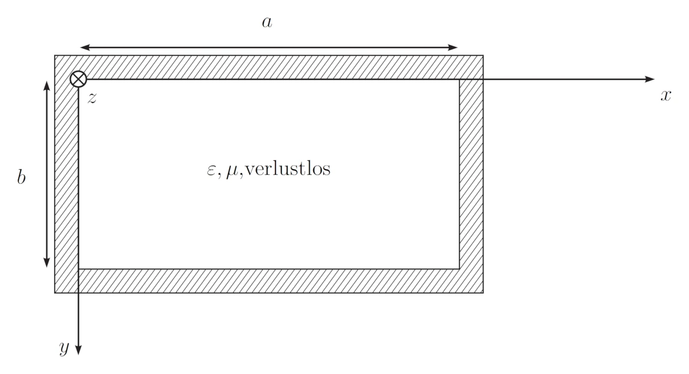

icon:: 🛜
inherit-color-icon-from:: [[logseq-page-color-purple]]
tags:: uni
alias:: wave propagation, wellenausbreitungs

- ## vorlesungen
	- 
	- [[wellen vo temp]]
- ## beispiele
	- 
	- \Unterlagen\Formelsammlung_7.Auflage.pdf)
	- Übergang von Vakuum nach Glas
	  background-color:: green
	  collapsed:: true
		- Variante 1) Eine zirkular polarisierte Welle mit einem Querschnitt von $A = \mathrm{3~mm^2}$ und einer Leistung von $P = \mathrm{10~mW}$ wird unter dem Brewster-Winkel auf eine Grenzfläche zwischen Vakuum ($n_1 = \mathrm{1}$) und Glas ($n_2 = \mathrm{1.6}$) eingestrahlt.
		  background-color:: green
		  {:width 400}
			- {{evalpage}}
			- a) Berechnen Sie Einfallswinkel $\Theta_e$, Reflexionswinkel $\Theta_r$ und Austrittswinkel $\Theta_t$ und zeichnen Sie diese in die Skizze ein!
			  background-color:: green
			  collapsed:: true
				- formeln
					- $\Theta_i = \Theta_r$
					  tags:: formel
					  bezeichnung:: Reflektions gesetz
						- $\Theta_i$ ... einfallswinkel (***i***nbound) $\mathrm{[°]}$
						- $\Theta_r$ ... reflektionswinkel (***r***eflected) $\mathrm{[°]}$
					- ((6734720f-e42f-46c0-a512-3075ea423042))
					- $\Theta_{b}=\arctan\left(\frac{n_2}{n_1}\right)$
					  tags:: formel
					  bezeichnung:: [[brewster winkel]]
						- $\Theta_b$ ... Brewster winkel $\mathrm{[°]}$
						- $n_1$ ... [[brechungsindex]] $\mathrm{[-]}$
						- $n_2$ ... [[brechungsindex]] $\mathrm{[-]}$
			- b) Berechnen Sie die Querschnitsfläche $A$ des transmittierten Strahls!
			  background-color:: green
			  collapsed:: true
				- formeln
					- ((6734720b-5c51-4f95-ac33-ed541e99c1ca))
			- c) Berechnen Sie die Leistungen $P_{\mathrm{TE,t}}$ und $P_{\mathrm{TM,t}}$ der transmittierten Wellen!
			  background-color:: green
			  collapsed:: true
				- formeln
					- ((6735b379-5292-4604-baef-85a4c9a6fc3f))
					- ((6735b379-80fa-4b2a-be2d-af5089fe1fa8))
					- ((6735b379-8ba8-4a90-b5e2-8b5b38036526))
					- ((6735b379-1a1f-417e-8323-7fe94bd9e2cf))
					- $\vect{P}_{\mathrm{t}} = \vect{P}_{\mathrm{TE,t}} + \vect{P}_{\mathrm{TM,t}}$
					  id:: 673b6e21-b584-4162-9dee-58697f01a4bb
					  tags:: formel
					  bezeichnung:: leistung der transmittierten welle
					  collapsed:: true
						- $\vect{P}_{\mathrm{t}}$ ... gesamte leistung der transmittierten Welle $\mathrm{\left[ W \right]}$
						- $\vect{P}_{\mathrm{TE,t}}$ ... leistung der transmittierten TE Welle $\mathrm{\left[ W \right]}$
						- $\vect{P}_{\mathrm{TM,t}}$ ... leistung der transmittierten TM Welle $\mathrm{\left[ W \right]}$
					- ((6735b379-9a02-48b3-997c-2ecd856cb257))
					- ((67360de7-70f6-457a-b7e1-e13b553b5d80))
			- [📚 2024-11-12 16h29m.xopp](../assets/documents/2024-11-12 16h29m.xopp)
			- 
		- Variante 2) Eine zirkular polarisierte Welle mit einem Querschnitt von $A = \mathrm{2~mm^2}$ und einer Leistung von $P = \mathrm{1~mW}$ wird unter dem Brewster-Winkel auf eine Grenzfläche zwischen Vakuum ($n_1 = \mathrm{1}$) und Glas ($n_2 = \mathrm{1.5}$) eingestrahlt.
		  background-color:: green
		  id:: 673c4ed2-b233-4982-9c12-8768a4de297f
		  {:width 400}
			- {{evalpage}}
			- a) Berechnen Sie Einfallswinkel $\Theta_e$, Reflexionswinkel $\Theta_r$ und Austrittswinkel $\Theta_t$ und zeichnen Sie diese in die Skizze ein!
			  background-color:: green
			  collapsed:: true
				- formeln
					- $\Theta_i = \Theta_r$
					  tags:: formel
					  bezeichnung:: Reflektions gesetz
						- $\Theta_i$ ... einfallswinkel (***i***nbound) $\mathrm{[°]}$
						- $\Theta_r$ ... reflektionswinkel (***r***eflected) $\mathrm{[°]}$
					- ((6734720f-e42f-46c0-a512-3075ea423042))
					- $\Theta_{b}=\arctan\left(\frac{n_2}{n_1}\right)$
					  tags:: formel
					  bezeichnung:: [[brewster winkel]] [link](((6735b379-a4a2-48f4-800f-7b9292b7a3a1)))
						- $\Theta_b$ ... Brewster winkel $\mathrm{[°]}$
						- $n_1$ ... [[brechungsindex]] $\mathrm{[-]}$
						- $n_2$ ... [[brechungsindex]] $\mathrm{[-]}$
			- b) Berechnen Sie die TE und TM-Anteile ($E$ und $H$) der reflektierten und der transmittierten Welle!
			  background-color:: green
			  id:: 673c4ed2-dc05-4f5a-9d66-ba650eefaef8
			  collapsed:: true
				- formeln
				  id:: 673c4ed2-0871-43a6-bce8-22143bd350d7
					- ((6735b379-5292-4604-baef-85a4c9a6fc3f))
					- ((6735b379-80fa-4b2a-be2d-af5089fe1fa8))
					- ((6735b379-8ba8-4a90-b5e2-8b5b38036526))
					- ((6735b379-1a1f-417e-8323-7fe94bd9e2cf))
					- $\Gamma_{TM} = 0$
					  tags:: formel
					  bezeichnung:: reflektionsfaktor wenn einfallswinkel = [[brewster winkel]] [FS](((6735b379-a4a2-48f4-800f-7b9292b7a3a1)))
						- $\Gamma_{TM}$ ... reflektionsfaktor $\mathrm{\left[ - \right]}$
					- ((6735b379-9a02-48b3-997c-2ecd856cb257))
					- $\eta H = E$
					  tags:: formel, wip
					  bezeichnung:: abgeleitet von hier [link](((6735b379-187a-4654-8126-efd8a322477b)))
					  collapsed:: true
						- $\eta$ ... [[wellenwiderstand]] $\mathrm{\left[ \Omega \right]}$
						- $H$ ... magnetsiche feldstärke $\mathrm{\left[ \frac{A}{m} \right]}$
						- $E$ ... elektrische feldstärke $\mathrm{\left[ \frac{V}{s} \right]}$
					- ((67360de7-70f6-457a-b7e1-e13b553b5d80))
			- c) Berechnen Sie die Elliptizität der reflektierten und der transmittierten Welle in $\mathrm{dB}$!
			  background-color:: green
			  collapsed:: true
				- formeln
					- ((67360dd7-52ba-4a90-a63b-ad4871a896af))
			- [📚 2024-11-18 17h41m.xopp](../assets/documents/2024-11-18 17h41m.xopp)
			- 
		- Variante 3) Ein Lichtstrahl der Sonne (unpolarisiert, aber TM, TE gleich stark) fällt zu später Stunde ($\Theta_e = 75°$) auf einen See ($n_2 = 1.33$). An der glatten Wasseroberfläche wird er reflektiert. Zwei Fotografen fotografieren diese Landschaft. Der zweite verwendet ein ideales Polarisationsfilter um die Reflexion der Sonne im Wasser zu unterdrücken.
		  background-color:: green
		  {:width 400, :height 213}
			- {{evalpage}}
			- a) Wie groß ist die (gesamte) reflektierte Lichtleistung im Verhältnis zur eingestrahlten (in $\mathrm{dB}$)? Zeichnen Sie alle verwendeten Winkel ein.
			  background-color:: green
				- formeln
				  collapsed:: true
					- $\Theta_i = \Theta_r$
					  tags:: formel
					  bezeichnung:: Reflektions gesetz
						- $\Theta_i$ ... einfallswinkel (***i***nbound) $\mathrm{[°]}$
						- $\Theta_r$ ... reflektionswinkel (***r***eflected) $\mathrm{[°]}$
					- ((6734720f-e42f-46c0-a512-3075ea423042))
					- ((6735b379-8ba8-4a90-b5e2-8b5b38036526))
					- ((6735b379-5292-4604-baef-85a4c9a6fc3f))
					- ((6735b379-9a02-48b3-997c-2ecd856cb257))
				- code
					- ```python
					  import pyodide_js
					  await pyodide_js.loadPackage("micropip")
					  import micropip
					  await micropip.install('scipy')
					  from scipy import *
					  from scipy.constants import *
					  from numpy import arcsin, arctan, arccos
					  
					  n1 = 1
					  n2 = 1.33
					  n = n2/n1
					  theta1 = 75 * degree
					  theta2 = arcsin(n1/n2 * sin(theta1))
					  "theta2: " + f"{round(theta2 / degree,3)}" +" deg"
					  ```
						- {{evalparent}}
					- ```python
					  gammaTE = (( n1 * cos(theta1) - n2 * cos(theta2) ) /
					             ( n1 * cos(theta1) + n2 * cos(theta2) ))
					  "gammaTE: " + str(gammaTE)
					  ```
						- {{evalparent}}
					- ```python
					  gammaTM = (( n2*cos(theta1)-n1*cos(theta2) ) /
					             ( n2*cos(theta1)+n1*cos(theta2) ))
					  "gammaTM: " + str(gammaTM)
					  ```
						- {{evalparent}}
					- ```python
					  R = round(10 * log10((gammaTE**2+gammaTM**2)/2),3)
					  "R: " + str(R) + " dB"
					  ```
						- {{evalparent}}
			- b) Wie gut kann das ideal eingesetzte Polarisationsfilter des zweiten Fotografen die Reflexion im Vergleich zum ersten Fotografen unterdrücken (in $\mathrm{dB}$)?
			  background-color:: green
				- es geht hierbei darum, dass ein filter verwendet wird welches den TM oder TE anteil filtert
				- code
					- ```python
					  # gammaTM = 0
					  R_TM=round(10 * log10((gammaTE**2)/2),3)
					  "R_TM: " + str(R_TM) + " dB"
					  ```
						- {{evalparent}}
					- ```python
					  # gammaTE = 0
					  R_TE = round(10 * log10((gammaTM**2)/2),3)
					  "R_TE: " + str(R_TE) + " dB"
					  ```
						- {{evalparent}}
					- ```python
					  # R_TE negativer
					  "Photograf2/Photograf1: " + str(R_TE-R) + " dB"
					  ```
						- {{evalparent}}
			- [📚 2024-11-20 19h04m.xopp](../assets/documents/2024-11-20 19h04m.xopp)
			- 
	- Stehende Welle im verlustbehafteten Medium
	  background-color:: green
	  collapsed:: true
		- Eine sich im [verlustbehafteten Medium](((6740c4fa-4d26-4310-b196-321b7391feb6))) (z.B.: trockener Erdboden) ausbreitende ebene Welle mit $f = \mathrm{20~MHz}$ wird von einer auf die Ausbreitungsrichtung senkrecht stehenden [metallischen Wand mit unendlicher Leitfähigkeit](((67405634-4634-4d0d-b586-6a52b1bb7c75))) reflektiert (siehe Abbildung). Die Amplitude der einfallenden Welle bei $z = 0$ beträgt $\mathrm{5~V/m}$.
		  background-color:: green
		  Hinweis: $\varepsilon_0 = \mathrm{8,854· 10^{−12}~As/Vm}$, $µ0 = \mathrm{4π · 10^{−7}~Vs/Am}$.
		  {:width 400}
			- skript
			  collapsed:: true
				- ((67405657-2347-4d8b-93f5-98a6b52c836c))
				  id:: 67405634-4634-4d0d-b586-6a52b1bb7c75
				- ((6740c51b-b09e-4b73-b018-e2d77efe468b))
				  id:: 6740c4fa-4d26-4310-b196-321b7391feb6
			- {{evalpage}}
			- a) Wie groß ist die Phasengeschwindigkeit $v_P$?
			  background-color:: green
				- formeln
					- ((673e3379-4b5b-475a-91a4-08da8e21eb58))
				- code
					- ```python
					  import pyodide_js
					  await pyodide_js.loadPackage("micropip")
					  import micropip
					  await micropip.install('scipy')
					  from scipy import *
					  from scipy.constants import *
					  from numpy import *
					  await micropip.install('matplotlib')
					  import matplotlib.pyplot as plt
					  import io, base64
					  await micropip.install('sympy')
					  import sympy as sp
					  from sympy.utilities.lambdify import lambdify
					  from sympy import latex
					  
					  
					  epsr = 7
					  mur = 1
					  
					  v_p = 1/((epsilon_0 * epsr * mu_0 * mur)**(1/2))
					  "v_p = " + f"{v_p:.4g}" + " m/s"
					  ```
						- {{evalparent}}
			- b) Setzten Sie die einfallende Welle an ($E_e$ und $H_e$) und berechnen Sie die Wellenzahl $k_e$. Wie groß ist die Dämpfung in $\mathrm{dB/m}$
			  background-color:: green
				- formeln
					- ((67404a07-268a-4632-b86f-c136cdfaf0eb))
					- ((673e3379-7ae8-425b-bf90-a176d50f983b))
					- ((673e3379-65ec-4bba-988b-f6a5d8499e68)) [FS](((6745a2d1-96eb-4141-93fd-4c8e10df8d94)))
					- ((674496c6-ef08-4cfe-8444-ef86aadf0f47)) [FS](((6740c68b-e124-4f93-b1f1-9c8be879951c)))
					- ((67459ac7-d3b4-47bf-9ac5-0379a5e2e1e8)) [FS](((673e3379-64cb-4d50-98c9-668f6b9fd3fd)))
				- code
					- ```python
					  mu = mur * mu_0
					  eps = epsr * epsilon_0
					  f = 20E6
					  w = 2 * pi * f
					  ke = w * sqrt(mu * eps)
					  "ke = " + f"{ke:.4g}" + "rad/m"
					  ```
						- {{evalparent}}
					- ```python
					  # bei z = 0
					  E0 = 5
					  sig = 1.5e-3
					  alpha = 0
					  
					  s = sig / (eps * w)
					  jke=1j*ke*sqrt(1-1j*s)
					  alpha = real(jke)
					  beta = imag(jke)
					  
					  "α = " + f"{alpha:.4g}" + " rad/m \n\
					  β = " + f"{beta:.4g}" + " rad/m"
					  ```
						- {{evalparent}}
					- ```python
					  D = 20 * log10(E0 / (E0 * e**-alpha))
					  
					  "D = " + f"{D:.4g}" + " dB"
					  ```
						- {{evalparent}}
						- ich weiß leider nicht warum man genau die Dämpfung so ausrechnet und warum man genau $\alpha$ verwendet #wip
			- c) Berechnen Sie die komplexe Amplitude und den zeitlichen Verlauf der einfallenden Welle am Ort der metallischen Wand $z_0 = \mathrm{8~m}$!
			  background-color:: green
				- formeln
					- ((673e3379-7ae8-425b-bf90-a176d50f983b))
					- ((673e3379-9e8e-4059-b99e-e764c678fa51))
					- ((673e3379-54d5-49f8-b0db-18b82bf799c4))
				- code
					- ```python
					  z0 = 8
					  z = z0
					  Ee = E0 * e**(-jke*z)
					  "Ee(z=8) = " + f"{Ee:.4g}" + " V/m \n\
					  abs(Ee) = " + f"{abs(Ee):.4g}" + " V/m"
					  ```
						- {{evalparent}}
					- ```python
					  T = 1/f
					  print(T)
					  t = linspace(0, 2*T , 500)  # Generate 500 points between 0 and 4π
					  y = E0*e**(-alpha*z0)*cos(w*t-beta*z0)
					  
					  # Create the plot
					  plt.clf()
					  plt.plot(t, y)  # Plot y = sin(x)
					  plt.xlabel('t')  # Label the x-axis
					  plt.ylabel('E_e(z_0, t)')  # Label the y-axis
					  plt.grid(True)  # Add a grid
					  buf = io.BytesIO()
					  plt.savefig(buf, format = 'png')
					  buf.seek(0)
					  png = 'data:image/png;base64,' + base64.b64encode(buf.read()).decode('UTF-8')
					  buf.close()
					  png
					  ```
						- {{evalparent}}
			- d) Finden Sie einen Ansatz für die reflektierte Welle ($E_r$ und $H_r$)! Wie muss der zeitliche Verlauf der reflektierten Welle aussehen, damit die Randbedingungen erfüllt sind?
			  background-color:: green
				- formeln
					- ((67459ac8-e918-4a08-8003-07057ff681d6))
					- ((6745a3c5-baa9-4655-ac6f-92348bdacfc0))
					- $E_{r}=Ae^{jk_{z}\left(z_0-z\right)}$
					  tags:: formel
					  bezeichnung:: ansatz für die reflektierte/rücklaufende welle
						- $E_r$ ... reflektierte/rücklaufende welle des [[elektrischen feldes]] $\mathrm{\left[ \frac{V}{m} \right]}$
						- $A$ ... anfangs amplitude der reflektierten welle. entspricht der einfallenden welle $\mathrm{\left[ \frac{V}{m} \right]}$
						- $k_z$ ... [[komplexe]] [[wellenzahl]] $\mathrm{\left[ \frac{rad}{m} \right]}$
						- $z$ ... entfernung in ausbreitungsrichtung (hier $z$-Achse) $\mathrm{\left[ m \right]}$
						- $z_0$ ... entfernung zur stelle an der die reflexion stattfindet $\mathrm{\left[ m \right]}$
				- code
					- ```python
					  t = sp.symbols('t')
					  z = sp.symbols('z', real=True)
					  z0 = 8
					  
					  # Expression
					  # gesamt feld momentanwert
					  eges = E0 * sp.exp(-alpha * z0) * sp.cos(w * t - beta * z0) * (1 - sp.exp(-alpha * (z0 - z)) * sp.cos(w * t - beta * (z0 - z)))
					  eges = eges.subs(z, z0)
					  # einfallendes feld momentanwert
					  ee = E0 * sp.exp(-alpha * z0) * sp.cos(w * t - beta * z0)
					  ee = ee.subs(z,z0)
					  # reflektiertes feld momentanwert
					  er = -E0 * sp.exp(-alpha * z0) * sp.cos(w * t - beta * z0) * sp.exp(-alpha * (z0 - z)) * sp.cos(w * t - beta * (z0 - z))
					  er = er.subs(z,z0)
					  
					  # Convert to numerical function
					  numerical_eges = lambdify(t, eges)
					  numerical_ee = lambdify(t, ee)
					  numerical_er = lambdify(t, er)
					  
					  # Numerical plotting
					  T=1/f
					  t_vals = linspace(-T+8, 8, 500)
					  
					  plt.clf()
					  y_vals = numerical_eges(t_vals)
					  plt.plot(t_vals, y_vals, label='eges')
					  y_vals = numerical_ee(t_vals)
					  plt.plot(t_vals, y_vals, label='ee')
					  y_vals = numerical_er(t_vals)
					  plt.plot(t_vals, y_vals, label='er')
					  
					  plt.xlabel("t")
					  plt.grid(True)
					  plt.legend()
					  buf = io.BytesIO()
					  plt.savefig(buf, format = 'png')
					  buf.seek(0)
					  png = 'data:image/png;base64,' + base64.b64encode(buf.read()).decode('UTF-8')
					  buf.close()
					  png
					  ```
						- {{evalparent}}
				- verstehe das beispiel nicht. da ist was an der reflektierten welle falsch
			- e) Berechnen Sie die Hüllkurve des Gesamtfeldes
			  background-color:: green
				- formeln
					- $|E_{ges}|^2 = \vect{E}(z) \cdot \vect{E}^*(z)$
					  tags:: formel
					  bezeichnung:: analyse der hüllkurve des [elektrischen gesamtfeldes]([[elektrisches feld]])
						- $|E_{ges}|^2$ ... betrags quadrat des gesamten [[elektrischen feldes]] $\mathrm{\left[ \frac{V}{m} \right]}$
						- $\vect{E}(z)$ ... [[komplexe]] amplitude des [[elektrischen feldes]] $\mathrm{\left[ \frac{V}{m} \right]}$
				- code
					- meine lösung
						- ```python
						  # meine lösung
						  # symbolic math
						  E_s = sp.symbols('E')
						  E0_s = sp.symbols('E0', positive = True)
						  a_s = sp.symbols('α', real = True)
						  b_s = sp.symbols('β', real = True)
						  z_s = sp.symbols('z', real = True)
						  z0_s = sp.symbols('z0', real = True)
						  jke_s = a_s + 1j * b_s
						  
						  E_s = E0_s * (sp.exp(-jke_s*z_s) \
						            -sp.exp(-jke_s*(z0_s-z_s)))
						  Eabs_s = sp.simplify(sp.conjugate(E_s)*E_s)
						  'E = ' + str(Eabs_s) + '\n\n\
						  latex output: ' + latex(Eabs_s)
						  ```
							- {{evalparent}}
							- $E_{0}^{2} \cdot \left(1 - e^{\left(2 z - z_{0}\right) \left(α - 1.0 i β\right)}\right) \left(1 - e^{\left(2 z - z_{0}\right) \left(α + 1.0 i β\right)}\right) e^{- 2 z α}$
						- ```python
						  # plot
						  # bei z = z0
						  lam = 2*pi / ke
						  z = linspace(-4*lam+z0,z0, 1000)
						  
						  E = E0 * e**(-jke*z0)*(1 - e**(-jke*(z0-z)))
						  absE2 = E*conj(E)
						  
						  y = absE2
						  
						  # Create the plot
						  plt.clf()
						  plt.plot(z, y)
						  plt.plot(z, -y)
						  plt.xlabel('z') 
						  plt.ylabel('E')
						  plt.grid(True)
						  buf = io.BytesIO()
						  plt.savefig(buf, format = 'png')
						  buf.seek(0)
						  png = 'data:image/png;base64,' + base64.b64encode(buf.read()).decode('UTF-8')
						  buf.close()
						  png
						  ```
							- {{evalparent}}
					- ausarbeitung
						- ```python
						  # lösung aus ausarbeitung
						  Eabs_s  =E0_s**2 * (sp.exp(-2 * a_s * z_s) + \
						                      sp.exp(-2 * a_s * (z0_s - z_s)) - \
						                      2 * sp.exp(-2 * a_s * z0_s) * sp.cos(2*b_s*(z0_s-z_s)))
						  'E = ' + str(Eabs_s) + '\n\n\
						  latex output: ' + latex(Eabs_s)
						  ```
							- {{evalparent}}
							- $E_{0}^{2} \left(e^{- 2 α \left(- z + z_{0}\right)} - 2 e^{- 2 z_{0} α} \cos{\left(2 β \left(- z + z_{0}\right) \right)} + e^{- 2 z α}\right)$
						- ```python
						  # plot
						  # bei z = z0
						  lam = 2*pi / ke
						  z = linspace(-4*lam+z0,z0, 1000)
						  
						  absE2  =E0**2 * (exp(-2 * alpha * z) + \
						                     exp(-2 * alpha * (z0 - z)) - \
						                      2 * exp(-2 * alpha * z0) * cos(2*beta*(z0-z)))
						  y = absE2
						  
						  # Create the plot
						  plt.clf()
						  plt.plot(z, y)
						  plt.plot(z, -y)
						  plt.xlabel('z') 
						  plt.ylabel('E')
						  plt.grid(True)
						  buf = io.BytesIO()
						  plt.savefig(buf, format = 'png')
						  buf.seek(0)
						  png = 'data:image/png;base64,' + base64.b64encode(buf.read()).decode('UTF-8')
						  buf.close()
						  png
						  ```
							- {{evalparent}}
			- [📚 2024-11-21 18h45m.xopp](../assets/documents/2024-11-21 18h45m.xopp)
			- 
	- Rechteckhohlleiter
	  background-color:: green
	  collapsed:: true
		- Variante 1) Untersuchen Sie die Ausbreitung von $\mathrm{TE}_{m,n}$ Wellen in $z$ Richtung im skizzierten Rechteckhohlleiter.
		  background-color:: green
		  collapsed:: true
		  {:width 400}
			- Finden Sie einen geeigneten Ansatz für die Komponenten der gewünschten Moden in Ausbreitungsrichtung, der die Wellengleichung erfüllt. Ermitteln Sie die Separationsbedingungen.
			  background-color:: green
				- formeln
					-
				- code
			- Leiten Sie daraus die restlichen Feldkomponenten her und passen Sie an den Rand an! Welche Komponenten verschwinden?
			  background-color:: green
			- Berechnen Sie die Hohlleiterwellenlängen, die Grenzwellenlängen und die Grenzfrequenzen aller gefragter Moden als Funktion von $m$ und $n$! Ist ein TEM Modus ausbreitungsfähig? Wieso? Wenn ja, welche Grenzwellenlänge bzw. Feldwellenwiderstand hat er?
			  background-color:: green
			- Berechnen und skizzieren Sie das Dispersionsdiagramm für die $\mathrm{TE}_{10}$, $\mathrm{TE}_{11}$, $\mathrm{TE}_{20}$ Moden für $a = 4 \mathrm{cm}$, $b = 3\mathrm{cm}$, $\varepsilon_r = 3$, $\mu_r = 1$, $\varepsilon_0 = 8,854 \cdot 10^{−12} \mathrm{As/Vm}$, $\mu_0 = 4\pi \cdot 10^{−7} \mathrm{Vs/Am}$. Achten Sie auf die Beschriftung! Geben Sie die Grenzfrequenzen an! In welchem Frequenzbereich ist nur ein einziger Modus ausbreitungsfähig? Welcher?
			  background-color:: green
		- Variante 2)
		  background-color:: green
		- Variante 3)
		  background-color:: green
		- Variante 4)
		  background-color:: green
	- Hohlraumresonator
	  background-color:: green
	  collapsed:: true
		- Variante 1) Berechnen Sie den Grundmodus $\mathrm{TE_{101}}$ eines luftgefüllten ($\varepsilon_r = 1$) Hohlraumresonators (Abmessungen: $a = 4\mathrm{cm}$, $b = 2\mathrm{cm}$, $c = 4\mathrm{cm}$) mit $\mathbb{R}_M = 20\mathrm{m\Omega}$.
		  background-color:: green
		  {:width 400}
			- a) Berechnen Sie die Resonanzfrequenz!
			  background-color:: green
				- formeln
					- ((6745a3c5-c443-4fb4-bbea-b455958f827a))
					- ((673e3379-4b5b-475a-91a4-08da8e21eb58))
					- ((674b703d-c8a8-4814-8c70-f8289a9b6bdf))
				- code
					- ```python
					  import pyodide_js
					  await pyodide_js.loadPackage("micropip")
					  import micropip
					  await micropip.install('scipy')
					  from scipy import *
					  from scipy.constants import *
					  from numpy import *
					  await micropip.install('matplotlib')
					  import matplotlib.pyplot as plt
					  import io, base64
					  await micropip.install('sympy')
					  import sympy as sp
					  from sympy.utilities.lambdify import lambdify
					  from sympy import latex
					  
					  # angabe
					  a = 4E-2
					  b = 2E-2
					  c = 4E-2
					  mur = 1
					  mu = mu_0 * mur
					  epsr = 1
					  eps = epsilon_0 * epsr
					  Rm = 20E-3
					  # TE_101
					  m = 1
					  n = 0
					  p = 1
					  
					  # rechnung
					  vp = 1 / sqrt((eps * mu))
					  wmnp = pi * vp * sqrt((m/a)**2 + (n/b)**2 + (p/c)**2)
					  fmnp = wmnp / (2 * pi)
					  "fmnp = " + f"{fmnp:.4g}" + "Hz"
					  ```
						- {{evalparent}}
			- b) Berechnen Sie die unbelastetet Güte! Vereinfachen Sie zuerst die Formel unter der Berücksichtigung $a = c$! Setzen Sie dann Zahlenwerte ein!
			  background-color:: green
				- formeln
					- ((6745a3c5-66f7-450b-94fe-f6068dde589d))
				- code
					- ```python
					  Rm_s, a_s, b_s, c_s, eta_s = sp.symbols('R_m a b c eta', 
					                                          real=True, 
					                                          positive=True)
					  eta = 377
					  Q0 = (
					    (pi * eta) / (2 * Rm) * 
					      (
					        (b * sqrt((a**2 + c**2)**3)) / 
					        (a * c * (a**2 + c**2) + 2 * b * (a**3 + c**3))
					      )
					  )
					  
					  Q0_s = (
					    (sp.pi * eta_s) / (2 * Rm_s) *
					    (
					      b_s * sp.sqrt((a_s**2 + c_s**2)**3) /
					      (a_s * c_s * (a_s**2 + c_s**2) + 2 * b_s * (a_s**3 + c_s**3))
					    )
					  )
					  Q0_s_sim = Q0_s.subs(c_s, a_s)
					           
					  Q0_s_sim = sp.simplify(Q0_s_sim)
					  'Q0_s = ' + str(Q0_s) + '\n\n\
					  latex output: ' + latex(Q0_s) + '\n\n\
					  Q0_s_sim = ' + str(Q0_s_sim) + '\n\n\
					  latex output: ' + latex(Q0_s_sim)
					  ```
						- {{evalparent}}
						- $\frac{\pi b \eta \left(a^{2} + c^{2}\right)^{\frac{3}{2}}}{2 Rm \left(a c \left(a^{2} + c^{2}\right) + 2 b \left(a^{3} + c^{3}\right)\right)}$
						- $\frac{\sqrt{2} \pi b \eta}{2 R_{m} \left(a + 2 b\right)}$
					- ```python
					  Q0_s_sim.subs(a_s, a).subs(b_s,b).subs(Rm_s, Rm).subs(eta_s, eta).evalf(n=5)
					  ```
						- {{evalparent}}
			- c) Berechnen Sie die Resonanzfrequenz und die unbelastete Güte, wenn der Hohlraumresonator mit einem verlustlosen Dielektrikum $\varepsilon_r = 2.5$ gefüllt ist!
			  background-color:: green
				- formeln
					- ((6745a3c5-c443-4fb4-bbea-b455958f827a))
					- ((6745a3c5-66f7-450b-94fe-f6068dde589d))
					- ((673c4eb2-5827-434c-a323-0ff29f347504))
				- code
					- ```python
					  # resonanzfrequenz
					  epsr = 2.5
					  eps = epsilon_0 * epsr
					  
					  # rechnung
					  vp = 1 / sqrt((eps * mu))
					  wmnp = pi * vp * sqrt((m/a)**2 + (n/b)**2 + (p/c)**2)
					  fmnp = wmnp / (2 * pi)
					  "fmnp = " + f"{fmnp:.4g}" + "Hz"
					  ```
						- {{evalparent}}
					- ```python
					  # unbelastete güte
					  eta = sqrt(mu/eps)
					  Q0 = (
					    (pi * eta) / (2 * Rm) * 
					      (
					        (b * sqrt((a**2 + c**2)**3)) / 
					        (a * c * (a**2 + c**2) + 2 * b * (a**3 + c**3))
					      )
					  )
					  "Q0 = " + f"{Q0:.4g}"
					  ```
						- {{evalparent}}
		- Variante 2) Berechnen Sie den Grundmodus $\mathrm{TE_{101}}$ eines luftgefüllten ($\varepsilon_r = 1$) Hohlraumresonators (Abmessungen: $a = 2b=c$, $\mathbb{R}_M = 30\mathrm{m\Omega}$).
		  background-color:: green
		  {:width 400}
			- a) Berechnen Sie die Abmessungen $a, b, c$ für eine Resonanzfrequenz von $20 \mathrm{GHz}$!
			  background-color:: green
				- formeln
					- ((6745a3c5-c443-4fb4-bbea-b455958f827a))
					- ((673e3379-4b5b-475a-91a4-08da8e21eb58))
					- ((674b703d-c8a8-4814-8c70-f8289a9b6bdf))
				- code
					- ```python
					  pyodide_js.globals.clear();
					  import pyodide_js
					  await pyodide_js.loadPackage("micropip")
					  import micropip
					  await micropip.install('scipy')
					  from scipy import *
					  from scipy.constants import *
					  from numpy import *
					  await micropip.install('matplotlib')
					  import matplotlib.pyplot as plt
					  import io, base64
					  await micropip.install('sympy')
					  import sympy as sp
					  from sympy.utilities.lambdify import lambdify
					  from sympy import latex
					  
					  # angabe
					  mur = 1
					  mu = mu_0 * mur
					  epsr = 1
					  eps = epsilon_0 * epsr
					  Rm = 30E-3
					  fR = 20E9
					  wmnp = 2 * pi * fR
					  # TE_101
					  m = 1
					  n = 0
					  p = 1
					  
					  Rm_s, a_s, b_s, c_s, vp_s ,m_s, n_s, p_s = sp.symbols('R_m a b c v_p m n p', 
					                                                       real=True, 
					                                                       positive=True)
					  
					  # rechnung
					  vp = 1 / sqrt((eps * mu))
					  wmnp_s = ( sp.pi * vp_s * sp.sqrt(
					              (m_s/a_s)**2 + (n_s/b_s)**2 + (p_s/c_s)**2
					             )
					           )
					  fmnp_s = wmnp_s / (2 * sp.pi)
					  
					  # werte einsetzen
					  fmnp_s = (fmnp_s.subs(m_s,m)
					                  .subs(n_s,n)
					            	    .subs(p_s,p)
					            	    .subs(c_s,a_s)
					           		.subs(b_s,a_s/2)
					           		.subs(vp_s, vp))
					  eqn = sp.Eq(fmnp_s,fR)
					  solution = sp.solve(eqn, a_s)
					  a = float(solution[0])
					  b = a/2
					  c = a
					  ("a = " + f"{a*100:.4g}" + "cm" + "\n" + 
					   "b = " + f"{b*100:.4g}" + "cm" + "\n" + 
					   "c = " + f"{c*100:.4g}" + "cm"
					  )
					  ```
						- {{evalparent}}
			- b) Berechnen Sie die unbelastetet Güte! Vereinfachen Sie zuerst die Formel unter der Berücksichtigung $a = 2b = c$!
			  background-color:: green
				- formeln
					- ((6745a3c5-66f7-450b-94fe-f6068dde589d))
				- code
					- ```python
					  eta_s = sp.symbols('eta', real=True, positive=True)
					  Q0_s = (
					    (sp.pi * eta_s) / (2 * Rm_s) *
					    (
					      b_s * sp.sqrt((a_s**2 + c_s**2)**3) /
					      (a_s * c_s * (a_s**2 + c_s**2) + 2 * b_s * (a_s**3 + c_s**3))
					    )
					  )
					  Q0_s_sim = Q0_s.subs(c_s, a_s).subs(b_s, a_s/2)
					           
					  Q0_s_sim = sp.simplify(Q0_s_sim)
					  'Q0_s = ' + str(Q0_s) + '\n\n\
					  latex output: \n' + latex(Q0_s) + '\n\n\
					  Q0_s_sim = ' + str(Q0_s_sim) + '\n\n\
					  latex output: \n' + latex(Q0_s_sim)
					  ```
						- {{evalparent}}
						- $\frac{\pi b \eta \left(a^{2} + c^{2}\right)^{\frac{3}{2}}}{2 Rm \left(a c \left(a^{2} + c^{2}\right) + 2 b \left(a^{3} + c^{3}\right)\right)}$
						- $\frac{\sqrt{2} \pi \eta}{8 R_{m}}$
					- ```python
					  eta = sqrt(mu/eps)
					  Q0_s_sim.subs(a_s, a).subs(b_s,b).subs(Rm_s, Rm).subs(eta_s, eta).evalf(n=5)
					  ```
						- {{evalparent}}
			- c) Berechnen Sie die relative Dielektrizitätskonstante und die unbelastete [[Güte]], wenn der Hohlraumresonator mit einem verlustlosen Dielektrikum gefüllt ist, um die Resonanzfrequenz auf $15 \mathrm{GHz}$ zu reduzieren!
			  background-color:: green
				- formeln
					- ((6745a3c5-c443-4fb4-bbea-b455958f827a))
					- ((6745a3c5-66f7-450b-94fe-f6068dde589d))
					- ((673c4eb2-5827-434c-a323-0ff29f347504))
				- code
					- ```python
					  # dielektrizitätskonstante
					  fR = 15E9
					  
					  epsr_s = sp.symbols('eps_r', real=True, positive=True)
					  eps_s = epsr_s * epsilon_0
					  vp_s = 1 / sp.sqrt((eps_s * mu))
					  wmnp_s = ( sp.pi * vp_s * sp.sqrt(
					              (m_s/a_s)**2 + (n_s/b_s)**2 + (p_s/c_s)**2
					             )
					           )
					  fmnp_s = wmnp_s / (2 * sp.pi)
					  
					  # werte einsetzen
					  fmnp_s = (fmnp_s.subs(m_s,m)
					                  .subs(n_s,n)
					            	    .subs(p_s,p)
					            		.subs(a_s,a)
					            	    .subs(c_s,c)
					           		.subs(b_s,b))
					  eqn = sp.Eq(fmnp_s,fR)
					  solution = sp.solve(eqn, epsr_s)
					  epsr = float(solution[0])
					  
					  "ɛ_r = " + f"{epsr:.4g}"
					  ```
						- {{evalparent}}
					- ```python
					  # unbelastete güte
					  eps = epsr * epsilon_0
					  eta = sqrt(mu/eps)
					  Q0 = (
					    (pi * eta) / (2 * Rm) * 
					      (
					        (b * sqrt((a**2 + c**2)**3)) / 
					        (a * c * (a**2 + c**2) + 2 * b * (a**3 + c**3))
					      )
					  )
					  "Q0 = " + f"{Q0:.4g}"
					  ```
						- {{evalparent}}
			- [📚 2024-12-01 16h11m.xopp](../assets/documents/2024-12-01 16h11m.xopp)
			- 
	- [[Koaxialkabel]]
	  background-color:: green
		- Variante 1)
		  background-color:: green
		  collapsed:: true
		  {:width 400}
			- a) Bestimmen Sie einen geeigneten Innenradius $r_i$ des abgebildeten Koaxialkabels für $Z_L = 60 \mathrm{\Omega}$. Der Außenradius sei $r_a = 8.5 \mathrm{mm}$, das verwendete Dielektrikum sei Luft mit $\varepsilon_r = 1$.
			  background-color:: green
				- formeln
					- ((6745a3c5-c563-4874-8d5b-50fee6812aea))
				- code
					- ```python
					  pyodide_js.globals.clear();
					  ```
						- {{evalparent}}
					- ```python
					  import pyodide_js
					  await pyodide_js.loadPackage("micropip")
					  import micropip
					  await micropip.install('scipy')
					  from scipy import *
					  from scipy.constants import *
					  from numpy import *
					  await micropip.install('matplotlib')
					  import matplotlib.pyplot as plt
					  import io, base64
					  await micropip.install('sympy')
					  import sympy as sp
					  from sympy.utilities.lambdify import lambdify
					  from sympy import latex
					  
					  # angabe
					  ZL = 60
					  ra = 8.5E-3
					  epsr = 1
					  eps = epsr * epsilon_0
					  mur = 1
					  mu = mur * mu_0
					  eta = sqrt(mu/eps)
					  
					  eta_s, ra_s, ri_s = sp.symbols('eta r_a r_i', 
					                                 real=True, 
					                                 positive=True)
					  ZL_s = eta_s/(2*pi) * sp.ln(ra_s / ri_s)
					  
					  eqn = sp.Eq(ZL_s, ZL)
					  sol = sp.solve(eqn, ri_s)
					  ri_s = sol[0]
					  
					  # werte einsetzen
					  ri = (ri_s.subs(ra_s, ra)
					          	.subs(eta_s, eta)).evalf(n=4)
					  
					  "r_i = " + f"{ri_s}" + '\n\n\
					  latex output: ' + latex(ri_s)  + '\n\n\
					  r_i = ' + f"{ri*1000:.4g}" + "mm"
					  ```
						- {{evalparent}}
						- $r_{a} e^{- \frac{376.991118430776}{\eta}}$
			- b) Die Innen- bzw. Außenleiter bestehen aus Kupfer mit $\sigma = 57 \cdot 10^6 \mathrm{S/m}$. Wie groß ist die Eindringtiefe bei $f = 5 \mathrm{GHz}$? Berechnen Sie die ohmschen Verluste des Kabels in $\mathrm{dB/m}$.
			  background-color:: green
				- formeln
					- ((674d7759-c315-4a22-a755-be7a35c4b441))
					- ((674d7759-1d40-46b8-9d39-cbf868cd298e))
					- ((674d7759-4a7e-4220-b396-27bd49ccaa45))
					- ((674de501-a2a9-4e7a-8a81-892354262c7e))
				- code
					- ```python
					  sig = 57E6
					  f = 5E9
					  w = 2*pi*f
					  d = sqrt(2/(w*mu*sig))
					  "d = " + f"{d*1E9:.4g}" + "nm"
					  ```
						- {{evalparent}}
					- ```python
					  R = (sqrt((w * mu)/(2 * sig))*
					       1 / (2 * pi) * (1 / ri + 1 / ra))
					  
					  alphaR = R/(2*ZL)
					  "alphaR = " + f"{alphaR:.4g}" + "Np/m \n\
					  alphaR = " + f"{alphaR*20/log(10):.4g}" + "dB/m"
					  ```
						- {{evalparent}}
			- c) Ein Ende der Koaxialleitung wird mit Hilfe einer kreisförmigen Scheibe aus Graphit abgeschlossen. Die Scheibe habe ein $R_\square  = 120\pi \mathrm{\Omega}$. Welchen ohmschen Widerstand hat die kreisförmige Scheibe für eine einfallende $\mathrm{TEM}$ Welle?
			  background-color:: green
				- {:width 400}
				- formeln
					- ((674d7759-2399-4628-94f1-400ee5be7c0e))
				- code
					- ```python
					  Rsq = 120*pi
					  r_s = sp.symbols('r', positive=True, real=True)
					  R = sp.integrate(Rsq/(2*pi*r_s), (r_s,ri,ra))
					  "R = " + f"{R:.4g}" + "Ω"
					  ```
						- {{evalparent}}
			- d) Wie groß ist der Reflexionsfaktor am Ende der Koaxialleitung auf Grund des Abschlusswidertandes der kreisförmigen Scheibe? In welchem Frequenzbereich gilt dieser Reflexionsfaktor?
			  background-color:: green
				- formeln
					- $\rho_{A} = \frac{R_{A}-Z_{L}}{R_{A}+Z_{L}}$
					  tags:: formel
					  bezeichnung:: reflexionsfaktor am ende einer [[koaxialleitung]]
						- $R_A$ ... Abschlusswiderstrand $\mathrm{\left[\Omega\right]}$
						- $Z_L$ ... leitungsimpedanz $\mathrm{\left[\Omega\right]}$
						- skript
						  collapsed:: true
							- ((674ec847-fd7d-4084-915e-8421e8671ad5))
				- code
					- ```python
					  RA = R # wert der vorher berechnet wurde
					  rA = (RA-ZL)/(RA+ZL)
					  "r = " + f"{rA*1E4:.4g}" + "e-4"
					  ```
						- {{evalparent}}
						- es ist schwierig den frequenzbereich abzuschätzen, da $R_A$ und $Z_L$ von der frequenz abhängen
		- Variante 2)
		  background-color:: green
		  {:width 400}
			- a) Bestimmen Sie einen geeigneten Innenradius $r_i$ des abgebildeten Koaxialkabels für $Z_L = 50 \mathrm{\Omega}$. Der Außenradius sei $r_a = 7.3 \mathrm{mm}$, das verwendete Dielektrikum sei Luft mit $\varepsilon_r = 2.35$.
			  background-color:: green
				- formeln
					- ((6745a3c5-c563-4874-8d5b-50fee6812aea))
				- code
					- ```python
					  pyodide_js.globals.clear();
					  ```
						- {{evalparent}}
					- ```python
					  import pyodide_js
					  await pyodide_js.loadPackage("micropip")
					  import micropip
					  await micropip.install('scipy')
					  from scipy import *
					  from scipy.constants import *
					  from numpy import *
					  await micropip.install('matplotlib')
					  import matplotlib.pyplot as plt
					  import io, base64, sys
					  await micropip.install('sympy')
					  import sympy as sp
					  from sympy.utilities.lambdify import lambdify
					  printer = io.StringIO()
					  sys.stdout = printer
					  
					  # angabe
					  ZL = 50
					  ra = 7.3E-3
					  epsr = 2.35
					  eps = epsr * epsilon_0
					  mur = 1
					  mu = mur * mu_0
					  eta = sqrt(mu/eps)
					  
					  eta_s, ra_s, ri_s = sp.symbols('eta r_a r_i', 
					                                 real=True, 
					                                 positive=True)
					  ZL_s = eta_s/(2*pi) * sp.ln(ra_s / ri_s)
					  
					  eqn = sp.Eq(ZL_s, ZL)
					  sol = sp.solve(eqn, ri_s)
					  ri_s = sol[0]
					  
					  # werte einsetzen
					  ri = (ri_s.subs(ra_s, ra)
					          	.subs(eta_s, eta)).evalf(n=4)
					  
					  print(f"r_i = {ri*1000:.4g}mm")
					  print("‾‾‾‾‾‾‾‾‾‾‾‾‾")
					  print(f"latex code: {sp.latex(ri_s)}")
					  sp.pprint(ri_s,use_unicode=False)
					  
					  printer.getvalue()
					  ```
						- {{evalparent}}
						- $r_{a} e^{- \frac{314.15926535898}{\eta}}$
			- b) Berechnen Sie die ohmschen Verluste $\alpha_R$ des Kabels für eine Leitfähigkeit des Innen- bzw. Außenleiters von $\sigma=5.7\cdot10^7\mathrm{S/m}$ bei $8\mathrm{GHz}$ in $\mathrm{dB/m}$.
			  background-color:: green
				- formeln
					- ((674d7759-1d40-46b8-9d39-cbf868cd298e))
					- ((674d7759-4a7e-4220-b396-27bd49ccaa45))
					- ((674de501-a2a9-4e7a-8a81-892354262c7e))
				- code
					- ```python
					  printer.seek(0); printer.truncate(0)
					  sig = 57E6
					  f = 8E9
					  w = 2*pi*f
					  R = (sqrt((w * mu)/(2 * sig))*
					       1 / (2 * pi) * (1 / ri + 1 / ra))
					  print(f"R' = {R:.4g}Ω/m")
					  
					  alphaR = R/(2*ZL)
					  print(f"alphaR = {alphaR:.4g}Np/m")
					  print(f"alphaR = {alphaR*20/log(10):.4g}dB/m")
					  print("‾‾‾‾‾‾‾‾‾‾‾‾‾‾‾‾‾‾‾‾")
					  
					  printer.getvalue()
					  ```
						- {{evalparent}}
			- c) Berechnen Sie die dielektrischen Verluste $\alpha_G$ des Kabels für ein Dielektrikum mit $\tan\delta = 0,001$ in $\mathrm{dB/m}$.
			  background-color:: green
				- formeln
					- ((674d7759-056e-4bac-998e-f2bccdc83035))
				- code
					- ```python
					  printer.seek(0); printer.truncate(0)
					  
					  tand= 0.001
					  G=1/R
					  a = G*ZL/2
					  print(f"α_G = {a*20/log(10):.4g}dB/m")
					  print("‾‾‾‾‾‾‾‾‾‾‾‾‾‾‾")
					  printer.getvalue()
					  ```
						- {{evalparent}}
- ## flashcards
	- ### index
		- query-table:: true
		  collapsed:: true
		  #+BEGIN_QUERY
		  {
		  :title [:b "all flashcards"]
		  :query [:find (pull ?block [*])
		  :where
		  [?block :block/content ?blockcontent]
		  [?block :block/page ?page]
		  [?page :block/name ?pagename]
		  [?block :block/path-refs [:block/name "flashcard"]]
		  ( or
		  (property ?block :deck "Uni::Automatisierungstechnik_Theorie")
		  (property ?block :deck "Uni::Mathematik_Theorie")
		  )
		  ( not
		  (?page :page/name "templates-uni")
		  )
		  ]
		  }
		  #+END_QUERY
		- query-table:: true
		  query-properties:: [:block :tags]
		  collapsed:: true
		  #+BEGIN_QUERY
		  {
		  :title [:b "all flashcards defined here"]
		  :query [:find (pull ?block [*])
		  :where
		  [?block :block/content ?blockcontent]
		  [?block :block/page ?page]
		  [?page :block/name ?pagename]
		  [?block :block/path-refs [:block/name "flashcard"]]
		  ( or
		  (property ?block :deck "Uni::Automatisierungstechnik_Theorie")
		  (property ?block :deck "Uni::Mathematik_Theorie")
		  )
		  [?page :page/name "automatisierungstechnik"]
		  ]
		  }
		  #+END_QUERY
	- wofür stehen TM, TE und TEM? 
	  deck:: Uni::Wellenausbreitung_Theorie
	  tags:: flashcard
	  id:: 6736247d-67c9-4c4e-ba0e-2d9d5c1a369d
	  collapsed:: true
		- TM
			- ***T***ransversal ***M***agnetische Welle
			- $H_z=0$ also der magnetische feldstärke vektor ist komplett transversal ($90°$) zur ausbreitungsrichtung (hier $z$)
		- TE
			- ***T***ransversal ***E***lektrische Welle
			- $E_z=0$ also der elektrische feldstärke vektor ist komplett transversal ($90°$) zur ausbreitungsrichtung (hier $z$)
		- TEM
			- ***T***ransversal ***E***lektro-***M***agnetische Welle
			- $H_z = E_z = 0$ also der magnetische und elektrische feldstärke vektor ist komplett transversal ($90°$) zur ausbreitungsrichtung (hier $z$)
	- wie teilt sich die leistung einer welle bei zitkular polarisierten welle auf?
	  deck:: Uni::Wellenausbreitung_Theorie
	  tags:: flashcard
	  collapsed:: true
		- die TE und TM Wellen haben die gleiche leistung
		- ((673b6e21-b584-4162-9dee-58697f01a4bb))
	- welcher faktor ($\Gamma_{\mathrm{TM}},~\Gamma_{\mathrm{TE}}, ~T_{\mathrm{TM}},~T_{\mathrm{TE}}$) ist unter einfall des [[brewster winkels]] gleich $0$?
	  deck:: Uni::Wellenausbreitung_Theorie
	  tags:: flashcard
		- $\Gamma_{\mathrm{TM}}$
	- was beschreibt eine mode?
	  deck:: Uni::Wellenausbreitung_Theorie
	  tags:: flashcard
		- eine mode beschreibt die gestalt der felder
	- was ist die günstigste form eines quaderförmigen hohlraum resonators?
	  deck:: Uni::Wellenausbreitung_Theorie
	  tags:: flashcard
		- wenn man das größte volumen bei kleinstmöglicher oberfläche hat, also $a=b=c$